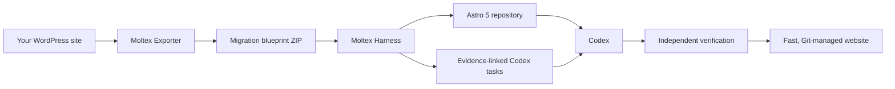

# Moltex

> **Moltex, the last WP plugin, rebuild your website in Astro JS using Codex.**

WordPress powers more than 40% of the web. Moltex is our plan to rebuild that web for
the next generation: fast, portable, Git-managed Astro websites created with Codex.

Moltex turns an existing WordPress site into structured migration evidence, compiles
that evidence into a safe Astro 5 workspace, and gives Codex a bounded, verifiable plan
for completing the rebuild. The result is not another WordPress layer. It is a path out
of WordPress.

## One last plugin

Install Moltex Exporter in WordPress, export a migration blueprint, and let the local
Moltex harness do the rest:

1. **Capture the site.** The exporter records public content, routes, menus, media,
   SEO data, theme and plugin evidence, custom content structures, and source visuals.
2. **Compile the blueprint.** The harness validates the archive, normalizes its data,
   and turns WordPress-specific observations into explicit migration contracts.
3. **Build in Astro.** Moltex creates a self-contained Astro 5 repository with local
   content and assets—without requiring WordPress at runtime.
4. **Finish with Codex.** Codex receives scoped tasks, source evidence, and visual
   references instead of an ambiguous instruction to “copy this website.”
5. **Verify the result.** A generated, independent verifier checks routes, assets,
   behavior, build health, and visual parity.



## Rebuilding 40% of the web

This is deliberately ambitious. WordPress is used by more than 40% of all websites,
which makes migration one of the largest modernization opportunities on the web.
Moltex is being built to make that migration repeatable instead of artisanal: observe
the source, preserve the evidence, generate the new foundation, let Codex perform
bounded implementation work, and verify every result.

We are starting with content-led sites—brochure sites, blogs, portfolios, directories,
and similar publishing experiences—because they are both widespread and well suited to
Astro. More complex WordPress applications will be added through explicit, tested
adapters rather than optimistic best-effort conversion.

The “more than 40%” figure reflects W3Techs reporting that WordPress is used by roughly
41% of websites. See [current WordPress usage statistics](https://w3techs.com/technologies/comparison/cm-wordpress).

## Why Moltex

- **Leave WordPress behind.** The generated Astro repository becomes the source of
  truth; the production site does not call WordPress or Moltex at runtime.
- **Keep what matters.** Content, media relationships, routes, metadata, menus, plugin
  evidence, and visual references travel together in a versioned blueprint.
- **Make Codex effective.** Work is split into bounded tasks with evidence, dependencies,
  acceptance checks, and protected contracts.
- **Verify instead of guessing.** The generated repository includes its own Node-based
  verifier and stable machine-readable reports.
- **Own the result.** The rebuilt site is a normal Git-managed Astro project with a
  committed lockfile and local assets.
- **Repeat safely.** Every export incarnation receives its own domain-and-timestamp
  workspace, so repeated rebuilds of the same WordPress domain cannot contaminate one
  another.

## The two-part system

Moltex contains exactly two internal projects:

- [`moltex_exporter`](./moltex_exporter/) is the WordPress plugin. It observes the source
  site and produces a privacy-filtered, versioned evidence ZIP. It does not generate
  Astro or make target-architecture decisions.
- [`moltex_harness`](./moltex_harness/) is the local migration system. It safely reads
  the export, compiles canonical contracts, acquires approved public assets, generates
  the Astro/Codex workspace, runs the build, creates the migration task graph, and
  verifies the result.

The ZIP is the boundary. This keeps source observation separate from migration judgment
and makes every rebuild inspectable and reproducible.

## Try the pipeline

The normal operator workflow is one command:

```bash
uv sync --project moltex_harness
uv run --project moltex_harness moltex create-site path/to/migration-artifacts.zip
```

Moltex reads the website identity and export time from the blueprint and creates a
contained workspace such as:

```text
output/example-com-2026-07-21_17-51-13/
```

Inside that folder is the complete generated website, its contracts, reports, Codex
task graph, verifier, source evidence references, and committed Node configuration.

Generated workspaces use Node 24.14.0 and npm 10.9.2 exactly:

```bash
cd output/example-com-2026-07-21_17-51-13
npm ci
npm run build
npm run verify
```

## What “built” means

Moltex is evidence-driven and intentionally honest about completion.

A successful baseline build means the export was accepted, contracts were compiled,
approved assets were localized, the Astro repository built successfully, and baseline
verification passed. If plugin behavior, custom fields, dynamic listings, forms, or
visual differences still require implementation, Moltex records them as explicit Codex
tasks. It never turns missing migration work into a silent green check.

## Current scope

The current Golden Path focuses on content-led WordPress sites using native Gutenberg
blocks and supported block/plugin evidence. Custom post types, custom fields, and plugin
residue are retained and classified so migration-relevant data is not lost merely
because a plugin is inactive.

Transactional applications—including ecommerce, memberships, communities, learning
systems, bookings, and multisite—require dedicated adapters and must currently produce
explicit readiness blockers. Elementor and Divi are also outside complete-migration
support until each has an accepted adapter and fixture suite. See the
[authoritative support matrix](./moltex.md#authoritative-support-matrix).

Moltex Exporter 1.3.0 is the current plugin release. The harness currently implements
safe intake, canonical contracts, content conversion, local media acquisition, source
visuals, Astro generation, Codex planning, lifecycle/eval orchestration, and the atomic
`create-site` workflow.

## Repository layout

```text
moltex_exporter/       WordPress evidence-export plugin
moltex_harness/        Local migration, generation, planning, and verification system
samples/               Sanitized fixtures used by tests and evals
docs/                  Bundle contracts and supporting documentation
moltex.md              Product, exporter, and end-to-end acceptance plan
moltex_harness.md      Harness implementation and verification plan
AGENTS.md              Repository development guidance
```

## Development

Harness development uses Python 3.11+, `uv`, pytest, Pydantic, Astro 5, Node, and
Playwright:

```bash
uv sync --project moltex_harness
uv run --project moltex_harness pytest
uv run --project moltex_harness moltex --help
```

Exporter development uses PHP, Composer, PHPUnit, standalone regression scripts, and
disposable WordPress installations. The versioned artifact format is documented in
[`docs/export-bundle-contract.md`](./docs/export-bundle-contract.md).

Implementation details and acceptance gates live in:

- [`moltex.md`](./moltex.md) — product scope, exporter contract, Golden Path, and
  end-to-end acceptance.
- [`moltex_harness.md`](./moltex_harness.md) — intake, canonical models, conversion,
  generation, Codex planning, verification, mutations, and evals.

## License

See [`LICENSE`](./LICENSE) and the component-specific licensing files.
