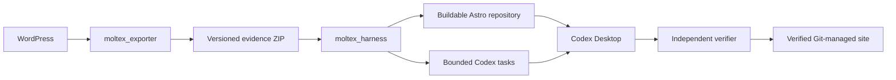

# Moltex

Moltex migrates content-led WordPress sites into verified, Git-managed Astro 5
repositories. It has two internal projects:

- [`moltex_exporter`](./moltex_exporter/) — the existing WordPress plugin that captures
  source content, media, configuration, relationships, and migration evidence in a
  versioned ZIP.
- [`moltex_harness`](./moltex_harness/) — the local Python project that safely parses exports,
  normalizes migration contracts, generates the Astro/Codex workspace, ships the
  self-contained verifier, and runs repository evals.

The previous migration implementation has been deleted. It is not a dependency or a
source of production code.

## Architecture



The boundary is deliberate: the exporter observes WordPress, while the harness interprets
and migrates the exported evidence. Neither project reaches through the ZIP to borrow the
other project's internal state.

## Current Status

`moltex_exporter` emits and enforces `moltex-export/1`, packages only privacy-scanned
producer artifacts, and declares unsupported site families through executable readiness
evidence. The 1.2.10 release candidate is the current implementation line.

`moltex_harness` implements bounded intake, canonical contracts, safe public-network
acquisition, source visuals, scalable Astro generation, the self-contained verifier,
planning, lifecycle/eval orchestration, and the atomic `create-site` workflow. A successful
pipeline result is a built, baseline-verified, planned workspace—not a claim that later
Codex migration tasks are already complete.

## Plans

- [`moltex.md`](./moltex.md) — product scope, current exporter audit, bundle contract,
  three exporter/integration phases, Golden Path, and end-to-end acceptance.
- [`moltex_harness.md`](./moltex_harness.md) — safe intake, canonical models, conversion,
  Astro generation, Codex tasks, verifier architecture, lifecycle, mutations, and evals.

The documents have explicit ownership boundaries to prevent duplicated implementation
plans.

## Repository Layout

```text
moltex_exporter/       Existing WordPress plugin
moltex_harness/        New local migration core; created during Phase H1
samples/               Sanitized shared fixtures; created during implementation
moltex.md              Product and exporter plan
moltex_harness.md      Harness/core migration component plan
AGENTS.md              Repository guidance
```

## Product Boundary

Moltex targets brochure sites, blogs, portfolios, and similar content-led WordPress
installations. Transactional applications such as ecommerce, memberships, communities,
learning systems, bookings, and multisite are outside the initial static-migration
profile and must produce explicit readiness blockers. Elementor and Divi are also
unsupported for complete migration until each has a dedicated accepted adapter and fixture
suite; they cannot silently pass as ordinary content-led sites. See the authoritative
support matrix in [`moltex.md`](./moltex.md#authoritative-support-matrix).

The generated Astro repository becomes the source of truth after migration. Routine
content is stored in editable Astro content collections; WordPress is not required. A
visual or Git-based CMS is a post-hackathon extension.

## Development

Exporter development uses PHP, Composer, PHPUnit, standalone regression scripts, and
disposable WordPress installations. The toolchain and fixtures are pinned in the E1–E3
verification receipts. Contract details are in
[`docs/export-bundle-contract.md`](./docs/export-bundle-contract.md).

The `moltex_harness` project uses Python 3.11+, `uv`, pytest, Pydantic, Astro 5, Node,
and Playwright. Python commands use the project explicitly:

```bash
uv sync --project moltex_harness
uv run --project moltex_harness pytest
uv run --project moltex_harness moltex inspect samples/golden-export.zip
```

Generated Astro repositories are self-contained and use their committed lockfile:

```bash
npm ci
npm run build
npm run verify
```

Do not infer current functionality from planned commands. Consult each phase's exit gate
and checked-in verification artifacts.

## License

See the root [`LICENSE`](./LICENSE) and component-specific licensing. Copied or closely
translated third-party algorithms and fixtures must be recorded in
`THIRD_PARTY_NOTICES.md` with their pinned source and license.
