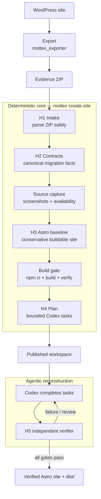
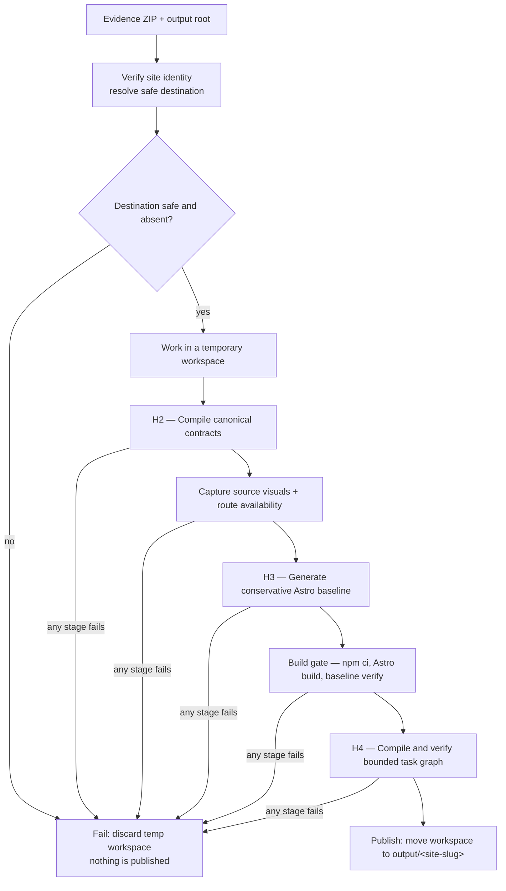
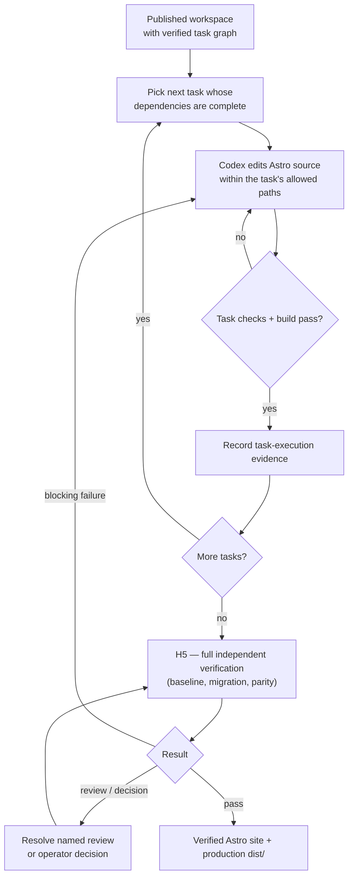

# Moltex complete rebuild pipeline

This document follows one exported WordPress site from the evidence ZIP to a
verified, Git-managed Astro repository. It shows the **main migration steps**, not
every internal check or function. For per-check detail, read the code under
`moltex_harness/src/moltex_harness/` and the plans in `moltex.md` /
`moltex_harness.md`.

The migration has two halves:

- A **deterministic core** (`moltex create-site`) that turns the export into a
  buildable, conservative Astro baseline plus a bounded task plan.
- An **agentic reconstruction loop** where Codex completes the bounded tasks and an
  independent verifier decides when the site is done.

The phase labels `H1`–`H6` and the module that owns each step:

| Phase | Step | Code module |
|---|---|---|
| — | Export the WordPress site to an evidence ZIP | `moltex_exporter` |
| H1 | Safely parse the untrusted ZIP | `intake/` |
| H2 | Normalize into canonical migration contracts | `normalize/`, `contracts/` |
| — | Capture source screenshots and route availability | `visuals/` |
| H3 | Generate a conservative Astro baseline | `conversion/`, `scaffold/` |
| — | Locked build gate (`npm ci` → build → baseline verify) | `scaffold/`, `pipeline/` |
| H4 | Compile a bounded Codex task graph | `planning/` |
| H5 | Codex reconstruction + independent verification | `harness/`, generated Node verifier |
| H6 | Pipeline assurance (evals / mutation testing) | `harness/` |

---

## Diagram 1 — End-to-end migration

The deterministic core never publishes a partial site: intake, contracts, capture,
baseline, build, and planning all run in a temporary workspace and are published
only if every stage passes.

---

## Diagram 2 — Deterministic core (`moltex create-site`)

At publish time the site is already structurally complete, local, editable, and
buildable — but intentionally conservative. Judgment-heavy visual and capability
work is left to the bounded task graph.

---

## Diagram 3 — Agentic reconstruction and verification

The verifier is a self-contained Node program shipped inside the generated
repository. It does not import the Python harness, call WordPress, or accept a
model's opinion in place of a deterministic check. The **verifier, not the Codex
session**, is the final authority on completion.

---

## What the finished repository contains

The published Astro repository is the post-migration source of truth and needs
neither WordPress nor the Python harness to build:

- `src/`, `public/`, `astro.config.mjs`, strict `tsconfig.json` — the editable site.
- `package.json`, `package-lock.json`, `.node-version`, `.npmrc` — the exact locked
  toolchain (Node 24.14.0 / npm 10.9.2).
- `.moltex/` — protected migration authority: contracts, source visual evidence,
  expectations, task graph and briefs, task-execution evidence, and reports.
- `scripts/` — the self-contained Node verifier (`build.mjs`, `verify*.mjs`,
  `verify-lib/`).
- `dist/` — the built static site: HTML, local assets, redirects, sitemap, and 404.

---

## Pipeline assurance (H6)

H6 is not part of migrating a customer site. It is the repository-level system that
proves the pipeline itself works: it compiles fixtures through the real H1–H4
pipeline, runs the generated verifier, injects one declared defect at a time
(mutation testing), and asserts the verifier fails on exactly the right check and
passes cleanly otherwise. A check is only trusted when the clean case passes and a
controlled negative case fails with the expected localization.

---

## Definition of done

Completion is a state, not a percentage. The site is done only when:

1. the export is accepted safely and every migrated fact traces to source evidence;
2. every available route, asset, content item, SEO rule, redirect, and capability is
   reproduced or explicitly disposed, and confirmed omissions stay absent;
3. all media is local — production has no WordPress runtime dependency;
4. the repository installs and builds with the exact locked toolchain;
5. every bounded task has valid completion evidence and protected authority was not
   weakened;
6. all verifier gates pass and any named reviews or operator decisions are resolved.
