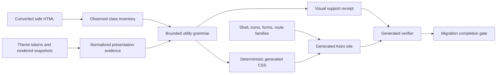

# CSS and Visual Fidelity Improvement Plan

Status: in progress

Implementation progress:

- **CSS1 (observed class inventory) — implemented.** `scaffold/css.py` extracts
  class tokens from converted sanitized HTML and binds them to record IDs.
- **CSS2 (bounded utility grammar and compiler) — implemented.** The hard-coded
  utility whitelist is superseded by a validated, evidence-driven compiler that
  emits only observed, supported utilities (layout, spacing, sizing, typography,
  color/border/effects, responsive and state variants) and rejects unsafe
  arbitrary values. Coverage is written to `.moltex/reports/css-support.json`.
- **CSS3 (theme tokens and typography) — implemented (Python side).**
  `BaselineService._theme_token_css` maps the Astra palette and derives
  body/heading fonts from safe source theme evidence, with unsafe values
  rejected. Full rendered-snapshot palette extraction remains a refinement.
- **CSS4 (theme-independent shell reconstruction) — implemented.**
  `intake/snapshot_shell.py` recognizes logos and header CTAs across themes
  (Astra, Neve, rel=home, generic buttons) and repairs footer/notice mojibake.
- **CSS5 (safe icon rendering) — implemented.** `conversion/icons.py` provides a
  local SVG registry rendered via CSS masks; unknown icons use a neutral
  fallback and are reported instead of collapsing to a bullet.
- **CSS6 (form presentation preservation) — implemented.** HTML forms are
  preserved with submission neutralized (event handlers, actions, and prefilled
  values stripped; submit controls downgraded to inert buttons) instead of being
  replaced by a diagnostic placeholder.
- **CSS7 (listing route family) — implemented.** The generated `ListingRoute`
  renders post cards (with featured media and metadata) before any page intro,
  honoring the `page_for_posts` listing family.
- **CSS8 (visual verification and mutation gates) — not implemented.** The core
  lives in the shipped Node verifier (`verify-lib/checks/*.mjs`) and mutation
  eval cases, which require the Node 24.14.0 toolchain to author and verify. The
  deterministic coverage artifact (`css-support.json`) is emitted and ready for
  the verifier to consume.

This plan captures the visual-parity defects found while comparing the rebuilt
`wptelescope.com` Astro workspace with the live WordPress site on 2026-07-22. It defines
general improvements to `moltex_harness`; it is not a one-site stylesheet patch and is not
limited to Spectra blocks.

Product scope, bundle acceptance, and end-to-end Golden Path remain owned by
[`moltex.md`](./moltex.md). Canonical conversion, scaffold generation, generated-workspace
verification, lifecycle, and eval architecture remain owned by
[`moltex_harness.md`](./moltex_harness.md). The broader Gutenberg conversion program is in
[`gutenberg_blocks_migration_improvement.md`](./gutenberg_blocks_migration_improvement.md).
This document narrows the next implementation cycle to CSS generation, source-theme
evidence, rendered shell fidelity, visual capability preservation, and visual regression
gates.

## 1. Objective

Generate Astro sites whose layout and presentation are derived from exported WordPress
evidence and whose visual support coverage can be measured before a migration is declared
complete.

The harness must:

- compile the utility classes and style primitives actually present in converted content;
- preserve responsive, state, layout, typography, color, border, shadow, and sizing
  behavior without requiring a manually maintained per-site whitelist;
- reconstruct the global shell from theme-independent evidence rather than Astra-specific
  selectors;
- retain the visual representation of safe forms, icons, post listings, and other
  presentation-bearing content even when their server-side behavior requires a separate
  integration decision;
- produce an explicit report for every visual class or source style it cannot compile;
- verify representative desktop and mobile output against source evidence; and
- fail completion on gross, deterministic visual defects or public diagnostic
  placeholders.

## 2. Audit Findings and Regression Baseline

The following findings came from the local site at `http://127.0.0.1:4322` compared with
`https://wptelescope.com` at a desktop viewport near 968 CSS pixels wide.

### 2.1 Global shell

- The generated header is approximately 77 pixels tall while the source header is
  approximately 198 pixels tall at the audited viewport.
- The generated header has neither the source logo nor the `Book Appointment` call to
  action.
- The source logo uses the Neve class `neve-site-logo`; shell extraction currently
  recognizes only a narrower logo shape.
- The source call to action uses generic Neve button classes (`button button-primary`),
  while extraction expects an Astra-specific class.
- The export contains duplicate desktop/mobile shell markup. Extraction needs semantic
  deduplication instead of selecting or concatenating arbitrary occurrences.
- Footer text can retain mojibake such as `©` rather than a normalized copyright symbol.

### 2.2 Utility and responsive CSS

- Converted Atomic Wind content retains a rich Tailwind-like class vocabulary, but the
  generated stylesheet contains a small hard-coded whitelist.
- The audited workspace has roughly 363 distinct class tokens; approximately 237 are not
  represented by the current static rules.
- Missing responsive rules include `md:py-28`, `md:px-8`, `md:text-4xl`, `md:text-5xl`,
  `lg:grid-cols-2`, `lg:grid-cols-5`, `lg:text-6xl`, `md:columns-2`, and
  `lg:columns-3`.
- Missing base rules include `inline-flex`, `rounded-xl`, `rounded-2xl`, `shadow-lg`,
  `p-4`, `p-5`, `p-10`, `py-16`, `py-28`, positioning, opacity, arbitrary colors,
  column flow, and break avoidance.
- State behavior such as `hover:*`, `group-hover:*`, `group-open:*`, and `open:*` is only
  partially represented.
- A concrete result is a services hero using 80 by 24 pixels of padding locally instead
  of the source's 112 by 32 pixels. Another is an `inline-flex` gallery label expanding
  into a full-width strip.

### 2.3 Forms and interactive presentation

- The source export contains complete safe form markup, including labels, inputs,
  textarea, choices, and submit controls.
- Conversion currently replaces an entire HTML form subtree with `Form requires
  integration`, destroying visual parity and useful static structure.
- Server-side submission behavior is a capability decision, but it must be separated from
  safe presentation preservation.

### 2.4 Icons

- Atomic Wind icon blocks currently collapse to a check mark or bullet fallback.
- The source uses named icons such as `leaf`, `heart`, `calendar-days`, `book-open`,
  `map-pin`, `phone`, `users`, `star`, and many others.
- Replacing all unknown icons with a bullet creates obvious visual and semantic errors.
- Some generated arrow and separator strings have encoding artifacts, showing that text
  glyphs are not a robust icon transport.

### 2.5 Route-family presentation

- WordPress identifies `/blog/` as the posts index, but the generated route displays the
  page's generic content hero before or instead of the expected post-card listing.
- Listing cards lack source-equivalent featured images and visual hierarchy.
- The route compiler already has a `listing` family; the scaffold and template must honor
  that family as a first-class visual contract rather than treating it as a decorated
  generic page.

### 2.6 Page-level evidence

Observed full-page height and media-count differences demonstrate that the issue is not a
single component:

| Route | Local height | Live height | Local images | Live images | Visible diagnostic |
| --- | ---: | ---: | ---: | ---: | --- |
| `/` | 5881 | 5100 | 5 | 9 | None |
| `/about-us/` | 4658 | 4511 | 5 | 7 | None |
| `/about/` | 3260 | 2980 | 4 | 6 | None |
| `/our-programs/` | 3952 | 4186 | 3 | 5 | None |
| `/services/` | 3685 | 3443 | 0 | 2 | None |
| `/gallery/` | 7026 | 2895 | 11 | 13 | None |
| `/blog/` | 2535 | 1412 | 0 | 7 | None |
| `/6115e-contact/` | 3410 | 3342 | 1 | 3 | Form placeholder |
| `/contact/` | 3212 | 3528 | 0 | 2 | Form placeholder |

These measurements are diagnostic inputs. They are not sufficient visual oracles by
themselves and should not be committed as expected values without review.

## 3. Design Principles

1. **Evidence-driven output.** Generate CSS from normalized source evidence and observed
   class usage, not a global list guessed in advance.
2. **Grammar over enumeration.** Support bounded families of utilities using validated
   parsers. Do not add hundreds of one-off selectors to `BASELINE_STYLES`.
3. **Safe values only.** Permit known keywords, numeric scales, validated units, approved
   CSS variables, safe hexadecimal colors, and explicitly supported state variants.
   Reject executable, URL-bearing, malformed, or unbounded arbitrary values.
4. **Coverage is a contract.** Every appearance-bearing class is compiled, categorized as
   a semantic hook, or reported as unresolved. Silent omission is a defect.
5. **Behavior and presentation are separate.** A form may be visually preserved while its
   submission capability remains blocked. An icon may be rendered locally without loading
   the WordPress plugin runtime.
6. **Source order and cascade are explicit.** Establish deterministic layers for reset,
   shell, canonical primitives, observed utilities, source tokens, and approved overrides.
7. **Responsive behavior is mobile-first.** Compile source breakpoint variants to stable,
   documented media queries and verify both sides of each breakpoint.
8. **No source runtime dependency.** Generated CSS, icons, forms, and templates must not
   call WordPress, plugin JavaScript, a CDN, or an OpenAI API at runtime.
9. **Verifier independence.** The generated Node verifier consumes serialized coverage
   artifacts; it does not import the Python compiler.
10. **General fixes only.** Site-specific evidence belongs in fixtures and generated
    output, not in shared production conditionals keyed to `wptelescope.com`.

## 4. Target Architecture

### 4.1 CSS layers

Generated CSS should use an explicit cascade order:

1. `reset` - box sizing, document defaults, media defaults, and accessibility helpers;
2. `tokens` - normalized theme colors, fonts, spacing, widths, radii, and breakpoints;
3. `shell` - header, navigation, footer, and route-level containers;
4. `components` - forms, cards, listings, icons, Gutenberg primitives, and capability
   replacements;
5. `utilities` - rules compiled only for observed, supported class tokens; and
6. `approved-overrides` - versioned, evidence-bound decisions where the source cannot be
   expressed by the common model.

Use CSS cascade layers where the generated browser support target permits them. If the
project deliberately avoids `@layer`, retain the same order in separate generated files
and bind the ordering in a manifest.

### 4.2 Visual support receipt

Generate `.moltex/reports/css-support.json` with a stable schema containing:

- compiler and schema versions;
- each observed class token and occurrence count;
- record IDs and route IDs where it appears;
- normalized variant chain and base utility;
- disposition: `compiled`, `semantic-hook`, `component-owned`, `ignored-nonvisual`,
  `unsupported-safe`, or `rejected-unsafe`;
- emitted selector and declaration family for compiled entries;
- source evidence IDs;
- warnings and loss notes; and
- totals used by completion checks.

Public routes must have no unresolved appearance-bearing tokens at completion. Explicitly
nonvisual or component-owned hooks may remain when their classification is tested.

## 5. Workstreams

### CSS1 - Observed class inventory and classification

Build:

- Parse `class` attributes from sanitized converted HTML with an HTML parser rather than
  regular expressions.
- Track classes before and after sanitization to detect accidental loss.
- Bind occurrences to content records and public route contracts.
- Classify known structural hooks such as `wp-block-*`, `moltex-*`, block style markers,
  and state-group hooks separately from utilities.
- Record variant chains without naïvely splitting inside arbitrary-value brackets.
- Limit token length, nesting depth, total tokens, and arbitrary-value size.
- Emit the visual support receipt even when compilation fails.

Tests:

- classes with responsive and state prefixes;
- arbitrary values containing punctuation;
- HTML entities and Unicode text around attributes;
- duplicate classes and occurrence reconciliation;
- malformed class attributes, excessive token counts, and oversized arbitrary values;
- clean classification for framework hooks versus appearance-bearing utilities; and
- a negative fixture proving an unsupported visual token is reported, not dropped.

Exit gate:

- Every class token in the audited fixture has one deterministic disposition and route
  coverage.

### CSS2 - Bounded utility grammar and CSS compiler

Implement safe, data-driven support for the following utility families.

#### Layout and display

- `block`, `inline-block`, `inline-flex`, `flex`, `grid`, hidden/visibility variants;
- flex direction, wrapping, growth, shrink, basis, alignment, and justification;
- grid columns, column spans, gaps, and responsive grid variants;
- multi-column layout and `break-inside-avoid`;
- positioning, inset, edge offsets, stacking order, isolation, and pointer behavior;
- overflow, object fit/position, and aspect ratio; and
- supported transforms and transform composition.

#### Spacing and sizing

- numeric quarter-rem spacing scale, including safe decimals;
- padding, margin, axis, and side-specific variants;
- negative margin and position scales;
- fixed width/height, fractions, full/fit/auto, min/max constraints, and safe arbitrary
  lengths; and
- content-width scales such as `max-w-*`.

#### Typography

- source-derived sans/serif/font token references;
- font sizes, weights, styles, line heights, letter spacing, alignment, transform, wrapping,
  line clamp, and decoration; and
- heading utility specificity that correctly overrides component defaults without
  `!important` proliferation.

#### Color, backgrounds, borders, and effects

- safe named colors, normalized theme variables, and hexadecimal arbitrary colors;
- slash opacity for colors and variables using deterministic supported CSS;
- gradient directions and from/via/to stops;
- border widths, sides, styles, colors, and opacity;
- radii and source radius tokens;
- opacity, shadows, and supported transition families; and
- safe hover/open state changes.

#### Responsive and state variants

- stable `sm`, `md`, `lg`, and `xl` breakpoint mapping derived from source evidence when
  available, with documented defaults otherwise;
- multiple compatible variants in deterministic order;
- `hover`, `focus`, `focus-visible`, `active`, `open`, `group-hover`, and `group-open` where
  they have a safe static-CSS representation; and
- rejection of arbitrary selectors or variants not covered by the grammar.

Implementation requirements:

- Use attribute selectors or a fully tested CSS escaping function so classes containing
  brackets, slashes, colons, or percent signs compile correctly.
- Deduplicate declarations while retaining a stable output order.
- Emit only observed utilities to keep generated workspaces small.
- Never insert an unvalidated class fragment directly into a declaration.
- Do not copy source CSS wholesale; source stylesheets are untrusted evidence.
- Store compiler decisions in the support receipt.

Tests:

- data-driven positive cases for every utility family and variant;
- invalid colors, units, URLs, functions, selectors, and injection attempts;
- deterministic output under reordered input records;
- specificity and cascade tests involving headings, links, images, and nested groups;
- viewport tests immediately below and above each breakpoint;
- mutation tests for a missing responsive rule, wrong fraction, wrong opacity, and wrong
  state selector; and
- a regression set containing all utility tokens observed in the audited export.

Exit gate:

- The audited export has no unsupported appearance-bearing utility token, and malicious
  arbitrary values are rejected with localized findings.

### CSS3 - Theme tokens, typography, and source CSS evidence

Build:

- Normalize safe theme variables from rendered snapshots, `theme.json`, global styles,
  and exported theme settings.
- Extract palette, body and heading fonts, font sizes, line heights, content widths,
  form tokens, button tokens, radii, shadows, and source breakpoint hints.
- Define precedence among explicit block values, utility values, normalized theme tokens,
  rendered observations, and harness defaults.
- Replace hard-coded baseline font and color assumptions when source evidence exists.
- Preserve only bounded `@font-face` declarations with local/materialized or approved HTTPS
  sources and validated descriptors.
- Normalize known encoding damage only when a reversible and tested transformation is
  justified; never apply an unconditional character-set round trip.
- Record fallback tokens and their reason when evidence is absent.

Tests:

- Neve, Astra, and core-theme token fixtures;
- conflicting evidence precedence;
- missing-token fallback behavior;
- unsafe custom property values and malicious font sources;
- UTF-8 copyright, arrows, accented text, and emoji; and
- deterministic token output across snapshot order.

Exit gate:

- Typography and core colors for the audited fixture derive from source evidence, and no
  mojibake is present in generated shell or component text.

### CSS4 - Theme-independent shell reconstruction

Build:

- Parse semantic `header`, `nav`, logo links/images, buttons, notices, and `footer`
  landmarks rather than relying on a single theme's class names.
- Add adapter hints for common theme shapes only where semantic extraction is ambiguous;
  adapters must feed one shared shell model.
- Recognize logo candidates through combinations of link relationship, image role/data,
  filename, accessible label, and common logo class families.
- Rank logo candidates deterministically and resolve them through the media contract.
- Recognize header CTA candidates inside the header using role, button classes, location,
  link prominence, and repeated desktop/mobile evidence.
- Merge duplicate desktop/mobile shell observations and retain responsive variants where
  they differ intentionally.
- Extract source header row heights, logo constraints, colors, navigation spacing, CTA
  presentation, and overlay/normal positioning into the shell model.
- Preserve multi-column footer regions, link groups, contact information, and responsive
  stacking without duplicating text gathered from nested links.
- Rewrite same-origin shell links through the route contract and preserve safe external
  links.

Tests:

- Neve logo (`neve-site-logo`) and CTA (`button button-primary`);
- existing Astra shell evidence;
- duplicated desktop/mobile logo and CTA markup;
- multiple images where only one is the site logo;
- navigation links that resemble buttons but are not the primary CTA;
- footer text/link deduplication and copyright encoding;
- missing media-map entries with a visible blocking finding; and
- overlay and normal shell variants at desktop and mobile widths.

Exit gate:

- The audited homepage renders its local logo, CTA, header geometry, navigation, and
  footer without theme-specific code in the Astro layout.

### CSS5 - Safe icon rendering

Build:

- Preserve normalized icon name, class name, size, color, and accessible intent during
  Gutenberg conversion.
- Generate a local, versioned SVG icon registry for approved icon names used by supported
  block adapters.
- Render SVG inline or through a generated local sprite; do not depend on a CDN or plugin
  runtime.
- Sanitize SVG elements and attributes through a minimal allowlist.
- Use `currentColor`, source sizing utilities, `aria-hidden` for decorative icons, and an
  accessible label only when the source establishes semantic meaning.
- For an unknown icon, emit a neutral safe SVG fallback plus an unresolved icon finding;
  never silently substitute a bullet or unrelated glyph.
- Include icon usage and unknown names in the visual support receipt or a linked icon
  support report.

Tests:

- every audited icon name;
- size and color utility inheritance;
- decorative and semantic accessibility behavior;
- malicious SVG/path/attribute input;
- unknown icon reporting; and
- a mutation replacing an icon with a bullet or empty span.

Exit gate:

- All audited icon blocks render stable local SVGs, and no text-encoding glyph fallback is
  used as the default transport.

### CSS6 - Preserve form presentation while isolating submission behavior

Build:

- Preserve safe form structure: form, fieldset, legend, label, input, textarea, select,
  option, checkbox/radio controls, and button.
- Retain safe visual and accessibility attributes including type, name, placeholder,
  autocomplete, required, checked, selected, rows, columns, min/max length, and label
  association.
- Remove actions, event handlers, executable URLs, inline scripts, and source integration
  tokens not required for display.
- Mark preserved forms with a generated capability ID and a static/integration-required
  state.
- Prevent accidental network submission until an approved target integration is bound.
  The generated behavior must be local, explicit, accessible, and covered by the verifier.
- Style form controls from normalized source form tokens and preserved utility classes.
- Keep server-side capability status in conversion findings and completion decisions; do
  not replace the visual form with a diagnostic box.

Tests:

- Otter/ThemeIsle rendered form evidence from the audited export;
- supported shortcode-generated baseline forms;
- labels, required markers, choices, textarea, and button preservation;
- removed action, event handler, script, unsafe URL, and hidden credential-like value;
- keyboard and accessible-name checks;
- static submission prevention; and
- a mutation that restores the `Form requires integration` placeholder.

Exit gate:

- Contact routes visually retain their source form structure while unresolved submission
  capability remains explicit and cannot send data accidentally.

### CSS7 - Listing and post-card visual contracts

Build:

- Treat WordPress `page_for_posts` as a listing route with listing-first presentation.
- Define a canonical listing-card model containing title, target URL, excerpt, publication
  metadata, taxonomy, and featured media.
- Generate source-equivalent card grids, responsive columns, image aspect ratios, spacing,
  radii, shadows, and typography from evidence.
- Avoid rendering placeholder page content ahead of the listing unless source evidence
  establishes a real archive header or introduction.
- Ensure posts referenced by dynamic/query presentation blocks are bound to real local
  records rather than placeholder titles and `#` links where source contracts permit it.
- Include listing media and relationships in route verification.

Tests:

- posts-page route classification and scaffold renderer selection;
- no generic page hero preceding an archive when absent from source;
- card ordering, featured media, links, excerpt, and responsive grid;
- empty listing behavior;
- missing featured image fallback; and
- mutations for lost images, wrong route family, and placeholder links.

Exit gate:

- `/blog/` matches the source route family and contains the expected local post-card
  hierarchy and media count.

### CSS8 - Visual verification and completion gates

Build:

- Select the homepage and all primary-menu routes, then add routes needed to cover each
  distinct route family, shell variant, utility signature, form, icon family, and complex
  responsive layout.
- Capture desktop and mobile viewports with stable browser, font, animation, and network
  settings.
- Compare source and generated output using several independent signals:
  - public placeholder text and diagnostic markers;
  - missing logo, CTA, form, icon, image, or listing landmarks;
  - horizontal overflow and vertical word stacking;
  - bounding-box geometry for header, hero, major sections, cards, forms, and footer;
  - computed typography, padding, gaps, colors, radius, and display mode;
  - image and link counts normalized for responsive duplicates;
  - page-height and section-height ratios; and
  - perceptual image difference for localized reviewed regions.
- Distinguish deterministic failures from nuanced review items.
- Bind each comparison artifact to route, viewport, source checksum, generated build
  checksum, and browser profile.
- Fail migration completion if required visual coverage is missing, a public placeholder
  is present, an appearance-bearing class is unresolved, or a gross layout signal fails.
- Keep raw local audit screenshots and temporary comparisons out of Git unless a specific
  reviewed fixture is deliberately adopted.

Required mutations:

- remove header logo or CTA;
- omit `inline-flex` or a responsive padding rule;
- change a responsive grid column count;
- replace icons with bullets;
- replace a form with the integration placeholder;
- render the blog route with the generic page template;
- remove listing featured images;
- introduce mojibake in footer text;
- create horizontal overflow; and
- skip one required route or viewport.

Exit gate:

- Each mutation fails and identifies the affected route, viewport, contract, CSS token or
  component, and evidence artifact.

## 6. File-Level Change Map

The exact names may be refined during implementation, but responsibilities should remain
inside the existing `moltex_harness` project.

- `src/moltex_harness/models/`
  - Add versioned visual-class disposition, theme-token, shell-presentation, icon, form
    presentation, and CSS support receipt models.
- `src/moltex_harness/normalize/`
  - Normalize source theme values, route-family presentation, responsive evidence, and
    visual coverage requirements.
- `src/moltex_harness/conversion/`
  - Preserve safe forms, normalize icon intent, and ensure converted HTML retains the
    attributes needed by the presentation compiler.
- `src/moltex_harness/scaffold/`
  - Add observed-class inventory and utility compiler modules.
  - Split static baseline CSS into deterministic layers/templates.
  - Generate local icon assets/components and form/listing component styles.
  - Improve shell extraction/model application and route-family templates.
- `src/moltex_harness/verification/` and `src/moltex_harness/scaffold/templates/`
  - Consume serialized CSS support and visual-plan contracts in the generated Node
    verifier.
  - Add layout, landmark, placeholder, and coverage checks.
- `src/moltex_harness/harness/`
  - Add clean and mutation eval cases for CSS omissions and visual regressions.
- `tests/`
  - Add unit, property, integration, generated-workspace, browser, and mutation fixtures.

Do not create a third implementation project. Change `moltex_exporter` only if a required
theme or computed-style fact cannot be represented by the current export contract. Any
such exporter requirement must first be added to the appropriate phase in `moltex.md` and
must have a declared harness consumer.

## 7. Test and Fixture Strategy

### 7.1 Reviewed fixture

Create a sanitized fixture derived from the audited archive, or an equivalent fixture
with the same constructs. It must cover:

- Neve header logo and primary CTA;
- duplicated responsive shell markup;
- source theme variables and typography;
- arbitrary hex and CSS-variable colors with opacity;
- desktop/mobile spacing and typography variants;
- grid, flex, multi-column, and break-avoidance layouts;
- hover, group-hover, open, and group-open states;
- named icon blocks;
- a complete rendered form with blocked submission capability;
- a posts-index listing with featured media; and
- UTF-8 footer and arrow text.

Expected CSS, receipts, markup, and screenshots must be deliberately reviewed. Tests must
never regenerate their oracle from the implementation in the same run.

### 7.2 Required test levels

| Level | Scope |
| --- | --- |
| Unit | Utility parsing, value validation, selector escaping, shell candidate ranking, icon and form conversion |
| Property | Determinism, arbitrary safe nesting, token limits, malformed values, injection resistance |
| Integration | Archive to contracts to converted records to generated CSS and reports |
| Generated workspace | `npm ci`, production build, local-only assets, generated verifier |
| Browser | Desktop/mobile computed style, landmark geometry, interaction states, accessibility |
| Mutation | Omitted rules/components/evidence fail with localized findings |

Every behavior change requires both a clean passing case and a negative or mutation case.

## 8. Implementation Sequence

1. **Freeze the audit fixture and expected dispositions.** Record the source archive
   checksum, audited routes, viewport profiles, and reviewed class/icon/form inventory.
2. **Implement CSS1 inventory and receipt.** Establish measurable support before changing
   rendering.
3. **Implement CSS2 utility grammar.** Replace the static utility whitelist and make all
   audited tokens explicit.
4. **Implement CSS3 theme tokens.** Correct base typography, palette, breakpoints, and form
   styling inputs.
5. **Implement CSS4 shell reconstruction.** Restore logo, CTA, header/footer geometry, and
   responsive shell behavior.
6. **Implement CSS5 and CSS6.** Replace glyph placeholders with local SVGs and retain safe
   form presentation.
7. **Implement CSS7 route-family visuals.** Correct the blog listing and post-card media.
8. **Implement CSS8 verification and mutations.** Make the defects independently
   detectable and connect them to completion semantics.
9. **Rebuild the audited archive from a clean output directory.** Use the locked harness
   and generated Node/npm toolchains.
10. **Repeat the menu-route visual audit.** Review desktop and mobile pairs, resolve
    deterministic failures, and record any remaining nuanced review items.

CSS1 and the negative tests must precede broad CSS generation so a larger stylesheet does
not merely hide unsupported behavior.

## 9. Acceptance Criteria for the Audited Site

The rebuilt `wptelescope.com` fixture passes this plan when:

- no public route contains `WordPress block requires replacement`, `Form requires
  integration`, or an equivalent development diagnostic;
- the homepage and all menu routes are captured at required desktop and mobile viewports;
- the source logo and `Book Appointment` CTA are present with local/same-origin URLs;
- header height, logo bounds, navigation spacing, CTA placement, and overlay/normal flow
  remain within reviewed geometry tolerances;
- every appearance-bearing class has a compiled or approved component-owned disposition;
- `inline-flex`, responsive padding, text sizing, grid columns, multi-column gallery flow,
  arbitrary colors, radii, shadows, and state variants match their source intent;
- all named icon blocks render local SVGs with correct sizing/color and no bullet fallback;
- contact routes contain the safe source form structure and cannot submit without an
  approved integration;
- `/blog/` renders the source-equivalent post listing and expected featured media without
  a spurious generic page hero;
- footer copyright and generated arrows render as valid UTF-8;
- there is no horizontal overflow, collapsed major section, or gross unexplained page
  height difference;
- production build and generated verifier pass independently; and
- all remaining visual differences are either below reviewed thresholds or represented by
  explicit nonblocking review findings with evidence.

## 10. Rollout and Compatibility

- Version the CSS support receipt, utility grammar, shell model, and generated stylesheet
  manifest.
- Record compiler versions in generated workspaces for reproducibility.
- Treat newly observed unsupported visual utilities as a controlled compatibility event:
  block completion, add a grammar rule and tests, or approve a component-owned
  disposition.
- Keep the previous generated-workspace schema readable for reporting, but do not claim
  parity when it lacks support-coverage evidence.
- Measure fixture coverage, unresolved token count, generated CSS size, build duration,
  browser-capture duration, and mutation detection rate.
- Roll out first against the audited fixture, then a core-Gutenberg fixture, a Spectra
  fixture, and at least one additional utility/block-library fixture to guard against
  overfitting.

## 11. Risks and Controls

- **CSS injection through arbitrary values:** strict token grammar, value allowlists,
  bounded lengths, property-specific validation, and hostile property tests.
- **Specificity conflicts:** explicit CSS layers/order, selector strategy tests, and
  computed-style assertions.
- **Overfitting to Tailwind or Atomic Wind:** compile normalized utility families and
  component primitives; retain adapters only at the source-normalization boundary.
- **Generated CSS growth:** emit only observed utilities, deduplicate rules, and report
  size budgets without silently dropping coverage.
- **Browser support differences:** declare the generated target baseline and test all
  emitted features, including `color-mix` or provide deterministic compatible output.
- **Theme heuristics selecting the wrong shell element:** semantic ranking, evidence IDs,
  duplicate reconciliation, and ambiguity decisions.
- **Forms accidentally becoming active:** remove submission targets, generate an explicit
  static handler/state, and verify no network request occurs.
- **Unknown icons appearing acceptable:** preserve unknown-name findings and block
  completion even when a neutral SVG fallback is visible.
- **Pixel comparisons producing noise:** combine perceptual results with semantic,
  computed-style, and geometry checks; reserve human review for nuanced differences.
- **Producer/verifier common-mode failure:** serialize independent expectations and retain
  mutations that remove real output after generation.

## 12. Definition of Done

This plan is complete only when:

1. the static Gutenberg utility whitelist has been replaced by an evidence-driven,
   validated compiler;
2. every observed visual token receives a serialized disposition;
3. theme typography, palette, spacing, and shell presentation are derived from source
   evidence with explicit precedence;
4. logos, CTAs, footer content, SVG icons, safe forms, and listing cards retain their
   source presentation;
5. all clean unit, property, integration, generated-workspace, browser, and visual tests
   pass using the required locked toolchains;
6. every required mutation fails with a localized explanation;
7. the audited homepage and menu routes satisfy the acceptance criteria at desktop and
   mobile viewports; and
8. a generated migration cannot report completion while public placeholders, unresolved
   appearance-bearing classes, missing visual evidence, or gross deterministic visual
   defects remain.
