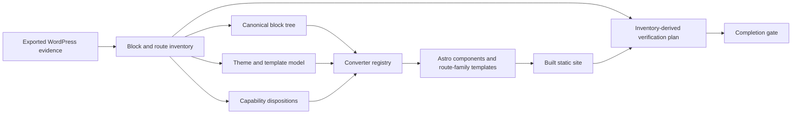

# Gutenberg Blocks Migration Improvement Plan

Status: implemented in `moltex_harness` on 2026-07-21

The generalized compiler, support inventory, route-family scaffold, source-derived shell,
redirect handling, completion gates, and inventory-driven verifier described here are now
implemented. Site-specific third-party capabilities without sufficient exported behavior
remain explicit blocking dispositions by design; they are not silently approximated.

This plan is subordinate to [`moltex.md`](./moltex.md) for product scope and Golden Path
acceptance, and to [`moltex_harness.md`](./moltex_harness.md) for canonical models,
conversion, generated-workspace, verifier, and eval architecture. It turns the findings in
the [`dev.wptelescope.com visual audit`](./visual-comparisons/full-site-audit-2026-07-21/audit-summary.md)
into a general migration improvement program.

## Objective

Make `moltex_harness` reliably migrate Gutenberg-based WordPress sites by compiling source
blocks, theme evidence, templates, routes, and capabilities into a visually and
semantically faithful Astro site. The solution must work across core Gutenberg blocks,
plugin block libraries, shortcodes, embeds, forms, theme patterns, and previously unseen
blocks. It must not be a collection of special cases for Spectra or for
`dev.wptelescope.com`.

Spectra defects found in the audit are the first regression fixtures. They are not the
architectural boundary of the work.

## Success Criteria

A generated migration may report `migration complete` only when:

- every public source route has exactly one reviewed disposition: generated route,
  redirect, intentional omission, or blocking decision;
- every encountered block and capability has a deterministic conversion, a reviewed
  semantic fallback, or a blocking decision;
- no published page contains a visible unresolved-block, shortcode, capability, or
  replacement placeholder;
- theme tokens, route-family templates, global shell behavior, and responsive layouts are
  reconstructed from evidence rather than generic defaults;
- every primary-navigation route and every distinct visual/block/template signature is
  exercised by the generated verifier;
- deterministic structural and visual checks pass at the required desktop and mobile
  viewports;
- nuanced differences that cannot be judged deterministically are explicitly recorded as
  review items; and
- all blocking tasks and decisions are complete, the production build passes, and the
  migration-level verifier passes independently inside the generated workspace.

`baseline generated` remains a useful intermediate state, but it is explicitly
non-deployable and cannot be presented as a completed migration.

## Design Principles

1. **Normalize before rendering.** Source-specific Gutenberg and plugin attributes are
   translated into versioned canonical block, style, layout, and capability models before
   Astro generation.
2. **Shared primitives before adapters.** Core and plugin converters target the same
   layout, typography, spacing, color, border, background, media, interaction, responsive,
   and accessibility primitives.
3. **Evidence over guessed defaults.** Theme JSON, block attributes, rendered markup,
   computed observations, screenshots, menus, widgets, and content relationships establish
   target behavior. Generic styling is used only when the source provides no evidence, and
   that fallback is recorded.
4. **Semantic preservation before visual approximation.** Content hierarchy, links,
   controls, media, forms, landmarks, and responsive order must remain correct even when a
   decorative detail needs review.
5. **Unknown is a state, not a silent success.** Unsupported constructs are preserved as
   safe evidence-backed fallback content when possible; otherwise they block completion.
6. **Producer and verifier remain independent.** The compiler emits versioned contracts;
   the generated Node verifier validates the built site without importing Python or
   trusting compiler internals.
7. **Fixtures are reviewed oracles.** Expected outputs are never regenerated from the
   implementation under test.

## Target Architecture

### Canonical block tree

Introduce a versioned, recursively nested representation that separates source identity
from target rendering. Each node records:

- stable block ID, canonical block name, namespace, version, and source evidence;
- normalized attributes and preserved original attributes;
- ordered inner blocks and safe literal content fragments;
- semantic role and content model;
- normalized layout, style, responsive, media, interaction, and accessibility values;
- dynamic or capability dependencies;
- conversion support state and selected fallback policy; and
- warnings, losses, decisions, and conversion receipt IDs.

Raw Gutenberg comments and plugin attributes remain evidence. Generated Astro components
must consume the canonical representation rather than repeatedly interpreting raw plugin
shapes.

### Shared presentation primitives

Define reusable typed values for:

- constrained, flow, flex, grid, positioned, and overlay layouts;
- content and wide widths, alignment, justification, wrapping, ordering, gaps, and
  responsive breakpoints;
- font family, size, weight, line height, letter spacing, text transform, and inheritance;
- palette references, solid colors, gradients, image overlays, opacity/dimming, background
  sizing, position, repeat, and attachment;
- margin, padding, minimum height, dimensions, aspect ratio, and overflow;
- per-side borders, per-corner radii, outlines, shadows, and filters;
- images, figures, captions, icons, SVGs, galleries, video, and responsive sources; and
- ARIA values, headings, landmarks, labels, focus behavior, and reduced-motion handling.

CSS generation must be deterministic, scoped, responsive, and driven by these primitives.
Plugin adapters map source attributes into the primitives; they do not build independent
styling systems.

### Converter registry

Replace monolithic conditional conversion with a registry keyed by canonical block name
and optional version predicate. A converter declares:

- accepted source shapes and versions;
- produced semantic node/component type;
- required shared primitives and capabilities;
- lossless, reviewed-lossy, decision-required, or unsupported status;
- deterministic fallback behavior; and
- fixture and verification coverage.

Registry coverage is compiled against the complete site inventory before scaffolding. A
converter may not silently claim support for unrecognized attribute shapes.

### Fallback policy

Fallback behavior is ordered:

1. render a fully supported canonical component;
2. preserve safe semantic HTML when it retains required behavior and structure;
3. use an evidence-backed capability replacement approved by contract;
4. omit only with explicit operator approval and route/content impact recorded; or
5. create a blocking decision and mark the workspace non-deployable.

Development diagnostics may display an unresolved placeholder, but production completion
must fail if placeholder markers or unresolved constructs are reachable on a published
route.

## Workstreams

### GBM1 - Inventory and canonical models

Build:

- Scan every content record for core blocks, plugin blocks, reusable blocks/patterns,
  nested attribute shapes, shortcodes, embeds, dynamic blocks, and form/integration
  dependencies.
- Resolve reusable blocks and patterns without losing evidence lineage or introducing
  recursion cycles.
- Add versioned canonical block, style, layout, responsive, theme-token, template-family,
  and conversion-receipt models under `moltex_harness/src/moltex_harness/models/`.
- Emit a block support matrix containing occurrence counts, routes, attribute signatures,
  converter status, fallback status, evidence IDs, and required tests.
- Reject duplicate IDs, invalid nesting, unsafe literal content, cyclic references, and
  unaccounted public occurrences.
- Add a deterministic inventory report to the generated `.moltex` artifacts.

Tests:

- unit tests for parsing, nested blocks, reusable blocks, malformed comments, attribute
  variants, and stable serialization;
- property tests for arbitrary safe nesting, deterministic IDs, round-trip evidence, and
  recursion/size limits; and
- an integration fixture proving every encountered construct receives exactly one support
  disposition.

Exit gate:

- The entire fixture inventory reconciles with source content and has no unclassified
  block, shortcode, embed, form, or dynamic dependency.

### GBM2 - General layout, style, and theme compiler

Build:

- Implement the shared presentation primitives and a deterministic CSS/value compiler.
- Correctly distinguish constrained/flow layout from flex and grid layout. Alignment
  attributes alone must not change the layout mode.
- Preserve `contentSize`, `wideSize`, full/wide alignment, nested width constraints, and
  responsive overrides.
- Compile gradients, overlay dimming, backgrounds, borders, per-corner radii, shadows,
  filters, responsive spacing, minimum heights, and image treatments.
- Normalize units, CSS custom properties, presets, and theme references with safe value
  validation.
- Extract theme evidence into tokens for typography, palette, spacing, content widths,
  breakpoints, backgrounds, buttons, forms, and utility classes.
- Establish named precedence rules for `theme.json`, global styles, block attributes,
  rendered evidence, and recorded operator decisions.
- Remove hard-coded shell typography and styling when source evidence is available.

Initial regression coverage:

- constrained Spectra heroes that currently become horizontal flex rows;
- `contentSize`/`wideSize` behavior;
- advanced gradients, `dimRatio`, background composition, attachment, and repeat;
- shadows, per-side borders, per-corner radii, and responsive spacing;
- core `is-style-rounded` image behavior; and
- Unicode-safe icons and SVG rendering without mojibake.

Exit gate:

- Shared primitive fixtures render identically regardless of whether equivalent values
  originated in core Gutenberg, Spectra, or another adapter.

### GBM3 - Extensible block and capability conversion

Build:

- Move core Gutenberg conversion into the registry and cover headings, paragraphs,
  lists, quotes, tables, code, groups, columns, cover blocks, buttons, images, galleries,
  media/text, navigation-relevant content, embeds, separators, spacers, and supported
  patterns.
- Add Spectra as an adapter into the same primitives, including a deterministic separator
  component with width, color, thickness, and margins.
- Make shortcode recognition grammar-aware. Punctuation text such as `[+]` inside an
  ordinary link must remain text.
- Classify real shortcodes, dynamic blocks, forms, comments, searches, feeds, and embeds as
  capabilities with explicit static replacements or blocking dispositions.
- Preserve safe rendered HTML only when its required assets, behavior, and sanitization
  contract can be proven.
- Generate conversion receipts containing input evidence, converter/version, output node,
  warnings, losses, capability dependencies, and test coverage.

Tests:

- positive and negative tests for every registered converter;
- sanitization and unsafe URL/HTML tests for fallbacks;
- data-driven coverage asserting every declared converter has fixtures;
- regression fixtures for the teachers cards, `[+]` link text, separators, icons, rounded
  portraits, buttons, gradients, and forms; and
- a mutation that changes a supported attribute signature and proves it no longer passes
  silently.

Exit gate:

- Every public block occurrence is converted, safely preserved, explicitly disposed, or
  blocks completion. No visible unresolved marker appears in a passing production build.

### GBM4 - Route families, theme shell, and dynamic behavior

Build:

- Replace the single generic catch-all presentation with renderers selected by canonical
  route family and content type: landing page, standard page, post, archive/listing, form,
  search/utility, and redirect/omission.
- Derive route families from content type, template evidence, block signatures, body/theme
  classes, rendered landmarks, relationships, and route behavior.
- Generate route-aware header variants, including transparent overlay and normal document
  flow, plus responsive navigation behavior.
- Reconstruct footer widget regions, columns, contact information, copyright, menus, and
  responsive stacking from evidence.
- Render post featured media, author/date/category metadata, previous/next navigation,
  comment state, and an approved static comment treatment where required.
- Reproduce forms through an explicit static form target or approved external replacement;
  never expose the source shortcode as page content.
- Detect same-origin path-changing source responses and compile redirects or omissions
  instead of standalone content routes.

Initial regression coverage:

- transparent language-tutor headers versus normal real-estate headers;
- the multi-column source footer;
- long post routes with featured images and metadata;
- SureForms replacement on `/contact-2/`; and
- `/form/2026/` redirecting to `/` rather than publishing placeholder content.

Exit gate:

- Every route has one route-family/template decision, and representative fixtures preserve
  their required header, footer, content container, metadata, capability, and redirect
  behavior.

### GBM5 - Inventory-derived visual and structural verification

Build:

- Generate the visual plan from the full route/block/template inventory.
- Select the homepage and all primary-navigation routes first. Then add every route needed
  to cover a new template family, block/attribute signature, form/capability, redirect,
  responsive behavior, or high-complexity layout.
- Replace arbitrary route limits and `publishedRoutes.slice(0, 5)` behavior with the
  explicit plan. Any resource bound must produce deterministic sharding, never silent
  exclusion.
- Capture every selected route at the declared desktop and mobile viewport profiles.
- Bind source and target captures through stable evidence IDs, route contracts, viewport,
  browser profile, and checksums.
- Add deterministic page assertions for unresolved placeholders, horizontal overflow,
  vertical word stacking, missing landmarks, missing images/forms, collapsed sections,
  gross page-height changes, and unexpected redirects.
- Add landmark geometry, typography, color/background, image-presence, and perceptual
  comparison signals with reviewed thresholds and localized artifacts.
- Treat gross differences as failures. Retain `review` only for nuanced visual judgments
  that deterministic signals cannot establish reliably.
- Ensure a migration cannot pass when required visual evidence is missing, stale,
  mismatched, or not exercised.

Negative/mutation cases:

- missing hero or featured image;
- constrained layout mutated into flex;
- removed form or primary call-to-action;
- square portrait replacing a required rounded portrait;
- placeholder text inserted on a public route;
- redirect replaced by a generated page;
- missing header/footer region;
- collapsed section or large landmark displacement; and
- selected route omitted from runtime capture.

Exit gate:

- Every published mutation is detected and localized to the affected route, viewport,
  contract, and evidence. All selected routes are captured without arbitrary truncation.

### GBM6 - Completion semantics, reporting, and rollout

Build:

- Introduce explicit pipeline states such as `baseline_generated_non_deployable`,
  `migration_in_progress`, `needs_decision`, `migration_failed`, and
  `migration_complete` in accordance with the result model in `moltex_harness.md`.
- Make the final completion command return non-success when migration verification fails,
  blocking decisions remain, required tasks are unfinished, route/capability dispositions
  are incomplete, or published placeholders remain.
- Surface the same state in CLI output, JSON reports, generated workspace documentation,
  preview diagnostics, and packaged artifacts.
- Add a completion manifest binding the source bundle, contracts, converter registry,
  theme/template model, task state, build, verifier reports, and visual evidence by
  checksum.
- Keep baseline verification scoped to baseline integrity, but prevent its passing result
  from being labeled or presented as migration completion.
- Add migration fixtures representing core-only Gutenberg, multiple plugin block
  libraries, mixed theme/template families, posts, forms, redirects, and unknown-block
  failure behavior.
- Roll out behind a versioned compiler/schema boundary. Generated workspaces record the
  compiler and schema versions needed to reproduce the result.

Exit gate:

- Clean fixtures complete; every incomplete, unsupported, mutated, or visually grossly
  incorrect fixture fails or requests a named decision. No baseline-only workspace can be
  mistaken for a deployable completed migration.

## Implementation Order

The workstreams are sequenced to avoid encoding source-plugin behavior directly into
templates:

1. GBM1 inventory and canonical models.
2. GBM2 shared layout/style/theme compiler.
3. GBM3 registry-based core and plugin conversion.
4. GBM4 route families, shell, posts, forms, and redirects.
5. GBM5 complete visual/structural verification.
6. GBM6 completion gates, compatibility, and rollout.

GBM5 fixture and mutation design begins alongside GBM1 so tests are established before
behavior changes. GBM6 state-model work may begin early, but `migration_complete` cannot be
enabled until the preceding exit gates pass.

## Initial File-Level Change Map

The exact module split may be refined while implementing, but responsibilities remain
inside `moltex_harness`:

- `src/moltex_harness/models/` — canonical blocks, presentation primitives, theme tokens,
  template families, support inventory, and receipts;
- `src/moltex_harness/normalize/` — inventory extraction, block-tree normalization, theme
  and template evidence compilation, and visual-plan selection;
- `src/moltex_harness/conversion/` — registry, core adapters, plugin adapters, shortcodes,
  sanitization, capability fallbacks, and deterministic CSS/value compilation;
- `src/moltex_harness/scaffold/` — generated components, route-family templates, shell,
  static behavior replacements, and redirect output;
- `src/moltex_harness/planning/` — bounded tasks for unresolved capabilities, conversions,
  visual review, and decisions;
- `src/moltex_harness/verification/` and generated verifier templates — completion gates,
  inventory-driven browser coverage, layout/perceptual checks, and findings;
- `src/moltex_harness/harness/` — clean/mutation lifecycle and metrics; and
- `tests/` — reviewed unit, property, integration, generated-workspace, browser, and
  mutation fixtures.

Do not create another implementation project. Exporter changes are required only if a
specific source fact cannot be obtained from the existing bundle contract; such work must
be specified in `moltex.md` and implemented in `moltex_exporter` rather than inferred by the
harness.

## Required Test Matrix

Each behavior change requires a clean case and a mutation/negative case that localizes the
failure. The minimum matrix covers:

| Area | Clean evidence | Required negative evidence |
| --- | --- | --- |
| Inventory | Every construct classified once | Unknown occurrence omitted from matrix |
| Nested blocks | Stable ordered canonical tree | Cycle, excessive depth, malformed nesting |
| Layout | Flow, constrained, flex, grid, overlay | Constrained layout misclassified as flex |
| Styles | Tokens, gradients, radii, shadows, borders | Unsupported shape silently discarded |
| Media/icons | Rounded media, SVG, captions, responsive images | Missing asset, unsafe SVG, mojibake |
| Shortcodes | Recognized shortcode disposition | `[+]` or ordinary bracketed text misparsed |
| Forms/capabilities | Approved replacement | Visible shortcode or missing behavior |
| Route families | Page, post, archive, form, redirect | Generic renderer drops family requirements |
| Shell | Route-aware header and footer | Missing/incorrect shell variant |
| Visual plan | Primary navigation plus signature coverage | Selected route silently truncated |
| Browser/layout | Required landmarks and stable geometry | Overflow, stacking, collapse, large displacement |
| Completion | Fully passing migration | Placeholder, unfinished task, decision, or failed verifier |

## dev.wptelescope.com Acceptance Fixture

The audited migration becomes a sanitized integration/regression fixture or an equivalent
reviewed fixture with the same constructs. At minimum it must prove:

- `/`, `/courses/`, `/our-teachers/`, `/about-2/`, and `/contact-2/` receive desktop and
  mobile coverage because they are primary-menu routes;
- separators render without replacement text;
- teacher portraits, cards, buttons, icons, and `[+]` link text preserve their intended
  semantics and presentation;
- constrained heroes do not produce vertical word columns;
- gradients, overlays, shadows, radii, spacing, and content widths are retained;
- the contact form has an explicit working static disposition;
- the two observed theme/shell families render their correct headers and footers;
- posts include required featured media, metadata, navigation, and comment disposition;
- `/form/2026/` has the correct redirect/omission behavior; and
- the pipeline remains non-deployable until all blocking tasks, decisions, placeholders,
  route requirements, and migration verifier checks are resolved.

The audit screenshots are diagnostic evidence, not automatically generated visual oracles.
Any committed expected image or geometry fixture must be deliberately reviewed and pinned.

## Risks and Controls

- **Overfitting to one plugin:** require equivalent primitive tests across core Gutenberg
  and at least one plugin adapter; keep plugin names out of shared rendering logic.
- **False confidence from pixel scores:** combine perceptual comparison with semantic,
  landmark, layout, content, and capability checks; retain explicit human review for nuance.
- **Unbounded visual runtime:** shard the explicit plan deterministically and report full
  coverage; never truncate routes silently.
- **Theme evidence conflicts:** apply named precedence rules and emit decisions when
  evidence is insufficient rather than inventing a target style.
- **Unsafe fallback HTML:** preserve only sanitized markup with proven local assets and no
  executable source behavior.
- **Schema churn:** version canonical models, adapters, receipts, and verifier inputs;
  retain fixture compatibility tests.
- **Compiler/verifier common-mode failure:** keep independent serialized contracts and
  mutation tests that prove verifier detection.
- **Generated-site complexity:** prefer a small stable component/runtime vocabulary and
  static output; do not recreate WordPress or execute source plugin code in Astro.

## Definition of Done

This improvement plan is complete when all GBM exit gates pass and the Golden Path proves
that:

1. the full WordPress construct inventory is classified with evidence lineage;
2. core and plugin blocks compile through shared canonical presentation primitives;
3. theme tokens, route families, headers, footers, posts, forms, and redirects are
   reconstructed from evidence;
4. unsupported or ambiguous behavior is safely preserved, explicitly disposed, or blocks
   completion;
5. primary navigation and all distinct migration signatures receive desktop and mobile
   verification without arbitrary route slicing;
6. clean fixtures pass while structural, capability, placeholder, redirect, layout, and
   visual mutations fail with localized findings;
7. the generated repository builds and verifies independently with its locked Node/npm
   toolchain; and
8. only a fully verified, decision-complete, task-complete workspace can report
   `migration_complete`.
