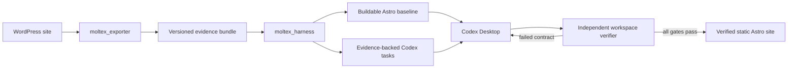

# Moltex Product and Exporter Delivery Plan

## Document Contract

This is the product-level source of truth for Moltex and the implementation plan for
`moltex_exporter`. The companion [`moltex_harness.md`](./moltex_harness.md) is the
component specification for `moltex_harness`, including export parsing, WordPress-to-Astro
compilation, generated Codex workspaces, verification, and evals.

The documents intentionally do not duplicate implementation details:

| Concern | Authoritative document |
|---|---|
| Product promise, supported scope, and end-to-end acceptance | `moltex.md` |
| `moltex_exporter` audit, hardening, and bundle contract | `moltex.md` |
| Export parsing and canonical migration models | `moltex_harness.md` |
| HTML/content conversion and Astro generation | `moltex_harness.md` |
| Codex task graph and generated workspace | `moltex_harness.md` |
| Workspace verifier, lifecycle harness, mutations, and evals | `moltex_harness.md` |

If the documents disagree, the product scope and exporter boundary in this document are
authoritative; the harness implementation must be updated to consume that boundary.

## Status and Naming

- Product name: **Moltex**
- Existing internal project: `moltex_exporter`
- New internal project: `moltex_harness`
- Target output: Git-managed Astro 5 static site
- Primary implementation surface: Codex Desktop working on a generated repository
- Hackathon track: Developer Tools
- Submission deadline in the current plan: July 21, 2026 at 5:00 PM PT
- Product stage: focused vertical slice for content-led WordPress sites

Naming is strict:

- `moltex_exporter` means the WordPress plugin that captures source facts and files.
- `moltex_harness` means the local compiler, migration workspace generator, verifier, and
  repository-level eval system.
- The only local migration project is `moltex_harness`.
- The deleted predecessor is not a dependency, reference implementation, or
  repository component. Historical lessons may be described without restoring its path.
- There is no third `moltex/` implementation package beside these two projects.

Recommended repository shape:

```text
moltex/
├── moltex_exporter/          # existing WordPress plugin
├── moltex_harness/           # new local Python core and its tests
├── samples/                  # sanitized cross-project fixtures and Golden Path evidence
├── moltex.md                 # product and exporter plan
├── moltex_harness.md         # harness/core migration component plan
├── THIRD_PARTY_NOTICES.md
└── README.md
```

The current checkout directory may retain its old filesystem name temporarily; code,
documentation, package names, generated artifacts, and user-facing text use Moltex.

## Executive Decision

Moltex is a two-project deterministic migration pipeline:



`moltex_exporter` owns source observation. `moltex_harness` owns interpretation,
transformation, task planning, and proof. Codex owns judgment-heavy frontend work. The
verifier, not Codex, is the final authority on completion.

Moltex will not attempt to encode an entire frontend engineer in a large collection of
WordPress-specific component generators. It will preserve facts deterministically,
produce a conservative site that builds, and give Codex bounded work backed by explicit
evidence and acceptance checks.

## Product Promise

> Moltex exports a real content-led WordPress site, turns the export into a buildable
> Astro repository and bounded Codex migration tasks, and proves the finished site
> preserves every declared route, asset, content item, SEO requirement, redirect, and
> capability disposition.

The three-minute demo promise is smaller:

> Export one real WordPress site, parse it locally, build its Astro baseline, let Codex
> complete one meaningful checkpoint, inject or reveal one real defect, and show the
> independent verifier reject the defect and accept the repair.

## Product Principles

### Evidence over inference

The exporter records what exists. The harness preserves the origin of every normalized
fact. Ambiguity becomes an explicit decision instead of an invented answer.

### Buildable before beautiful

The generated baseline must install and build before visual reconstruction begins. A
credible conservative site is more useful than ambitious broken output.

### Deterministic boundaries, agentic middle

Export, parsing, normalization, contracts, and verification are deterministic. Codex is
used where judgment is valuable: component boundaries, layout reconstruction, responsive
behavior, and scoped repairs.

### Complete or explicitly disposed

Every public item and discovered capability appears exactly once in the target plan. A
feature may be reproduced, replaced, externalized, omitted with approval, or require a
decision; it may not silently disappear.

### Local-first and secret-free

Export and migration run locally. Moltex requires no hosted database, vector store, or
runtime OpenAI API key. Exported artifacts are treated as untrusted data and are scrubbed
before they enter generated instructions.

### Qualify instead of overpromising

The hackathon profile targets content-led sites that fit practical static generation.
Ecommerce, memberships, communities, learning systems, booking applications, multisite,
and other transactional systems are blocked or routed to an explicit decision.

## Product Scope

### Hackathon scope

- Brochure and corporate sites
- Blogs and basic editorial sites
- Portfolios and simple custom post type families
- Gutenberg-first content
- Navigation, taxonomies, authors, media, SEO, and redirects
- ACF data that can be represented as static content or explicit structured fields
- Forms and integrations only when a safe replacement or external disposition is named
- Desktop and mobile evidence for representative page families
- Static Astro output stored in Git

### Explicitly outside the initial scope

- Ecommerce checkout and account state
- Memberships and authenticated communities
- Learning-management workflows
- Booking engines and other transactional applications
- WordPress multisite
- Unbounded archives that cannot be built practically as static output
- Ongoing WordPress-to-Astro synchronization
- Automatic production deployment
- A visual or Git-based CMS

Unsupported does not mean ignored. The exporter records the evidence and the readiness
report blocks the complete-migration path with a reason.

### Post-migration content model

Moltex produces a Git-managed static Astro site. Content is stored in editable Astro
content collections. WordPress is not required after migration. A visual or Git-based
CMS is a post-hackathon extension.

Routine content edits happen in content collection files without requiring a layout or
component change. Codex may assist, but it is not the required editorial interface.

## Ownership Boundaries

| Component | Owns | Must not own |
|---|---|---|
| `moltex_exporter` | WordPress discovery, privacy filtering, raw evidence, completeness, packaging | Astro code, target routes, component choices, migration acceptance |
| Export bundle | Versioned, checksummed handoff between projects | Hidden in-memory assumptions |
| `moltex_harness` | Safe intake, adapters, canonical contracts, conversion, Astro baseline, tasks, verification, evals | Reading a live WordPress database or silently revising source facts |
| Codex Desktop | Scoped frontend reconstruction and repairs | Marking its own work complete without verifier evidence |
| Human operator | Scope approvals and ambiguous capability decisions | Repeating deterministic checks by hand |

This boundary prevents two common forms of overlap:

1. The exporter does not perform HTML-to-Astro conversion. It exports original content,
   rendered evidence, metadata, and relationships.
2. The harness does not rescan WordPress. If a fact is absent, it reports missing evidence
   or requests a new export instead of reaching back into the source site.

## Existing `moltex_exporter` Audit

This audit is based on the repository state inspected on July 14, 2026. It is a static
code and documentation audit: PHP, Composer, and PHPUnit are not installed in the current
workspace, so the existing test claims have not yet been independently executed here.
Establishing a runnable baseline is the first implementation gate.

### What already exists

The exporter is substantial and should be improved rather than rewritten:

- 33 scanners are registered through a declarative priority registry.
- Core orchestration supports progress, scanner isolation, error logging, and a batching
  protocol.
- The content scanner supports `complete` and `discovery` modes.
- Complete mode emits per-item files under `content/<post-type>/<slug>.json` and an
  `export_completeness.json` report.
- Private content is excluded by default and can be included only explicitly.
- `migration_readiness.json` detects several unsupported plugin families, multisite, and
  incomplete content exports.
- Dedicated scanners cover site data, theme evidence, plugins, content, taxonomies,
  media, menus, ACF, shortcodes, forms, redirects, SEO, integrations, page composition,
  relationships, field usage, and other source signals.
- Security filters enumerate sensitive options, metadata, credentials, and PII-like
  values.
- The packager separates temporary export directories from stored ZIP files, creates
  signed download links, supports a legacy token fallback, streams large downloads, and
  cleans old artifacts.
- The repository contains PHPUnit-style tests and standalone regression scripts for
  content export, sampled scope, export-directory isolation, and signed downloads.

These are valuable pre-existing assets. Phase 1 must preserve working behavior while
making the contract smaller and more reliable.

### Gaps and risks found in the current implementation

| Finding | Why it matters | Planned treatment |
|---|---|---|
| Plugin header still describes Strapi on DigitalOcean | Product metadata contradicts Moltex | Correct during Phase E1 |
| Documentation still refers to a deleted local migration component | Obsolete project names misroute users | Replace with `moltex_harness` |
| No top-level bundle manifest or checksum inventory was found | The consumer cannot prove completeness or tampering for the ZIP as a whole | Add `bundle.json` in Phase E2 |
| `schema_version` is broadly injected, but formal validation is mainly limited to the site blueprint | A numeric field alone is not a contract | Publish schemas for required artifacts and compatibility rules |
| Several scanners write JSON directly with `file_put_contents` | Encoding, validation, error handling, and schema behavior can drift | Route required artifacts through one safe writer; inventory exceptions |
| The scanner surface is much broader than the hackathon requirement | Broad collection increases privacy, runtime, and maintenance risk | Classify scanners as required, optional evidence, or excluded |
| The batching protocol exists, but coverage by high-volume scanners is not proven | Large sites may exhaust one request | Measure and test representative volume before claiming support |
| Readiness output is framed around ChatGPT Sites rather than the static Astro profile | Qualification policy should match the actual target | Rename target and make rules data-driven |
| Existing test documentation describes scenarios that may not match executable fixtures | Claimed coverage is not proof | Run, repair, and report the real suite before adding features |
| There is no checked-in Golden Path ZIP accepted by `moltex_harness` | The two projects do not yet have a proven handshake | Produce and pin it in E3; prove intake in H1 |

### Preserve, narrow, replace

Preserve:

- Scanner base, registry, progress model, security filters, complete/discovery distinction,
  per-item content export, packaging, and download protections
- Existing tests that accurately exercise current behavior
- Useful source artifacts required by a migration contract

Narrow:

- Default scanner set for complete content-led migrations
- Plugin and database evidence to fields that inform a capability decision
- Environment data to non-secret compatibility facts
- Rendered HTML to representative, bounded evidence; source screenshots are captured
  automatically downstream after H2 selects canonical routes

Replace or redesign:

- Old product metadata and target naming
- Implicit artifact conventions with a versioned `bundle.json`
- Ad hoc required-file writes with one writer and explicit schemas
- Claims of support that have no executable fixture or real WordPress proof

## Export Bundle Contract

`moltex_exporter` owns the physical ZIP contract. `moltex_harness` owns the adapter that
maps it into canonical migration models.

For the hackathon, the exporter should retain useful current filenames instead of
renaming every artifact. Add a top-level manifest that declares which files are required,
optional, or diagnostic:

```text
moltex-export.zip
├── bundle.json                    # new authoritative index and checksums
├── site_blueprint.json            # current site/theme/plugin/content overview
├── export_completeness.json       # discovered/exported/excluded counts
├── migration_readiness.json       # qualification outcome and blockers
├── content/<post-type>/*.json     # one record per exported item
├── menus.json
├── seo_full.json
├── forms_config.json
├── integration_manifest.json
├── redirects_candidates.csv
├── media/
├── media-map.json or declared equivalent
├── theme/
├── snapshots/                     # optional bounded rendered evidence
├── error_log.json                 # present when findings exist
└── additional optional evidence declared by bundle.json
```

### `bundle.json` minimum fields

```json
{
  "schema": "moltex-export/1",
  "bundle_id": "sha256:...",
  "created_at": "2026-07-14T18:00:00Z",
  "exporter_version": "1.1.0",
  "mode": "complete",
  "site_origin": "https://example.test",
  "privacy": {
    "private_content_included": false,
    "secret_scan": "pass"
  },
  "artifacts": [
    {
      "path": "site_blueprint.json",
      "kind": "site_blueprint",
      "required": true,
      "schema": "moltex-site-blueprint/1",
      "sha256": "...",
      "bytes": 1234
    }
  ],
  "counts": {
    "public_items_discovered": 12,
    "public_items_exported": 12,
    "media_files": 18
  }
}
```

`bundle_id` is calculated from a deterministic manifest representation, not from a field
that includes itself. All paths are relative POSIX-style paths. Duplicate paths, absolute
paths, traversal segments, checksum mismatches, unsupported schemas, and contradictory
counts make the bundle invalid.

### Required semantic evidence

Regardless of filename, the bundle must provide:

- Site identity, canonical origin, locale, permalink policy, and WordPress version
- Every eligible public content item with stable source ID, type, status, slug, legacy
  URL, title, dates, authorship, taxonomies, original content, and relevant metadata
- Navigation hierarchy and labels
- Media source URL, local path, MIME type, alt text, checksum, and referencing content IDs
- Resolved SEO evidence, including title, description, canonical hints, and indexability
- Redirect candidates and legacy URLs
- Forms, search, scripts, integrations, shortcodes, hooks, and custom behaviors needed for
  capability decisions
- Export completeness, omissions, errors, and migration-readiness findings
- Representative bounded HTML for the Golden Path homepage and selected page families,
  plus sufficient public route evidence for downstream automated visual capture

### Compatibility policy

- `moltex_harness` initially supports the audited current export layout through adapter
  `moltex_export/legacy-1` and the new manifest layout through `moltex-export/1`.
- New `moltex-export/1` bundles must include `bundle.json`; legacy fixtures are immutable
  regression inputs, not a reason to keep emitting an undocumented format.
- Additive optional artifacts are allowed within a major schema version.
- Removing or changing required fields requires a new major schema and a new adapter.
- The exporter and harness each keep the same accepted fixture ZIP and expected bundle ID.

## Exporter Delivery Plan

The main plan has three phases. Each phase produces a usable artifact and has an
independent verification gate. Work does not advance merely because code was written.

The strict cumulative order is:

```text
E1 → E2 → E3 → H1 → H2 → H3 → H4 → H5 → H6
```

“Independently verifiable” means a phase can be accepted using its own outputs and all
previously accepted fixtures. It never requires implementation from a later phase.

| Checkpoint | Material output | Acceptance proof | Later work required? |
|---|---|---|---:|
| E1 | Stabilized current exporter and `legacy-1` ZIP | PHP/regression suite, WordPress smoke export, privacy audit | No |
| E2 | `moltex-export/1`, schemas, manifest, and standalone validator | Contract/tamper/schema tests against synthetic fixtures | No |
| E3 | Real sanitized Golden Path ZIP | Standalone validation and WordPress/bundle count reconciliation | No |
| H1 | Safe intake plus typed raw evidence for both bundle versions | Intake unit/property tests and `moltex inspect` | No |
| H2 | Canonical evidence-linked migration contracts and visual capture plan | Model/property tests and contract verifier | No |
| H3 | Automatically captured source visuals and complete conservative Astro baseline | Capture receipt, conversion tests, clean `npm ci`, and production build | No |
| H4 | Generated Codex workspace and task DAG | Planning tests, graph validation, build, and one real task | No |
| H5 | Self-contained workspace verifier | Clean and direct-negative verifier cases | No |
| H6 | Lifecycle, mutation, reproducibility, and repair eval reports | Published eval suite and metrics | No |

For example, after H1 you can run and accept E1, E2, E3, and H1 completely. H2 does not
need to exist. “Self-contained” does not mean H1 can run without its accepted E1–E3 input
fixtures; phases are cumulative checkpoints rather than nine unrelated projects.

### Phase E1 — Audit and stabilize the existing exporter

Objective: establish what the renamed plugin actually does, make its current behavior
executable, and remove stale product identity before changing the contract.

Work:

1. Inventory all 33 registered scanners and classify each as:
   - required for the hackathon complete-migration profile;
   - optional migration evidence;
   - diagnostic only;
   - excluded because of privacy, runtime, or lack of a consumer.
2. Map every emitted file to its producer, schema/version behavior, privacy classification,
   size risk, and intended `moltex_harness` consumer.
3. Install a reproducible PHP/Composer test environment and record the commands.
4. Run PHP syntax checks, standalone regressions, and the real PHPUnit suite; distinguish
   executable coverage from claims in README files.
5. Install the plugin in a disposable WordPress site and perform one complete and one
   discovery export.
6. Correct Moltex names, plugin description, admin copy, README instructions, action/filter
   examples, and test documentation without changing behavior unnecessarily.
7. Audit sensitive option/meta filters and manually inspect a sample export for secrets,
   PII, absolute server paths, and private content.
8. Freeze the resulting current-format ZIP as the `legacy-1` compatibility fixture.

Verification:

```bash
php -l moltex_exporter/moltex_exporter.php
php moltex_exporter/tests/content_export_regression.php
php moltex_exporter/tests/sample_scope_regression.php
php moltex_exporter/tests/export_directory_regression.php
php moltex_exporter/tests/packager_download_regression.php
moltex_exporter/vendor/bin/phpunit moltex_exporter/tests
```

Required evidence:

- `docs/exporter-audit.md`
- artifact/scanner classification table
- captured commands and test results
- sanitized `samples/legacy-1-export.zip` plus checksum
- complete versus discovery count comparison
- privacy review record

Exit gate:

- All required tests run in a documented environment.
- Known failures are fixed or explicitly classified; no claimed test is silently skipped.
- The plugin installs, exports, packages, and downloads a ZIP on a disposable WordPress
  site.
- Stale product names are absent from user-facing exporter files.
- The current artifact surface is documented before contract changes begin.

### Phase E2 — Publish and enforce the Moltex export contract

Objective: turn the current collection of useful files into a versioned, checksummed,
privacy-reviewed handoff without rewriting all working scanners.

Work:

1. Define `moltex-export/1` and JSON schemas for required JSON artifacts.
2. Define one declarative artifact registry containing path, kind, producer, required flag,
   schema ID, privacy class, and size limits. Use it as the source for writing,
   `bundle.json`, validation, and tests.
3. Add reviewed characterization fixtures and tests for current artifact paths and semantic
   JSON content before changing write behavior; never regenerate those expectations from the
   implementation under test.
4. Introduce one validated artifact writer responsible for path containment, deterministic
   JSON encoding, atomic writes where possible, schema validation, byte size, checksum,
   producer context, and classified errors.
5. Migrate every required JSON artifact through the validated writer. Enumerate and test
   justified binary, CSV, HTML, copied-tree, and large-file exceptions rather than forcing
   them through JSON handling.
6. Add deterministic `bundle.json` generation from the artifact registry and successful
   writer receipts after all required files are written.
7. Reconcile discovered, exported, excluded, and failed content counts by post type.
8. Centralize option, post-meta, and term-meta export policy in
   `Moltex_Exporter_Security_Filters`; scanners must not maintain divergent sensitive or
   temporary-key rules.
9. Convert migration readiness to the documented static Astro qualification profile.
10. Bound optional evidence by file count and total uncompressed size.
11. Add ZIP structure, traversal, duplicate-path, checksum, secret-filter, writer-failure,
    and schema tests.
12. Preserve the old fixture only as an input compatibility case; emit the new contract by
    default.
13. Add a standalone exporter-side bundle validator that checks the ZIP without importing
    `moltex_harness`.

Bounded refactoring rule: E2 may extract the artifact registry, validated writer, and shared
metadata policy required above. It must not split the plugin or theme scanners, introduce a
general block-walker abstraction, or remove duplicate legacy artifacts unless an executable
contract requirement demands it. Record broader cleanup for after the E2 exit gate.

Verification cases:

- A clean complete bundle validates against every declared schema and checksum.
- A changed byte fails checksum validation.
- A missing required file fails packaging or downstream intake.
- A discovery bundle is valid evidence but cannot pass complete migration.
- Excluding private content is reflected in both counts and privacy metadata.
- Duplicate slugs produce stable, unique per-item filenames without losing source IDs.
- Malformed UTF-8 or JSON fails with the producer and artifact path.
- Traversal or an undeclared required-artifact path is rejected by the writer before a file
  is created.
- Content and taxonomy metadata pass through the same tested security policy.
- Migrating an artifact to the writer preserves its reviewed semantic characterization.
- An unsupported site class produces a structured readiness blocker, not a crash.

Required evidence:

- versioned schema files
- declarative artifact registry and registry-completeness test
- reviewed pre-writer characterization fixtures
- validated writer unit tests covering containment, deterministic encoding, atomic failure,
  schema rejection, checksums, and producer-localized errors
- `bundle.json` fixture and deterministic serialization test
- standalone bundle validator and validation-report schema
- tamper and missing-artifact regression tests
- updated exporter README and bundle contract documentation
- `samples/moltex-export-1.zip` plus expected bundle ID

Exit gate:

- Two identical exports of unchanged fixture data produce equivalent normalized manifests.
- Every required artifact has a schema or explicit non-JSON contract.
- Every required JSON artifact is declared once and written through the validated writer.
- Option, post-meta, and term-meta export use the shared security policy.
- The ZIP proves its inventory and integrity without relying on undocumented filenames.
- Complete/discovery and privacy semantics are executable.

### Phase E3 — Produce and freeze the real Golden Path export

Objective: produce one real sanitized WordPress bundle that independently satisfies the
published exporter contract and becomes the immutable production fixture for H1.

Work:

1. Select a real content-led Golden Path site with five to ten public routes, navigation,
   local images, SEO, one repeatable content family, and at least one capability requiring
   a disposition.
2. Capture bounded rendered HTML in the export. Do not request, upload, or manage source
   screenshots in WordPress; H2 selects their routes and Moltex captures them automatically
   before H3.
3. Export in complete mode with private content disabled.
4. Run the standalone E2 bundle validator from outside the WordPress request lifecycle.
5. Reconcile every content and media count between WordPress, `bundle.json`, and export
   reports.
6. Pin the ZIP, bundle ID, schema versions, and exporter validation report.
7. Document how to replace the Golden Path without silently regenerating expected results.

Verification:

```bash
# Exporter-side contract verification
moltex_exporter/vendor/bin/phpunit moltex_exporter/tests
php moltex_exporter/tools/validate-bundle.php samples/golden-export.zip
```

Required evidence:

- sanitized real `samples/golden-export.zip`
- expected `bundle_id`
- exporter test proving the bundle structure
- standalone exporter validation report
- signed count-reconciliation table
- documented capability and privacy review

Exit gate:

- A clean complete export passes the standalone schema, checksum, size, and inventory
  validator without hand editing.
- WordPress, `bundle.json`, and export reports agree on content and media counts.
- Every public item and required media file appears in the bundle inventory exactly once.
- Any unsupported capability is explicit rather than dropped.
- No `moltex_harness` code is required to prove E3.

## `moltex_harness` Handoff

After Phase E3, implementation continues under the independently gated phases in
[`moltex_harness.md`](./moltex_harness.md):

1. Scaffold the local core and prove the exporter-to-harness handshake by parsing both
   accepted bundle versions.
2. Normalize evidence into canonical migration contracts.
3. Compile the Git-managed Astro baseline.
4. Generate bounded Codex tasks and proof artifacts.
5. Ship the self-contained workspace verifier.
6. Prove the system with isolated lifecycle and mutation evals.

This list is a dependency map, not a duplicate implementation plan. Details and exit
criteria are owned only by the harness document.

## Cross-Project Integration Rules

### Contract-first communication

The projects communicate only through files and versioned schemas. Tests may share an
immutable fixture ZIP, but production code may not import across project directories.

### Producer/consumer responsibility

- If the source fact is wrong or absent, fix `moltex_exporter` and issue a new bundle.
- If a correct fact is parsed or normalized incorrectly, fix `moltex_harness`.
- If a migration decision is ambiguous, create a decision item; neither side guesses.
- If a target implementation violates a declared contract, fix the generated site or
  Codex task; do not rewrite the source evidence to make it pass.

### Compatibility fixture

The Golden Path ZIP is copied or referenced immutably by both suites. Each project asserts
its own boundary:

- Exporter: emitted files, schemas, checksums, counts, privacy, and readiness.
- Harness: safe extraction, accepted schema, references, normalized models, and findings.

Expected results are reviewed, not regenerated from the current implementation during the
same test run.

## End-to-End User Journey

1. The operator installs `moltex_exporter` on a WordPress site.
2. The plugin scans supported source facts and reports readiness blockers.
3. The operator chooses complete migration and reviews the privacy settings.
4. The exporter writes and packages a versioned, checksummed evidence ZIP.
5. The operator opens `moltex_harness` locally and selects the ZIP.
6. Harness intake validates paths, schemas, checksums, counts, and qualification.
7. The harness normalizes evidence, compiles canonical routes, and writes a deterministic
   visual capture plan.
8. Moltex launches Chromium without prompting the operator, captures the planned source
   routes at desktop and mobile viewports, and binds the capture receipt to the bundle ID.
9. The harness produces a buildable static Astro baseline.
10. It generates a parity matrix, bounded Codex tasks, an ExecPlan, and verification
   commands.
11. The operator opens the generated repository in Codex Desktop.
12. Codex completes tasks in dependency order and attaches required evidence.
13. The independent verifier builds, serves, and checks the site.
14. Failed contracts produce localized repair work; ambiguity returns to the operator.
15. When all blocking gates pass, the Git-managed Astro repository is ready for normal
   hosting or a later publishing workflow.

## Golden Path Acceptance

The Golden Path must originate from a real WordPress installation, not only hand-authored
JSON. It includes:

- five to ten public routes;
- homepage, standard page, and one repeatable collection;
- a real navigation hierarchy;
- local images with alt text;
- resolved SEO evidence;
- at least one custom or ambiguous section for Codex;
- at least one capability disposition;
- public source routes from which Moltex automatically captures desktop and mobile visual
  evidence after H2;
- sanitized content safe for a public repository.

End-to-end acceptance:

- Export counts reconcile exactly.
- Bundle schemas and checksums pass.
- Harness intake requires no manual editing.
- The Astro baseline installs and builds from its lockfile.
- Every public item has one target route and parity row.
- Codex completes at least one meaningful bounded task.
- The verifier catches a deliberately introduced regression and accepts the repair.
- Required routes, links, assets, metadata, redirects, and capability dispositions pass.
- Representative desktop/mobile evidence is reviewed.
- No critical/high browser issue or required decision remains unresolved.
- A clean clone reproduces the documented flow.

## Measurable Success Criteria

| Metric | Hackathon target |
|---|---:|
| Exported eligible public content | 100% |
| Required bundle artifacts with valid checksum | 100% |
| Required artifact references resolved at intake | 100% |
| Expected Astro route coverage | 100% |
| Referenced local asset coverage | 100% |
| Internal broken links | 0 |
| Indexable routes missing required metadata | 0 |
| Capabilities without disposition | 0 |
| Unresolved critical/high browser findings | 0 |
| Published verifier mutations detected and localized | 100% |
| Required human decisions unresolved at completion | 0 |
| Clean-clone Golden Path reproduction | Pass |

No aggregate percentage can compensate for a failed critical gate.

## Selective Reuse Policy

Moltex may study the MIT-licensed
[WP Astro MCP](https://github.com/vapvarun/wp-astro-mcp) for bounded conversion algorithms
and regression cases. It will not embed or depend on the complete TypeScript service.

The implementation and detailed examples belong to `moltex_harness.md` because conversion
is a consumer responsibility. Candidate areas are HTML sanitization/conversion, shortcode
handling, frontmatter normalization, URL/media rewriting, large-content fallback, and
transient-versus-permanent failure classification.

Directly copied or closely translated code and fixtures require license attribution and a
pinned upstream commit in `THIRD_PARTY_NOTICES.md`. Independently reimplemented ideas are
recorded in an engineering decision entry when they materially shape the architecture.

Moltex-specific evidence lineage, canonical contracts, Codex tasks, capability
dispositions, route/asset/SEO/redirect contracts, verification, visual QA, and parity
matrix remain local work.

## Demo Storyboard

### 0:00–0:25 — Source and export

Show the real WordPress site, open Moltex Exporter, and point out complete mode, privacy,
readiness, and evidence capture. Export the ZIP or use the identical pre-generated ZIP for
demo reliability.

### 0:25–0:55 — Contract handshake

Show `bundle.json`, content/media counts, checksums, and the harness intake result. Make
the two-project boundary visible: WordPress observation ends at the ZIP.

### 0:55–1:25 — Buildable migration workspace

Show the generated Astro site building, editable content collections, source evidence,
route contracts, parity matrix, and bounded tasks.

### 1:25–2:05 — Codex checkpoint

Show Codex completing or repairing one scoped visual/structural task using only its named
evidence and allowed files.

### 2:05–2:40 — Independent proof

Introduce or reveal a missing route/broken link. Run verification, show the localized
failure, apply the repair, and rerun to green. This is the strongest proof that the
architecture is real.

### 2:40–3:00 — Result

Show the credible desktop/mobile Astro result and the final parity summary. Close with the
two-part value: complete WordPress evidence in, verified Git-managed static site out.

## Risks and Cut Lines

### Exporter breadth consumes the schedule

Mitigation: classify existing scanners and improve the required subset. Do not add a new
scanner unless a Golden Path contract cannot be satisfied without it.

### Bundle contract redesign breaks working exports

Mitigation: retain one immutable `legacy-1` fixture, add `bundle.json` around useful current
artifacts, and make the harness adapter explicit. Avoid a cosmetic mass rename.

### Tests exist but are not executable

Mitigation: Phase E1 cannot pass without a recorded PHP/Composer environment and real test
results. Reduce claims to what actually runs.

### Export contains secrets or private material

Mitigation: private content stays off by default, required artifacts use centralized
filtering, the manifest records privacy state, and a sanitized real export receives manual
review before publication.

### Harness work starts before the producer contract stabilizes

Mitigation: E3 freezes the independently valid canonical fixture. H1 is the mandatory
cross-project handshake before H2 normalization or broader migration work.

### Visual parity consumes remaining time

Mitigation: prove three representative route families at two viewports. Preserve all
content and routes structurally before expanding visual review.

### Static generation is unsuitable

Mitigation: readiness blocks known transactional classes, and the harness applies a tested
static-eligibility envelope before generation.

## Product Definition of Done

Moltex is ready for submission only when:

- The repository and user-facing documentation use `moltex_exporter` and
  `moltex_harness` consistently.
- The deleted predecessor is absent and no production module imports or describes it as a
  current component.
- The existing exporter has an executable, documented test baseline.
- A real WordPress site emits a complete, sanitized `moltex-export/1` ZIP.
- The bundle proves required artifacts, schemas, checksums, counts, privacy, and readiness.
- `moltex_harness` accepts the ZIP without manual editing.
- The harness produces a buildable Astro repository with Git-managed content collections.
- Every exported public item and capability maps to one final parity row.
- Generated tasks are evidence-backed, bounded, and independently verified.
- Codex completes at least one meaningful task.
- The verifier catches a deliberate defect and accepts a valid repair.
- The final site passes build, route, link, asset, content, SEO, redirect, and capability
  gates.
- Required desktop/mobile and browser QA evidence is present.
- No critical/high issue or required decision remains unresolved.
- A clean clone reproduces the Golden Path.
- Third-party code or fixtures have pinned attribution.
- Repository, video, sample, test instructions, and Codex session evidence are ready.

## Immediate Next Actions

1. Complete Phase E1 before adding exporter features.
2. Create `docs/exporter-audit.md` from the scanner/artifact inventory.
3. Establish PHP, Composer, PHPUnit, and disposable WordPress test commands.
4. Fix stale project names and product metadata in exporter-facing files.
5. Freeze one current-format sanitized ZIP as `legacy-1`.
6. Define `moltex-export/1` and add `bundle.json` without renaming every useful artifact.
7. Produce and independently validate the real Golden Path export in E3.
8. Scaffold `moltex_harness` H1 against the frozen legacy and Golden Path fixtures and
   prove the cross-project handshake.
9. Continue migration/compiler work exclusively under `moltex_harness.md`.

## Final Product Thesis

Moltex should not compete with Codex at writing an entire website, and it should not hide
WordPress complexity behind an unverifiable export. `moltex_exporter` captures complete,
privacy-reviewed source evidence. `moltex_harness` turns that evidence into a buildable,
bounded, and independently verified migration workspace. The versioned ZIP between them
makes the boundary testable, replaceable, and easy to explain.
