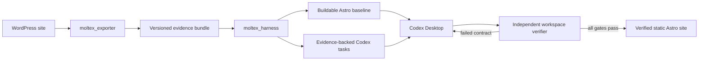

# Moltex Product and Exporter Delivery Plan

## Document Contract

This is the product-level source of truth for Moltex and the implementation plan for
`moltex_exporter`. The companion [`moltex_harness.md`](./moltex_harness.md) is the
component specification for `moltex_harness`, including export parsing, WordPress-to-Astro
compilation, generated Codex workspaces, verification, and evals.

The documents intentionally do not duplicate implementation details:

| Concern | Authoritative document |
|---|---|
| Product promise, supported scope, and end-to-end acceptance | `moltex.md` |
| `moltex_exporter` audit, hardening, and bundle contract | `moltex.md` |
| Export parsing and canonical migration models | `moltex_harness.md` |
| HTML/content conversion and Astro generation | `moltex_harness.md` |
| Codex task graph and generated workspace | `moltex_harness.md` |
| Workspace verifier, lifecycle harness, mutations, and evals | `moltex_harness.md` |

If the documents disagree, the product scope and exporter boundary in this document are
authoritative; the harness implementation must be updated to consume that boundary.

## Status and Naming

- Product name: **Moltex**
- Exporter project: `moltex_exporter`
- Harness project: `moltex_harness`
- Current exporter release: **1.2.9**
- Current export contract: **`moltex-export/1`**
- Target output: Git-managed Astro 5 static site
- Primary implementation surface: Codex Desktop working on a generated repository
- Hackathon track: Developer Tools
- Submission deadline in the current plan: July 21, 2026 at 5:00 PM PT
- Product stage: implemented exporter and active harness vertical slice for content-led
  WordPress sites

Naming is strict:

- `moltex_exporter` means the WordPress plugin that captures source facts and files.
- `moltex_harness` means the local compiler, migration workspace generator, verifier, and
  repository-level eval system.
- The only local migration project is `moltex_harness`.
- The deleted predecessor is not a dependency, reference implementation, or
  repository component. Historical lessons may be described without restoring its path.
- There is no third `moltex/` implementation package beside these two projects.

Recommended repository shape:

```text
moltex/
├── moltex_exporter/          # existing WordPress plugin
├── moltex_harness/           # new local Python core and its tests
├── samples/                  # sanitized cross-project fixtures and Golden Path evidence
├── moltex.md                 # product and exporter plan
├── moltex_harness.md         # harness/core migration component plan
├── THIRD_PARTY_NOTICES.md
└── README.md
```

The current checkout directory may retain its old filesystem name temporarily; code,
documentation, package names, generated artifacts, and user-facing text use Moltex.

## Executive Decision

Moltex is a two-project deterministic migration pipeline:



`moltex_exporter` owns source observation. `moltex_harness` owns interpretation,
transformation, task planning, and proof. Codex owns judgment-heavy frontend work. The
verifier, not Codex, is the final authority on completion.

Moltex will not attempt to encode an entire frontend engineer in a large collection of
WordPress-specific component generators. It will preserve facts deterministically,
produce a conservative site that builds, and give Codex bounded work backed by explicit
evidence and acceptance checks.

## Product Promise

> Moltex exports a real content-led WordPress site, turns the export into a buildable
> Astro repository and bounded Codex migration tasks, and proves the finished site
> preserves every declared route, asset, content item, SEO requirement, redirect, and
> capability disposition.

The three-minute demo promise is smaller:

> Export one real WordPress site, parse it locally, build its Astro baseline, let Codex
> complete one meaningful checkpoint, inject or reveal one real defect, and show the
> independent verifier reject the defect and accept the repair.

## Product Principles

### Evidence over inference

The exporter records what exists. The harness preserves the origin of every normalized
fact. Ambiguity becomes an explicit decision instead of an invented answer.

### Buildable before beautiful

The generated baseline must install and build before visual reconstruction begins. A
credible conservative site is more useful than ambitious broken output.

### Deterministic boundaries, agentic middle

Export, parsing, normalization, contracts, and verification are deterministic. Codex is
used where judgment is valuable: component boundaries, layout reconstruction, responsive
behavior, and scoped repairs.

### Complete or explicitly disposed

Every public item and discovered capability appears exactly once in the target plan. A
feature may be reproduced, replaced, externalized, omitted with approval, or require a
decision; it may not silently disappear.

### Local-first and secret-free

Export and migration run locally. Moltex requires no hosted database, vector store, or
runtime OpenAI API key. Exported artifacts are treated as untrusted data and are scrubbed
before they enter generated instructions.

### Qualify instead of overpromising

The hackathon profile targets content-led sites that fit practical static generation.
Ecommerce, memberships, communities, learning systems, booking applications, multisite,
and other transactional systems are blocked or routed to an explicit decision.

## Product Scope

### Hackathon scope

- Brochure and corporate sites
- Blogs and basic editorial sites
- Portfolios and simple custom post type families
- Gutenberg-first content
- Navigation, taxonomies, authors, media, SEO, and redirects
- ACF data that can be represented as static content or explicit structured fields
- Forms and integrations only when a safe replacement or external disposition is named
- Desktop and mobile evidence for representative page families
- Static Astro output stored in Git

### Explicitly outside the initial scope

- Ecommerce checkout and account state
- Memberships and authenticated communities
- Learning-management workflows
- Booking engines and other transactional applications
- WordPress multisite
- Unbounded archives that cannot be built practically as static output
- Ongoing WordPress-to-Astro synchronization
- Automatic production deployment
- A visual or Git-based CMS

Unsupported does not mean ignored. The exporter records the evidence and the readiness
report blocks the complete-migration path with a reason.

### Post-migration content model

Moltex produces a Git-managed static Astro site. Content is stored in editable Astro
content collections. WordPress is not required after migration. A visual or Git-based
CMS is a post-hackathon extension.

Routine content edits happen in content collection files without requiring a layout or
component change. Codex may assist, but it is not the required editorial interface.

## Ownership Boundaries

| Component | Owns | Must not own |
|---|---|---|
| `moltex_exporter` | WordPress discovery, privacy filtering, raw evidence, completeness, packaging | Astro code, target routes, component choices, migration acceptance |
| Export bundle | Versioned, checksummed handoff between projects | Hidden in-memory assumptions |
| `moltex_harness` | Safe intake, adapters, canonical contracts, conversion, Astro baseline, tasks, verification, evals | Reading a live WordPress database or silently revising source facts |
| Codex Desktop | Scoped frontend reconstruction and repairs | Marking its own work complete without verifier evidence |
| Human operator | Scope approvals and ambiguous capability decisions | Repeating deterministic checks by hand |

This boundary prevents two common forms of overlap:

1. The exporter does not perform HTML-to-Astro conversion. It exports original content,
   rendered evidence, metadata, and relationships.
2. The harness does not rescan WordPress. If a fact is absent, it reports missing evidence
   or requests a new export instead of reaching back into the source site.

## Current `moltex_exporter` State

This section is the retroactive implementation record for the exporter at release 1.2.9,
inspected and reverified on July 18, 2026. The original July 14 audit and the E1-E3 receipts
remain available in [`docs/exporter-audit.md`](./docs/exporter-audit.md) and
[`docs/verification/`](./docs/verification/).

Exporter phases E1, E2, and E3 are complete. The plugin is no longer an unverified legacy
exporter awaiting a contract: it emits `moltex-export/1` by default, validates the finished
archive before download, and has an installable release artifact.

### Implemented behavior

- The declarative scanner registry still contains 33 scanners. The reviewed classification
  is 14 required, 14 optional-evidence, three diagnostic, and two excluded from the target
  profile; the detailed producer/consumer inventory lives in `docs/exporter-audit.md`.
- Core orchestration provides ordered scanner execution, progress reporting, scanner-local
  error isolation, persisted diagnostics, and AJAX-safe execution.
- Complete mode exports every eligible public item up to the configured per-post-type safety
  ceiling. Discovery mode emits representative evidence and is explicitly ineligible for a
  complete migration.
- Content records use stable source IDs and collision-safe filenames under
  `content/<post-type>/`. Export completeness reconciles discovered, exported, excluded,
  and failed counts by post type.
- Private content is excluded by default. Option, post-meta, and term-meta filtering is
  centralized in `Moltex_Exporter_Security_Filters` and covers nested sensitive and
  PII-like keys.
- `migration_readiness.json` applies the static-Astro qualification profile and reports
  multisite, incomplete exports, and known transactional plugin families as structured
  findings rather than silently treating them as supported.
- Required JSON artifacts are declared in one artifact registry, written through the
  validated writer, and checked against the schemas shipped inside the bundle. Optional
  binary, CSV, HTML, theme, plugin, asset, and media evidence is bounded and inventoried.
- `bundle.json` records the normalized bundle identity, exporter and contract versions,
  privacy state, completeness, counts, artifact registry, byte sizes, and SHA-256 hashes.
  Packaging refuses an invalid contract archive; valid discovery archives remain
  downloadable but are marked ineligible for complete migration.
- The standalone PHP validator checks ZIP structure, normalized paths, duplicates, declared
  sizes, checksums, schemas, inventory, and complete/discovery eligibility without importing
  `moltex_harness` or extracting untrusted entries.
- The packager uses isolated temporary and stored-archive directories, signed downloads,
  streaming that clears output buffers and compression, retention cleanup, and release-time
  validation.
- Release builds are byte-reproducible for a clean Git tree, use an explicit runtime
  allowlist, reject development-only files, and pin all four exporter version declarations.
- The admin surface includes export preflight, complete/discovery controls, the per-type
  ceiling, and bounded/off/all rendered-HTML modes. Bounded mode captures at most 12
  representative routes by default.
- Frontend script/style collection is limited to public enqueued assets and dependency
  closure. Raw plugin readmes and PHP templates are not packaged; structured plugin and
  capability evidence owns those decisions.
- Byte-identical media is stored once while every source URL remains in
  `media/media_map.json`. Each media record now declares bundled, deferred, or unavailable
  acquisition and a `local-only` runtime policy.
- GeoDirectory evidence includes privacy-filtered listing fields, locations, gallery
  descriptors, approved reviews, public field definitions, and search/sort/tab behavior.
  The primary bundle includes featured gallery binaries and marks remaining public gallery
  sources for deferred acquisition.
- WordPress-side screenshot capture was removed in 1.2.2. The exporter records bounded HTML
  and route evidence; `moltex_harness` owns automated desktop/mobile capture after canonical
  routes are selected. The immutable 1.2.0 Golden Export still contains two optional reviewed
  screenshots, which remain valid contract artifacts but are not current plugin behavior.
- The obsolete `djamingo-exporter` menu is suppressed when legacy site-local code registers
  it, leaving the Moltex export screen as the supported bundle producer.

### Current verification evidence

| Evidence | Current result |
|---|---|
| Local PHPUnit suite | PASS on July 18, 2026: 123 tests, 1,730 assertions |
| Standalone exporter regressions | PASS: content, scope, directory isolation, download, scanner inventory, callback paths, identity, and Golden privacy |
| Synthetic `moltex-export/1` fixture | PASS: 24 artifacts, no validator errors or warnings, complete-migration eligible |
| Immutable Golden Export | PASS: 401 artifacts, no validator errors or warnings, complete-migration eligible |
| Golden identity | `sha256:1700381e5023e1ee456439f62ba00e17bd5af18917169c76679fd17fe5aba03f` |
| Current release ZIP | `dist/moltex-exporter-1.2.9.zip`, 187,369 bytes, 69 files |
| Current release SHA-256 | `9ceaac338007a94ba7f47ac7e42fffeb8021050e87cb77a5bd4b7d58867ca864` |
| Recorded compatibility smoke | PASS for WordPress 5.9.10/PHP 7.4 and WordPress 7.0.1/PHP 8.2 at the E3 release gate |

The current local checks do not replace a staging-clone pilot. The latest checked-in live
WordPress receipts prove the E3 and compatibility gates; changes after 1.2.0 are protected by
the expanded unit/regression suite and versioned release artifacts. A new production pilot
still requires the staging runbook and manual privacy review.

### Current constraints and deliberate cut lines

| Constraint | Current disposition |
|---|---|
| The exporter still executes a broad 33-scanner registry | Keep the audited surface; do not add a scanner without a declared consumer and behavior-focused tests. |
| Complete exports have a 5,000-item per-post-type default ceiling | Mark the bundle incomplete when exceeded; do not claim unbounded-site support. |
| The contract has global limits of 5,000 files and 250 MiB uncompressed | Fail safely or require a scoped export instead of weakening archive bounds. |
| Redirect CSV and database SQL sidecars are optional | Their intentional absence is silent as of 1.2.9; genuine scanner, writer, and package failures remain diagnostics. |
| Deferred GeoDirectory gallery media is not bundled in the primary blueprint | Preserve every source URL and acquisition state; the harness must acquire or explicitly dispose it before local-only output can pass. |
| Unknown plugins and custom runtime behavior cannot be proven static automatically | Emit capability/readiness evidence and require an explicit downstream decision. |
| Screenshots are not captured by WordPress | Capture them automatically in the harness from the canonical route plan. |
| The frozen Golden Export was produced by 1.2.0 | Keep it immutable as the accepted contract fixture; replace it only through the documented review procedure. |

## Export Bundle Contract

`moltex_exporter` owns the physical ZIP contract. `moltex_harness` owns the adapter that
maps it into canonical migration models.

The implemented contract retains useful legacy filenames and adds an authoritative
top-level manifest that declares every file as required, optional, or diagnostic:

```text
moltex-export.zip
├── bundle.json                    # authoritative index, bounds, and checksums
├── site_blueprint.json            # site/theme/plugin/content overview
├── site_settings.json
├── export_completeness.json       # discovered/exported/excluded counts
├── migration_readiness.json       # qualification outcome and blockers
├── content/<post-type>/*.json     # one record per exported item
├── menus.json
├── seo_full.json
├── forms_config.json
├── integration_manifest.json
├── geodirectory.json              # optional typed directory evidence
├── redirects_candidates.csv       # optional
├── media/
│   └── media_map.json
├── schemas/                       # shipped contract schemas
├── theme/                         # optional bounded evidence
├── assets/                        # optional public frontend assets
├── snapshots/                     # optional bounded rendered evidence
├── error_log.json                 # present when findings exist
└── additional optional evidence declared by bundle.json
```

### `bundle.json` minimum fields

```json
{
  "schema": "moltex-export/1",
  "manifest_version": 1,
  "bundle_id": "sha256:...",
  "created_at": "2026-07-18T11:00:00Z",
  "exporter_version": "1.2.9",
  "mode": "complete",
  "site_origin": "https://example.test",
  "complete": true,
  "privacy": {
    "private_content_included": false,
    "excluded_statuses": ["private", "draft", "pending", "future", "trash"],
    "metadata_policy": "Moltex_Exporter_Security_Filters",
    "secret_scan": "pass"
  },
  "artifacts": [
    {
      "path": "site_blueprint.json",
      "kind": "json",
      "producer": "exporter",
      "required": true,
      "schema": "schemas/site-blueprint.schema.json",
      "sha256": "...",
      "bytes": 1234
    }
  ],
  "counts": {
    "post": {
      "discovered": 12,
      "exported": 12,
      "excluded": 0,
      "failed": 0,
      "complete": true
    }
  },
  "artifact_registry": [
    {
      "path": "site_blueprint.json",
      "kind": "json",
      "producer": "exporter",
      "required": true,
      "schema": "schemas/site-blueprint.schema.json",
      "privacy": "filtered aggregate",
      "max_bytes": 10485760,
      "schema_versioned": true
    }
  ]
}
```

`bundle_id` is calculated from the canonical manifest with `bundle_id` and `created_at`
omitted, so unchanged evidence has an equivalent normalized identity across export times.
All paths are relative POSIX-style paths. Duplicate normalized paths, absolute paths,
traversal segments, checksum mismatches, unsupported schemas, exceeded bounds, and
contradictory counts make the bundle invalid.

### Required semantic evidence

Regardless of filename, the bundle must provide:

- Site identity, canonical origin, locale, permalink policy, and WordPress version
- Every eligible public content item with stable source ID, type, status, slug, legacy
  URL, title, dates, authorship, taxonomies, original content, and relevant metadata
- Navigation hierarchy and labels
- Media source URL, artifact path when bundled, acquisition state, MIME type, alt text,
  checksum, and referencing content IDs
- Resolved SEO evidence, including title, description, canonical hints, and indexability
- Redirect candidates and legacy URLs
- Forms, search, scripts, integrations, shortcodes, hooks, and custom behaviors needed for
  capability decisions
- Export completeness, omissions, errors, and migration-readiness findings
- Representative bounded HTML and sufficient public route evidence for downstream
  automated visual capture

### Compatibility policy

- `moltex_harness` supports the audited legacy layout through adapter `legacy-1` and the
  current manifest layout through `moltex-export/1`.
- `moltex-export/1` bundles include `bundle.json`; legacy fixtures are immutable regression
  inputs, not a format the exporter continues to emit.
- Additive optional artifacts are allowed within a major schema version.
- Removing or changing required fields requires a new major schema and a new adapter.
- The exporter and harness each verify the same accepted Golden fixture ZIP and expected
  bundle ID.

## Exporter Delivery Plan

The exporter plan had three cumulative phases. All three are accepted; the descriptions
below are retained as a retroactive delivery record and boundary for future maintenance.

The completed producer sequence and current handoff are:

```text
E1 (accepted) → E2 (accepted) → E3 (accepted) → moltex_harness phases
```

“Independently verifiable” means each exporter phase was accepted using its own outputs and
previously accepted fixtures, without requiring a later harness implementation.

| Checkpoint | Status | Material output | Acceptance proof |
|---|---|---|---|
| E1 | Accepted July 14, 2026 | Stabilized exporter and `legacy-1` ZIP | PHP/regression suite, WordPress smoke export, privacy audit |
| E2 | Accepted July 14, 2026 | `moltex-export/1`, schemas, manifest, writer, and standalone validator | Contract, tamper, schema, and live two-mode tests |
| E3 | Accepted July 16, 2026 | Real sanitized Golden Path ZIP | Standalone validation, count reconciliation, capability/privacy review |

Harness phase definitions, status, and acceptance remain exclusively in
[`moltex_harness.md`](./moltex_harness.md). Exporter maintenance must preserve the accepted
E1-E3 fixtures and contract unless a change explicitly versions that boundary.

### Phase E1 — Audit and stabilize the existing exporter (accepted)

Outcome: established what the renamed plugin did, made its behavior executable, removed
stale product identity, and froze the last pre-contract layout before E2.

Delivered:

1. Inventoried all 33 registered scanners and classified each as:
   - required for the hackathon complete-migration profile;
   - optional migration evidence;
   - diagnostic only;
   - excluded because of privacy, runtime, or lack of a consumer.
2. Mapped every emitted file to its producer, schema/version behavior, privacy
   classification, size risk, and intended `moltex_harness` consumer.
3. Installed a reproducible PHP/Composer test environment and recorded the commands.
4. Ran PHP syntax checks, standalone regressions, and the real PHPUnit suite, then repaired
   stale mocks, fixtures, privacy filtering, callback paths, and media coverage exposed by
   the first executable run.
5. Installed the plugin in a disposable WordPress site and performed complete and discovery
   exports through authenticated AJAX and signed downloads.
6. Corrected Moltex names, plugin description, admin copy, README instructions,
   action/filter examples, and test documentation.
7. Audited sensitive option/meta filters and inspected the frozen export for secrets, PII,
   absolute server paths, and private content.
8. Froze `samples/legacy-1-export.zip` as the compatibility fixture.

Verification:

```bash
php -l moltex_exporter/moltex_exporter.php
php moltex_exporter/tests/content_export_regression.php
php moltex_exporter/tests/sample_scope_regression.php
php moltex_exporter/tests/export_directory_regression.php
php moltex_exporter/tests/packager_download_regression.php
php moltex_exporter/vendor/phpunit/phpunit/phpunit -c moltex_exporter/phpunit.xml.dist
```

Accepted evidence:

- `docs/exporter-audit.md`
- artifact/scanner classification table
- captured commands and test results
- sanitized `samples/legacy-1-export.zip` plus checksum
- complete versus discovery count comparison
- privacy review record

Accepted gate:

- All required tests ran in a documented environment.
- Known failures were fixed or explicitly classified; no claimed test was silently skipped.
- The plugin installed, exported, packaged, and downloaded a ZIP on a disposable WordPress
  site.
- Stale product names were removed from user-facing exporter files.
- The legacy artifact surface was documented before E2 changed the contract.

### Phase E2 — Publish and enforce the Moltex export contract (accepted)

Outcome: turned the producer-driven collection of files into a versioned, checksummed,
privacy-reviewed handoff without rewriting the working scanner architecture.

Delivered:

1. Defined `moltex-export/1` and JSON schemas for required JSON artifacts.
2. Defined one declarative artifact registry containing path, kind, producer, required flag,
   schema ID, privacy class, and size limits, and used it as the source for writing,
   `bundle.json`, validation, and tests.
3. Added reviewed characterization fixtures and tests for artifact paths and semantic JSON
   content before changing write behavior; tests do not regenerate expectations from the
   implementation under test.
4. Introduced one validated artifact writer responsible for path containment, deterministic
   JSON encoding, atomic writes where possible, schema validation, byte size, checksum,
   producer context, and classified errors.
5. Migrated every required JSON artifact through the validated writer and enumerated and tested
   justified binary, CSV, HTML, copied-tree, and large-file exceptions rather than forcing
   them through JSON handling.
6. Added deterministic `bundle.json` generation from the artifact registry and successful
   writer receipts after all required files are written.
7. Reconciled discovered, exported, excluded, and failed content counts by post type.
8. Centralized option, post-meta, and term-meta export policy in
   `Moltex_Exporter_Security_Filters`.
9. Converted migration readiness to the documented static-Astro qualification profile.
10. Bounded optional evidence by file count and total uncompressed size.
11. Added ZIP structure, traversal, duplicate-path, checksum, secret-filter, writer-failure,
    and schema tests.
12. Preserved the old fixture only as an input compatibility case and emitted the new contract by
    default.
13. Added a standalone exporter-side bundle validator that checks the ZIP without importing
    `moltex_harness`.

The bounded-refactoring rule was honored: E2 extracted the registry, writer, validator, and
shared metadata policy without splitting the plugin/theme scanners or creating a third
implementation surface.

Verification cases:

- A clean complete bundle validates against every declared schema and checksum.
- A changed byte fails checksum validation.
- A missing required file fails packaging or downstream intake.
- A discovery bundle is valid evidence but cannot pass complete migration.
- Excluding private content is reflected in both counts and privacy metadata.
- Duplicate slugs produce stable, unique per-item filenames without losing source IDs.
- Malformed UTF-8 or JSON fails with the producer and artifact path.
- Traversal or an undeclared required-artifact path is rejected by the writer before a file
  is created.
- Content and taxonomy metadata pass through the same tested security policy.
- Migrating an artifact to the writer preserves its reviewed semantic characterization.
- An unsupported site class produces a structured readiness blocker, not a crash.

Accepted evidence:

- versioned schema files
- declarative artifact registry and registry-completeness test
- reviewed pre-writer characterization fixtures
- validated writer unit tests covering containment, deterministic encoding, atomic failure,
  schema rejection, checksums, and producer-localized errors
- `bundle.json` fixture and deterministic serialization test
- standalone bundle validator and validation-report schema
- tamper and missing-artifact regression tests
- updated exporter README and bundle contract documentation
- `samples/moltex-export-1.zip` plus expected bundle ID

Accepted gate:

- Two exports of unchanged fixture data produced equivalent normalized manifests.
- Every required artifact has a schema or explicit non-JSON contract.
- Every required JSON artifact is declared once and written through the validated writer.
- Option, post-meta, and term-meta export use the shared security policy.
- The ZIP proves its inventory and integrity without relying on undocumented filenames.
- Complete/discovery and privacy semantics are executable.

### Phase E3 — Produce and freeze the real Golden Path export (accepted)

Outcome: produced one sanitized WordPress bundle that independently satisfies the published
exporter contract and serves as the immutable production fixture for the harness.

Delivered:

1. Built a disposable real WordPress Golden Path site with eight public routes, navigation,
   local images, SEO, one repeatable content family, and at least one capability requiring
   a disposition.
2. Captured bounded rendered HTML. The accepted 1.2.0 fixture also retained two reviewed
   screenshots; current releases no longer collect screenshots in WordPress.
3. Exported in complete mode with private content disabled and seeded privacy canaries.
4. Ran the standalone E2 bundle validator outside the WordPress request lifecycle.
5. Reconciled every content, media, snapshot, SEO, and capability count between WordPress,
   `bundle.json`, and export
   reports.
6. Pinned the ZIP, bundle ID, schema versions, reviewed expectations, and exporter validation
   report.
7. Documented how to replace the Golden Path without silently regenerating expected results.

Verification:

```bash
# Exporter-side contract verification
php moltex_exporter/vendor/phpunit/phpunit/phpunit -c moltex_exporter/phpunit.xml.dist
php moltex_exporter/tools/validate-bundle.php samples/golden-export.zip
```

Accepted evidence:

- sanitized real `samples/golden-export.zip`
- expected `bundle_id`
- exporter test proving the bundle structure
- standalone exporter validation report
- signed count-reconciliation table
- documented capability and privacy review

Accepted gate:

- The clean complete export passes the standalone schema, checksum, size, and inventory
  validator without hand editing.
- WordPress, `bundle.json`, and export reports agree on content and media counts.
- Every public item and required media file appears in the bundle inventory exactly once.
- The YouTube embed capability is explicit rather than dropped.
- No `moltex_harness` code is required to prove E3.

## `moltex_harness` Handoff

Exporter delivery ends at the accepted E3 bundle. Downstream implementation and current
status are governed by the independently gated phases in
[`moltex_harness.md`](./moltex_harness.md):

1. Maintain the local core and exporter-to-harness handshake for both
   accepted bundle versions.
2. Normalize evidence into canonical migration contracts.
3. Compile the Git-managed Astro baseline.
4. Generate bounded Codex tasks and proof artifacts.
5. Ship the self-contained workspace verifier.
6. Prove the system with isolated lifecycle and mutation evals.

This list is a dependency map, not a duplicate implementation plan. Details and exit
criteria are owned only by the harness document.

## Cross-Project Integration Rules

### Contract-first communication

The projects communicate only through files and versioned schemas. Tests may share an
immutable fixture ZIP, but production code may not import across project directories.

### Producer/consumer responsibility

- If the source fact is wrong or absent, fix `moltex_exporter` and issue a new bundle.
- If a correct fact is parsed or normalized incorrectly, fix `moltex_harness`.
- If a migration decision is ambiguous, create a decision item; neither side guesses.
- If a target implementation violates a declared contract, fix the generated site or
  Codex task; do not rewrite the source evidence to make it pass.

### Compatibility fixture

The Golden Path ZIP is copied or referenced immutably by both suites. Each project asserts
its own boundary:

- Exporter: emitted files, schemas, checksums, counts, privacy, and readiness.
- Harness: safe extraction, accepted schema, references, normalized models, and findings.

Expected results are reviewed, not regenerated from the current implementation during the
same test run.

## End-to-End User Journey

1. The operator installs `moltex_exporter` on a WordPress site.
2. The plugin scans supported source facts and reports readiness blockers.
3. The operator chooses complete migration and reviews the privacy settings.
4. The exporter writes and packages a versioned, checksummed evidence ZIP.
5. The operator opens `moltex_harness` locally and selects the ZIP.
6. Harness intake validates paths, schemas, checksums, counts, and qualification.
7. The harness normalizes evidence, compiles canonical routes, and writes a deterministic
   visual capture plan.
8. Moltex launches Chromium without prompting the operator, captures the planned source
   routes at desktop and mobile viewports, and binds the capture receipt to the bundle ID.
9. The harness produces a buildable static Astro baseline.
10. It generates a parity matrix, bounded Codex tasks, an ExecPlan, and verification
   commands.
11. The operator opens the generated repository in Codex Desktop.
12. Codex completes tasks in dependency order and attaches required evidence.
13. The independent verifier builds, serves, and checks the site.
14. Failed contracts produce localized repair work; ambiguity returns to the operator.
15. When all blocking gates pass, the Git-managed Astro repository is ready for normal
   hosting or a later publishing workflow.

## Golden Path Acceptance

The Golden Path must originate from a real WordPress installation, not only hand-authored
JSON. It includes:

- five to ten public routes;
- homepage, standard page, and one repeatable collection;
- a real navigation hierarchy;
- local images with alt text;
- resolved SEO evidence;
- at least one custom or ambiguous section for Codex;
- at least one capability disposition;
- public source routes from which Moltex automatically captures desktop and mobile visual
  evidence after H2;
- sanitized content safe for a public repository.

End-to-end acceptance:

- Export counts reconcile exactly.
- Bundle schemas and checksums pass.
- Harness intake requires no manual editing.
- The Astro baseline installs and builds from its lockfile.
- Every public item has one target route and parity row.
- Codex completes at least one meaningful bounded task.
- The verifier catches a deliberately introduced regression and accepts the repair.
- Required routes, links, assets, metadata, redirects, and capability dispositions pass.
- Representative desktop/mobile evidence is reviewed.
- No critical/high browser issue or required decision remains unresolved.
- A clean clone reproduces the documented flow.

## Measurable Success Criteria

| Metric | Hackathon target |
|---|---:|
| Exported eligible public content | 100% |
| Required bundle artifacts with valid checksum | 100% |
| Required artifact references resolved at intake | 100% |
| Expected Astro route coverage | 100% |
| Referenced local asset coverage | 100% |
| Internal broken links | 0 |
| Indexable routes missing required metadata | 0 |
| Capabilities without disposition | 0 |
| Unresolved critical/high browser findings | 0 |
| Published verifier mutations detected and localized | 100% |
| Required human decisions unresolved at completion | 0 |
| Clean-clone Golden Path reproduction | Pass |

No aggregate percentage can compensate for a failed critical gate.

## Selective Reuse Policy

Moltex may study the MIT-licensed
[WP Astro MCP](https://github.com/vapvarun/wp-astro-mcp) for bounded conversion algorithms
and regression cases. It will not embed or depend on the complete TypeScript service.

The implementation and detailed examples belong to `moltex_harness.md` because conversion
is a consumer responsibility. Candidate areas are HTML sanitization/conversion, shortcode
handling, frontmatter normalization, URL/media rewriting, large-content fallback, and
transient-versus-permanent failure classification.

Directly copied or closely translated code and fixtures require license attribution and a
pinned upstream commit in `THIRD_PARTY_NOTICES.md`. Independently reimplemented ideas are
recorded in an engineering decision entry when they materially shape the architecture.

Moltex-specific evidence lineage, canonical contracts, Codex tasks, capability
dispositions, route/asset/SEO/redirect contracts, verification, visual QA, and parity
matrix remain local work.

## Demo Storyboard

### 0:00–0:25 — Source and export

Show the real WordPress site, open Moltex Exporter, and point out complete mode, privacy,
readiness, and evidence capture. Export the ZIP or use the identical pre-generated ZIP for
demo reliability.

### 0:25–0:55 — Contract handshake

Show `bundle.json`, content/media counts, checksums, and the harness intake result. Make
the two-project boundary visible: WordPress observation ends at the ZIP.

### 0:55–1:25 — Buildable migration workspace

Show the generated Astro site building, editable content collections, source evidence,
route contracts, parity matrix, and bounded tasks.

### 1:25–2:05 — Codex checkpoint

Show Codex completing or repairing one scoped visual/structural task using only its named
evidence and allowed files.

### 2:05–2:40 — Independent proof

Introduce or reveal a missing route/broken link. Run verification, show the localized
failure, apply the repair, and rerun to green. This is the strongest proof that the
architecture is real.

### 2:40–3:00 — Result

Show the credible desktop/mobile Astro result and the final parity summary. Close with the
two-part value: complete WordPress evidence in, verified Git-managed static site out.

## Risks and Cut Lines

### Exporter breadth creates privacy or runtime regressions

Mitigation: preserve the audited scanner classification and bounded artifact registry. Do
not add a scanner without a declared bundle consumer and behavior-focused tests.

### Contract maintenance breaks accepted bundles

Mitigation: keep the immutable `legacy-1`, synthetic `moltex-export/1`, and Golden fixtures;
run both producer and consumer tests for additive changes; require a new major schema and
adapter for breaking changes.

### Release behavior drifts beyond the last live WordPress receipt

Mitigation: keep the 1.2.9 unit/regression and reproducible-release gates green, then run the
install-from-ZIP smoke and staging-clone pilot before making production claims for a newer
release.

### Export contains secrets or private material

Mitigation: private content stays off by default, required artifacts use centralized
filtering, the manifest records privacy state, and a sanitized real export receives manual
review before publication.

### Exporter and harness schema copies drift

Mitigation: treat the checked-in Golden bundle and schema-pin tests as the handshake. Update
both schema copies and adapter coverage in the same contract change without cross-project
runtime imports.

### Visual parity consumes remaining time

Mitigation: prove three representative route families at two viewports. Preserve all
content and routes structurally before expanding visual review.

### Static generation is unsuitable

Mitigation: readiness blocks known transactional classes, and the harness applies a tested
static-eligibility envelope before generation.

## Product Definition of Done

Moltex is ready for submission only when:

- The repository and user-facing documentation use `moltex_exporter` and
  `moltex_harness` consistently.
- The deleted predecessor is absent and no production module imports or describes it as a
  current component.
- The released exporter has an executable, documented test baseline.
- A real WordPress site emits a complete, sanitized `moltex-export/1` ZIP.
- The bundle proves required artifacts, schemas, checksums, counts, privacy, and readiness.
- `moltex_harness` accepts the ZIP without manual editing.
- The harness produces a buildable Astro repository with Git-managed content collections.
- Every exported public item and capability maps to one final parity row.
- Generated tasks are evidence-backed, bounded, and independently verified.
- Codex completes at least one meaningful task.
- The verifier catches a deliberate defect and accepts a valid repair.
- The final site passes build, route, link, asset, content, SEO, redirect, and capability
  gates.
- Required desktop/mobile and browser QA evidence is present.
- No critical/high issue or required decision remains unresolved.
- A clean clone reproduces the Golden Path.
- Third-party code or fixtures have pinned attribution.
- Repository, video, sample, test instructions, and Codex session evidence are ready.

## Current Next Actions

1. Treat exporter phases E1-E3 as accepted maintenance gates, not open implementation work.
2. Pilot `dist/moltex-exporter-1.2.9.zip` on a staging clone using the checked-in runbook;
   validate the downloaded bundle and review privacy/readiness evidence before production.
3. Keep the PHPUnit suite, standalone regressions, synthetic bundle, legacy fixture, and
   immutable Golden fixture green for every exporter change.
4. Exercise current release behavior through the minimum/reference install-from-ZIP smoke
   whenever packaging, WordPress compatibility, AJAX execution, or download streaming changes.
5. Preserve the `moltex-export/1` boundary. Coordinate additive schema changes with the
   matching `moltex_harness` schema pins and adapters; version breaking changes.
6. Do not restore WordPress screenshot collection. Keep automatic visual capture in the
   harness-owned H2-to-H3 workflow.
7. Require explicit acquisition or disposition for deferred GeoDirectory gallery media so
   generated production sites remain local-only.
8. Continue migration, Astro generation, planning, verification, and eval work exclusively
   under `moltex_harness.md`.

## Final Product Thesis

Moltex should not compete with Codex at writing an entire website, and it should not hide
WordPress complexity behind an unverifiable export. `moltex_exporter` captures complete,
privacy-reviewed source evidence. `moltex_harness` turns that evidence into a buildable,
bounded, and independently verified migration workspace. The versioned ZIP between them
makes the boundary testable, replaceable, and easy to explain.
