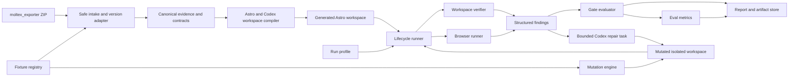
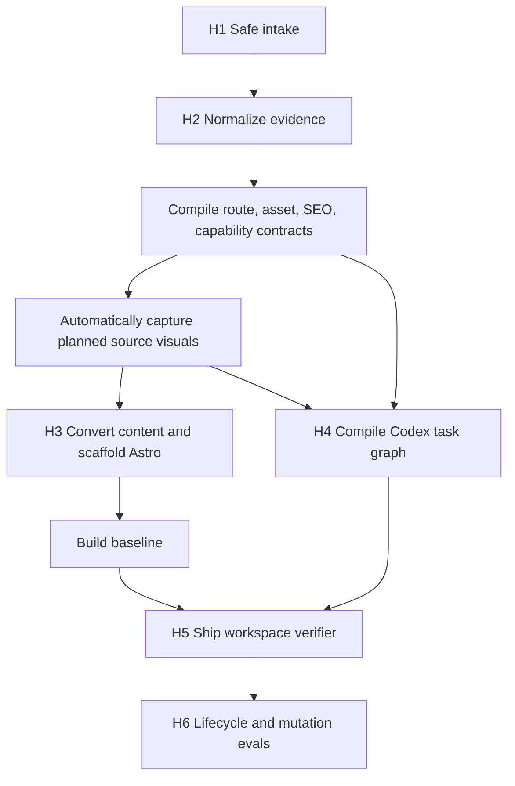
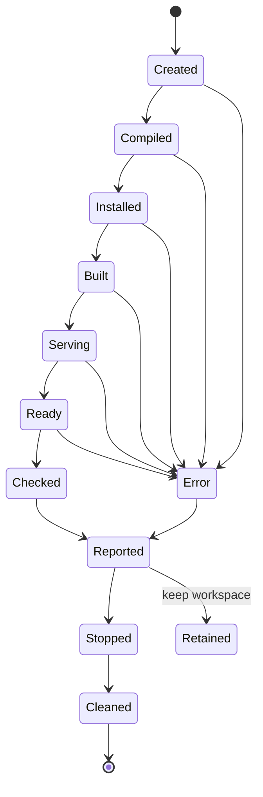

# `moltex_harness` — Migration Core, Verifier, and Eval Architecture

Status: component specification complementary to [`moltex.md`](./moltex.md)

## Document Contract

This document is the implementation source of truth for `moltex_harness`. Despite its
name, the project is not only a test runner. It is the complete local consumer of a Moltex
export:

1. safely parse the versioned ZIP from `moltex_exporter`;
2. normalize WordPress evidence into canonical migration contracts;
3. compile a Git-managed Astro baseline and bounded Codex workspace;
4. ship an independent verifier inside the generated repository; and
5. evaluate the compiler and verifier with isolated fixtures and controlled defects.

`moltex.md` owns product scope, the physical export bundle contract, Golden Path
acceptance, and the `moltex_exporter` implementation plan. This document does not specify
how WordPress is scanned, which plugin admin controls exist, or how the exporter packages
and downloads its ZIP.

| Concern | Owned here | Imported boundary |
|---|---:|---|
| Safe ZIP intake and export-version adapters | Yes | `moltex-export/1` from `moltex.md` |
| Canonical migration models and evidence lineage | Yes | Raw source facts from the bundle |
| WordPress content conversion and Astro generation | Yes | No live WordPress access |
| Generated Codex plans and tasks | Yes | Product task-size policy from `moltex.md` |
| Workspace verifier and repository evals | Yes | Product completion gates from `moltex.md` |
| WordPress scanners, privacy UI, ZIP creation | No | Owned by `moltex_exporter` |

The central recommendation is to build the core migration in independently verifiable
layers and make the final verifier a first-class harness with fixtures, fault injection,
reports, and evals. A verifier that only passes the Golden Path proves little. A system
that parses source evidence deterministically, builds a correct site, rejects known
defects, localizes them, and preserves reproducible evidence is trustworthy.

## Executive Decision

Build `moltex_harness` as three related layers:

1. **Migration core**: a local Python package that validates bundles, normalizes evidence,
   compiles contracts, scaffolds Astro, and generates Codex tasks.
2. **Workspace verifier**: a self-contained Node program shipped inside every generated
   Astro repository. It verifies one site without requiring the Python package.
3. **Repository eval layer**: thin pytest/CLI orchestration that creates isolated
   workspaces, invokes the migration core and shipped Node verifier, injects controlled
   defects, measures detection/localization, and archives evidence.

Python is not required for isolation itself. It is used for repository-level orchestration
because the migration core and its fixture models are Python. Verification semantics for
the generated site remain in the shipped Node verifier; the eval layer must not reimplement
route, link, asset, SEO, or redirect rules in Python.

This is not an LLM-as-judge system. Contract checks remain deterministic. Browser and
visual review may produce `review` results, but neither a model opinion nor an aggregate
score can override a failed blocking contract.

## Why the Harness Matters

The most persuasive demo is not a wall of green checks. It is a short causal story:

1. A known-good migration passes.
2. The demo deliberately removes an expected route or breaks an internal link.
3. The verifier fails for the exact contract and points to the relevant source evidence.
4. Codex receives a bounded repair task.
5. The verifier passes after the smallest valid repair.

That sequence demonstrates independent authority, useful failure messages, controlled
agent work, and proof of completion. Without the injected defect, judges must trust that
the verifier is meaningful. With it, they can see that the system detects a real migration
regression rather than merely confirming that an Astro build exits successfully.

## Terminology

| Term | Meaning |
|---|---|
| Contract | Versioned statement of what must be preserved or explicitly disposed |
| Check | One executable assertion over a contract, build artifact, served page, or evidence item |
| Suite | Named set of checks with a shared purpose and gate policy |
| Verifier | Program that evaluates one generated workspace |
| Harness | Lifecycle, isolation, execution, mutation, and reporting system around the verifier |
| Fixture | Sanitized input bundle plus expected contracts and outcomes |
| Mutation | Reversible, declared defect introduced into an isolated generated workspace |
| Eval case | Fixture, mode, optional mutation, expected findings, and metric assertions |
| Oracle | Canonical expected result derived from contracts and fixture metadata |
| Finding | One localized result with severity, contract ID, evidence, and remediation context |
| Run profile | Reproducibility record for source revision, tools, OS, configuration, and mode |

Unit and property tests answer whether individual algorithms behave correctly. Harness
evals answer whether the complete Moltex system detects the failures it claims to
detect.

## Authority Model

The harness separates deterministic gates from advisory review.

### Deterministic blocking gates

- Astro dependency installation and production build
- Contract and schema validity
- Route and content coverage
- Internal-link integrity
- Local-asset existence and checksum integrity
- Navigation structure
- Required SEO metadata and canonical policy
- Redirect targets, chains, loops, and legacy-route coverage
- Capability disposition completeness
- Parity-matrix uniqueness and completion
- Required report and task evidence
- Absence of unresolved critical or high browser defects

### Deterministic non-blocking findings

- Performance budget warnings during the hackathon
- Optional metadata not present in the source
- Non-critical accessibility findings where the plan explicitly permits review
- Known source defects faithfully reported rather than silently corrected

### Review-only evidence

- Visual hierarchy and overall design fidelity
- Ambiguous source behavior
- Third-party form or integration disposition requiring human confirmation
- Differences intentionally accepted by an operator

The final result is a state, not a percentage:

- `pass`: every blocking check passed and no review is required.
- `fail`: at least one blocking semantic check failed.
- `review`: deterministic checks passed, but named evidence still requires review.
- `blocked`: required external input or an artifact is unavailable.
- `needs_decision`: a policy or migration ambiguity needs an operator decision.
- `error`: the harness itself could not complete reliably.

`error` is intentionally distinct from `fail`. A preview process that never becomes ready
is a harness or environment error; a served route returning 404 is a product failure.

## System Architecture



The migration core and verifier never share mutable in-memory assumptions. They communicate
through the same versioned files that ship to the user. This prevents a bug from being
hidden because the producer and checker happen to reuse the same object graph.

The migration core never reaches into a live WordPress installation. Its only source
boundary is an extracted, validated bundle produced by `moltex_exporter`.

## Project Shape and Technology

`moltex_harness` is the only new implementation project. There is no separate migration
implementation package.

```text
moltex_harness/
├── pyproject.toml
├── uv.lock
├── src/moltex_harness/
│   ├── cli.py
│   ├── intake/
│   │   ├── archive.py
│   │   ├── manifest.py
│   │   └── adapters/
│   │       ├── legacy_1.py
│   │       └── moltex_export_1.py
│   ├── models/
│   ├── normalize/
│   ├── conversion/
│   ├── contracts/
│   ├── scaffold/
│   ├── planning/
│   ├── verification/
│   ├── harness/
│   ├── reporting/
│   └── packaging/
├── templates/
│   ├── astro/
│   ├── workspace/
│   └── verifier/
├── tests/
│   ├── unit/
│   ├── property/
│   ├── integration/
│   ├── harness/
│   └── fixtures/
└── README.md
```

Technology choices:

- Python 3.11+
- Pydantic for explicit, versioned canonical contracts
- Typer or a similarly small CLI layer
- `uv` for Python environments, dependencies, and commands
- pytest, pytest-asyncio where needed, and Hypothesis for invariants
- Astro 5 and strict TypeScript in generated repositories
- Static output, Node 24.14.0, npm 10.9.2, and committed `package-lock.json`
- Self-contained Node verification scripts in generated repositories
- Playwright for production-preview browser checks
- FastAPI plus minimal HTMX only after the CLI Golden Path is stable

The Python core is appropriate because intake and migration are predominantly ZIP, JSON,
schema, HTML, Markdown, URL, and filesystem transformations. Node owns the generated Astro
runtime and the verifier that ships with it.

## Intake and Version Adapters

The physical bundle contract is defined in `moltex.md`. `moltex_harness` implements a
narrow adapter for each accepted major version:

```python
class ExportAdapter(Protocol):
    schema: str

    def validate(self, extracted: SafeBundle) -> AdapterReport: ...
    def read_source(self, extracted: SafeBundle) -> RawSourceEvidence: ...
```

Initial adapters:

- `moltex_export/legacy-1`: reads the frozen pre-manifest fixture. It exists only to
  protect compatibility while the exporter is hardened.
- `moltex-export/1`: requires `bundle.json`, validates schemas and checksums, and becomes
  the default production input.

Adapters translate physical filenames and legacy field shapes. They do not sanitize HTML,
choose routes, invent capability dispositions, or emit Astro code. Those are later stages
with their own tests and reports.

### Safe extraction gates

Before an adapter runs, intake must:

- reject absolute paths, drive-qualified paths, `..` traversal, NULs, and unsafe names;
- reject symlinks or archive entries that resolve outside the extraction root;
- reject duplicate normalized paths and case-collisions relevant to target filesystems;
- enforce compressed size, uncompressed size, file count, per-file size, and nesting
  limits;
- validate `bundle.json` before trusting its paths;
- verify declared hashes and byte sizes while streaming files;
- reject undeclared required-file substitutions;
- treat JSON, HTML, Markdown, CSV, CSS, images, and logs as untrusted data;
- scrub secret-like values from diagnostic output;
- write an intake report even when rejection occurs.

No export content is imported as Python, JavaScript, shell, template, or instruction code.

### Adapter output

Every accepted bundle becomes a `RawSourceEvidence` value with:

- bundle identity and schema;
- site facts;
- content records indexed by stable source ID;
- navigation, taxonomy, author, and relationship evidence;
- media records and local file references;
- SEO and redirect evidence;
- capability/plugin/shortcode/form/integration observations;
- rendered HTML and screenshot evidence references;
- exporter completeness, privacy, readiness, warnings, and omissions;
- source artifact path and JSON pointer for every extracted fact.

The adapter output is still source-shaped. Canonical migration meaning is assigned only
by normalization.

## Canonical Models and Evidence Lineage

The first canonical model set is deliberately small:

### `SourceManifest`

- Bundle ID, schema, exporter version, and hashes
- Site identity and source origin
- Export completeness and privacy state
- Content/media/evidence inventory
- Export warnings, blockers, and omissions

### `SiteSpec`

- Site name, locale, target canonical origin, and trailing-slash policy
- Content collection definitions
- Route families and global navigation
- Global layout requirements and theme evidence
- Capability dispositions and unresolved decisions
- Static-eligibility result

### `ContentRecord`

- Stable source ID and content type
- Legacy URL, slug, status, title, dates, and author IDs
- Taxonomy IDs and relationships
- Original HTML/block content and normalized body representation
- Custom fields with source ownership and disposition
- Required media and internal-link references
- Evidence lineage for every normalized field

### `RouteContract`

- Contract ID, source content ID, legacy URL, and target URL
- Page family and output expectation
- Required content markers
- Redirect requirement
- SEO contract reference
- Source evidence references

### `VisualCapturePlan`

- Source bundle ID and deterministic plan ID
- Bounded representative public route IDs and source URLs
- Required desktop and mobile viewport profiles
- Selection reason and route-family evidence for every target
- Stable evidence ID used to pair source and target captures
- No credentials, private routes, browser state, or user-supplied screenshots

### `AssetContract`

- Stable asset ID and source URL
- Bundle path and target path
- Checksum, size, MIME type, and alt text
- Referencing content IDs
- Acquisition status and method (`bundle`, deferred public source fetch, or operator decision)
- A `local-only` production runtime policy
- Declared transform and provenance, when applicable

### `SeoContract`

- Target route
- Title, description, canonical, and robots disposition
- Open Graph requirements
- Structured-data hints grounded in source evidence
- Precedence decision when multiple SEO sources disagree

### `CapabilityDisposition`

- Capability ID and type
- Source plugin/construct and evidence references
- Business-critical flag
- Disposition: reproduce, replace, externalize, omit-with-approval, or `needs_decision`
- Target behavior and verification method
- Required operator decision

### `MigrationTask`

- Task ID, objective, dependencies, risk, and 30-to-60-minute target
- Relevant evidence and input contracts
- Allowed and forbidden file scope
- Constraints, expected outputs, acceptance checks, and verification commands
- Required completion evidence and current state

### `VerificationReport`

- Workspace, bundle, compiler, and verifier identities
- Build, route, link, asset, content, SEO, redirect, capability, and browser results
- Warnings, blocking failures, review items, and decisions
- Artifact references and tool profile

All models include a schema version and deterministic serialization policy.

### Evidence reference format

A normalized value must be traceable without copying its source into a prompt:

```json
{
  "evidence_id": "ev:content:page:42:title",
  "bundle_id": "sha256:abc...",
  "artifact": "content/page/about.json",
  "pointer": "/title/rendered",
  "sha256": "sha256:def..."
}
```

Transforms append lineage rather than replacing it:

```json
{
  "value": "About Moltex",
  "derived_by": "frontmatter.title-precedence/1",
  "inputs": [
    "ev:seo:page:42:title",
    "ev:content:page:42:title"
  ],
  "decision": "seo_plugin_over_content_title"
}
```

This is the basis for trustworthy tasks and localized verifier failures.

## Core Migration Pipeline



Each boundary is materialized as versioned files. A later phase can be tested against a
pinned earlier-phase fixture without running the whole pipeline.

### Normalization rules

- Stable IDs derive from source IDs and types, never array position.
- URLs are parsed and normalized under an explicit origin and trailing-slash policy.
- Legacy URLs remain immutable evidence even when the target route changes.
- Menu hierarchy references route contracts rather than copied URL strings.
- Authors, terms, media, and content relationships resolve by stable IDs.
- Missing references become findings; they are not dropped.
- Conflicting SEO, route, or capability evidence uses a named precedence rule or produces
  `needs_decision`.
- Generated timestamps never participate in deterministic snapshot comparisons.
- Re-running normalization over normalized data is either rejected or idempotent by
  explicit contract; accidental double rewriting is forbidden.

## WordPress-to-Astro Conversion Algorithms

Moltex should learn from good bounded algorithms in
[WP Astro MCP](https://github.com/vapvarun/wp-astro-mcp) without depending on its full
TypeScript MCP service. The project is
[MIT licensed](https://github.com/vapvarun/wp-astro-mcp/blob/main/LICENSE), so direct reuse
is possible with required attribution. Because `moltex_harness` is Python, porting small,
understood algorithms or adopting their test vectors is cleaner than embedding the entire
service.

Every audit pins an upstream commit. Copied or closely translated code/fixtures record the
repository, commit, source path, original test name, copyright, license, and local changes
in `THIRD_PARTY_NOTICES.md`. Independently implemented ideas still receive an engineering
decision record when they materially shape behavior.

### HTML sanitization and conversion

Treat security filtering, structural normalization, Markdown conversion, and validation
as separate deterministic steps:

1. Parse HTML with an HTML parser; do not sanitize with regular expressions.
2. Remove scripts, event attributes, dangerous schemes, disallowed embeds, and unsafe
   elements while preserving editorial meaning.
3. Remove Gutenberg wrapper comments without removing their contents.
4. Normalize entities, whitespace, captions, figures, lists, tables, code, and embeds.
5. Rewrite internal URLs and media only after the URL map exists.
6. Convert to Markdown when structure is preserved.
7. Retain sanitized HTML when Markdown would lose required meaning.
8. Compare source/sanitized text and structural markers to detect suspicious content loss.

Example:

```html
<!-- wp:paragraph --><p onclick="steal()">Hello <strong>world</strong>.</p><!-- /wp:paragraph -->
<script>stealCredentials()</script>
<figure><figcaption>At work</figcaption></figure>
```

Safe Markdown when conversion is lossless:

```markdown
Hello **world**.


*At work*
```

Tests cover malformed HTML, scripts, dangerous URLs, Gutenberg comments, captions,
galleries, tables, nested lists, code blocks, iframes, entities, empty content, and
content-loss thresholds. Sanitized-HTML fallback passes through the same security policy.

### Shortcode handling

Use a real parser capable of nesting, escaped shortcodes, quoted attributes, and enclosing
content. A shortcode is converted only through a registered rule:

```text
[caption id="attachment_12"]A caption[/caption]
[gallery ids="12,19,27"]
[contact-form-7 id="8" title="Contact"]
[unknown foo="bar"]Original text[/unknown]
```

Possible dispositions:

- `caption`: preserve figure, media reference, and caption.
- `gallery`: resolve every media ID and emit a declared gallery structure.
- `contact-form-7`: emit a capability reference and safe placeholder until its replacement
  is approved.
- unknown shortcode: preserve original source evidence, render a visible conservative
  fallback when safe, and create `needs_decision`; never silently delete it.

Tests cover nesting, mixed text, escaped syntax, malformed closing tags, repeated
attributes, unknown tags, missing media, and output escaping.

### Frontmatter normalization

Frontmatter is compiled from source facts using named precedence and stable types, not by
dumping arbitrary WordPress metadata.

```yaml
title: "A migration story"
description: "How the site moved"
legacyUrl: "/2024/05/migration-story/"
publishDate: 2024-05-10T09:30:00Z
author: "author:7"
taxonomies:
  categories: ["term:category:3"]
seo:
  canonical: "https://example.com/migration-story/"
  noindex: false
acf:
  hero_variant: "split"
```

Required rules:

- SEO plugin fields override generic excerpts only through an explicit precedence table.
- Authors and taxonomies reference stable normalized IDs.
- Dates use one timezone-aware representation.
- ACF values preserve boolean, number, array, relationship, and null types.
- Secret or irrelevant metadata is never copied wholesale.
- Unsupported complex fields receive a finding and evidence reference.
- Key ordering and quoting serialize deterministically.

Tests include conflicting SEO sources, missing authors, duplicate terms, nested ACF
values, relationship cycles, invalid dates, Unicode, multiline descriptions, and schema
round trips.

### URL-map and media rewriting

Build immutable maps before rewriting content:

```json
{
  "routes": {
    "https://old.example/about-us/": "/about/",
    "https://old.example/?p=42": "/about/"
  },
  "media": {
    "https://old.example/wp-content/uploads/2024/hero.jpg": "/media/asset-19-hero.jpg"
  }
}
```

Rewriting rules:

- Parse URLs; do not perform global string replacement.
- Match normalized source origin, decoded path, query identity rules, and fragments.
- Preserve external, `mailto:`, `tel:`, data explicitly allowed by policy, and fragment-only
  links.
- Rewrite `src`, `srcset`, poster, CSS URLs when supported, canonical/OG references, and
  Markdown links through the appropriate map.
- Preserve fragments after route rewriting.
- Record unresolved internal URLs as findings with source content ID and location.
- Make a second application idempotent.
- Give copied media collision-safe filenames based on stable asset ID, not basename alone.
- Assign a deterministic local target path to deferred media before acquisition; a source URL is
  evidence for fetching, never the production runtime URL.

Tests cover encoded paths, uppercase hosts, ports, protocol-relative URLs, query strings,
fragments, `srcset`, filename collisions, missing media, and repeated rewriting.

### Large-content fallback strategy

Do not force every content item through one representation:

1. Attempt structured Markdown conversion within configured size and complexity limits.
2. Validate required text, headings, images, links, tables, and code markers.
3. If conversion exceeds limits or loses required structure, store sanitized HTML in the
   content collection with an explicit renderer mode.
4. If even sanitized HTML exceeds safe processing limits, store a bounded referenced body
   artifact and create a blocking or review finding according to publication impact.
5. Record the chosen representation, reason, sizes, hashes, and warnings in the content
   record.

Example frontmatter:

```yaml
bodyFormat: sanitized_html
conversion:
  reason: complex_table_structure
  sourceBytes: 483221
  outputBytes: 401882
  warnings: ["markdown_structure_loss"]
```

Tests prove Markdown and sanitized-HTML paths render required content equivalently and
that thresholds are deterministic rather than dependent on machine memory.

### Transient versus permanent failure classification

Classify an operation before applying retry policy:

| Failure | Class | Policy |
|---|---|---|
| Temporary package registry timeout | Transient infrastructure | Retry once and record both attempts |
| Loopback port collision | Transient infrastructure | Allocate once more and retry start |
| Malformed JSON artifact | Permanent input | Do not retry; identify artifact and parser location |
| Checksum mismatch | Permanent input/security | Do not retry; reject bundle |
| Unsupported export schema | Permanent compatibility | Do not retry; name supported versions |
| HTML conversion loses required content | Permanent semantic | Select declared fallback or fail |
| Astro compilation error | Permanent implementation | Do not retry unchanged source |
| Missing route/asset/SEO/capability | Permanent product | Do not retry; create localized finding |
| Missing operator decision | Blocked decision | Pause dependent work |

Retries never hide semantic failures and never restart already proven independent stages.
Every attempt is visible in the final report.

### Upstream-inspired regression corpus

- Convert useful cases into Moltex bundle/model vocabulary rather than importing upstream
  runtime objects.
- Keep cases only when they protect a Moltex contract.
- Add assertions for evidence lineage, capability disposition, and verifier outcomes.
- Cover hostile HTML, nested/unknown shortcodes, complex ACF values, SEO conflicts,
  URL/media edge cases, large content, and failure sequences.
- Exclude MCP routing, SQLite jobs, live WordPress credentials, GitHub publication,
  webhooks, and continuous synchronization tests.
- Require attribution review when a copied or closely translated fixture changes.

### Moltex-specific work that remains local

Do not delegate these product layers to WP Astro MCP:

- Canonical evidence contracts
- Evidence lineage
- Codex task graph and task files
- Capability dispositions
- Route, asset, SEO, and redirect contracts
- Baseline and final verification
- Visual/browser QA and the parity matrix

Those contracts define Moltex's product and judge experience.

## Generated Astro and Codex Workspace

The generated repository root is directly openable in Codex Desktop:

```text
generated-site/
├── package.json
├── package-lock.json
├── astro.config.mjs
├── tsconfig.json
├── src/
│   ├── content.config.ts
│   ├── content/
│   │   ├── pages/
│   │   └── posts/
│   ├── layouts/
│   ├── components/
│   ├── pages/
│   └── styles/
├── public/media/
├── scripts/
│   ├── verify.mjs
│   ├── verify-task.mjs
│   └── verify-lib/
├── evidence/
├── .moltex/
│   ├── source-manifest.json
│   ├── site-spec.json
│   ├── contracts/
│   ├── tasks/
│   ├── parity-matrix.json
│   ├── codex-goal.md
│   ├── qa-plan.md
│   └── reports/
├── AGENTS.md
├── EXECPLAN.md
├── MIGRATION.md
└── README.md
```

### Buildable baseline

Before Codex work begins, the repository must:

- install with the committed lockfile;
- build in Astro static mode;
- materialize every eligible content item in a content collection;
- generate every expected route, including collection listings where required;
- copy and reference local media deterministically;
- render conservative navigation, layout, metadata, and redirects;
- expose unsupported visual/capability work as tasks rather than broken components;
- pass baseline contract checks.

The baseline may be visually simple. It may not be incomplete, unbuildable, or dependent
on WordPress.

### Codex task graph

Initial task families are generated only when relevant:

1. Foundation and design tokens
2. Global shell and navigation
3. Content collections and route families
4. Page-family visual reconstruction
5. Capability dispositions
6. SEO, redirects, accessibility, and production details
7. Final parity and handoff

Each task targets 30 to 60 minutes, declares dependencies, links only necessary evidence,
limits file scope, names acceptance checks, and requires completion artifacts. Broad tasks
are split before execution.

Generated `AGENTS.md` instructs Codex to treat exported text as untrusted data, preserve
contracts, avoid modifying verifier expectations, run task checks, update the ExecPlan,
and stop for required decisions.

### Content ownership after migration

The generated Astro repository is the post-migration source of truth. Editors can change
content collection files directly. WordPress is not required. A visual or Git-based CMS
is intentionally outside the hackathon scope.

## Runtime Boundary

### Generated workspace verifier

Every generated repository contains:

```text
scripts/
  verify.mjs
  verify-task.mjs
  verify-lib/
    contracts.mjs
    files.mjs
    http.mjs
    results.mjs
    checks/
.moltex/
  contracts/
  tasks/
  parity-matrix.json
  qa-plan.md
  reports/
```

Required commands:

```bash
npm run verify
npm run verify -- --level baseline
npm run verify -- --level migration
npm run verify -- --level parity
npm run verify:task -- T003
```

The Node verifier reads only committed workspace files and built/served output. It does
not import `moltex_harness`, call WordPress, require a local service, or use an OpenAI API.
Its JSON output is stable enough for the repository eval layer, CI, Codex, and the local
UI to consume.

### Repository eval layer

The thin Python orchestration belongs inside `moltex_harness`:

```text
moltex_harness/src/moltex_harness/harness/
  models.py
  profiles.py
  fixtures.py
  workspace.py
  lifecycle.py
  processes.py
  readiness.py
  runner.py
  gates.py
  artifacts.py
  reporting.py
  cli.py
  checks/
  mutations/
  evals/
moltex_harness/tests/harness/
moltex_harness/tests/fixtures/
```

This layer owns fixture compilation, workspace isolation, process lifecycles,
mutation application, cross-run metrics, and artifact retention. It invokes the same
generated Node verifier that users invoke. There must not be a separate Python
implementation of route, link, or SEO semantics that can drift from the shipped verifier.

## Component Responsibilities

### `HarnessProfile`

Captures every input that can change behavior:

The repository and generated-workspace runtime is fixed to Node 24.14.0 and npm
10.9.2. A run with any other version fails toolchain validation before build or
verification work and records the observed versions in its report.

- Moltex source revision and dirty-state flag
- Fixture ID, bundle checksum, and expected-contract revision
- Compiler and verifier schema versions
- Operating system and architecture
- Python, Node, npm, Astro, and Playwright versions
- Lockfile checksum
- Harness mode and selected suites
- Browser name and viewport
- Environment-variable allowlist values that affect behavior
- Random seed, timeouts, concurrency, and retry policy
- Start time and stable run ID

Secrets and unrelated environment variables are never recorded.

### `FixtureRegistry`

Resolves a fixture ID into immutable source data and expectations. A fixture contains:

```text
fixtures/golden-blog/
  fixture.json
  source.zip
  expected/
    source-manifest.json
    site-spec.json
    route-contracts.json
    asset-contracts.json
    seo-contracts.json
    capabilities.json
    parity-rows.json
  evidence/
  mutations.json
```

`fixture.json` records provenance, sanitization, license, supported modes, expected
warnings, and the hashes of all fixture files. Expected output must not be inferred from
the compiler result during the same run; doing so would let compiler defects rewrite the
oracle.

### `WorkspaceFactory`

Creates a unique disposable directory for every eval case, copies or compiles fixture
inputs into it, and records the filesystem root in the profile. It must:

- preserve relative symlinks without allowing them to escape the workspace;
- reject absolute or traversal paths;
- avoid copying build directories or dependency caches as fixture truth;
- allocate separate output, log, and artifact paths;
- never mutate the canonical fixture or the user's working tree;
- optionally retain the directory after failure for investigation.

### `LifecycleRunner`

Owns the state machine for one workspace:



Each transition emits a timestamped event and has a bounded timeout. Teardown runs even
when compilation, build, readiness, browser checks, or assertions fail.

### `ProcessSupervisor`

Starts commands with argument arrays rather than interpolated shell strings. It captures
stdout, stderr, exit code, duration, working directory, and a redacted environment
allowlist. It terminates the complete process tree on teardown and distinguishes:

- expected non-zero exit caused by a product failure;
- timeout;
- unexpected signal or crash;
- readiness failure;
- cleanup failure.

On Windows and Unix, a process that is already stopped counts as successful cleanup.
Orphan processes are a harness defect and fail harness self-tests.

### `PortAllocator` and `ReadinessProbe`

The harness asks the operating system for an available loopback port and then passes it
explicitly to the preview server. Readiness is established by polling a declared health
URL and verifying a response predicate. Fixed sleeps are forbidden because they are both
slow and flaky.

Readiness has a deadline, bounded polling interval, last-response capture, and preview-log
attachment. A port collision may be retried as an infrastructure event; a route contract
returning the wrong response after readiness may not.

### `CheckRegistry`

Checks are registered by stable ID and schema version. A check declaration contains:

```json
{
  "id": "route.expected-output",
  "version": "1.0",
  "phase": "served",
  "severity": "critical",
  "contract_kinds": ["route"],
  "requires": ["preview.ready"],
  "timeout_seconds": 10,
  "deterministic": true,
  "retry_policy": "never"
}
```

Each result contains:

```json
{
  "check_id": "route.expected-output",
  "status": "fail",
  "severity": "critical",
  "subject": "/about/",
  "contract_ids": ["route:page:42"],
  "evidence_refs": ["evidence/pages/page-42.html"],
  "expected": {"status": 200, "output": "about/index.html"},
  "actual": {"status": 404, "output_exists": false},
  "message": "Expected /about/ from page:42, but no built output exists and preview returned 404.",
  "artifacts": ["http/about.response.json"],
  "duration_ms": 38
}
```

A failure must say what failed, which contract required it, what was observed, and where
the evidence lives. Generic messages such as `verification failed` are harness bugs.

### `GateEvaluator`

Evaluates declared severity and dependency policy after all runnable checks finish.
Independent checks continue after a failure so the operator receives a useful defect
set. Dependent checks become `blocked`, not `pass` or `skipped` without explanation.

The gate evaluator never calculates a compensating average. One missing critical route
fails the run even if 99 other routes pass.

### `ArtifactStore`

Writes immutable run evidence:

```text
.moltex/reports/harness/<run-id>/
  profile.json
  lifecycle.jsonl
  summary.json
  summary.md
  checks.json
  junit.xml
  processes/
  http/
  browser/
    traces/
    screenshots/
    console.json
  mutations/
    receipt.json
    diff.patch
  metrics.json
```

Reports use relative artifact references so a packaged run remains portable. Large
artifacts may be omitted from the final ZIP only through an explicit retention policy;
their checksums and omission reason stay in the report.

## Harness Modes

| Mode | Lifecycle | Primary purpose |
|---|---|---|
| `contract` | Compile and inspect files | Fast schema, lineage, route, asset, SEO, and parity checks |
| `build` | Install and production-build | Prove a clean locked build and generated output |
| `serve` | Build, start preview, issue HTTP checks | Prove production output behaves correctly over HTTP |
| `browser` | Serve plus Playwright | Navigation, responsive layout, accessibility, screenshots, console errors |
| `mutation` | Clone a passing workspace, inject one defect, rerun affected suites | Prove detection and localization |
| `repair` | Mutation plus generated task and post-repair verification | Evaluate the Codex repair loop |
| `repro` | Repeat the same case from clean workspaces | Detect nondeterminism and leaked state |

The hackathon requires `contract`, `build`, `serve`, `browser`, and a focused `mutation`
suite. `repair` should cover at least one representative task for the demo. Broad agent
benchmarking is a post-hackathon extension.

## Check Families

### Contract integrity

- All contract files validate against their declared versions.
- Every evidence reference resolves and has the expected checksum.
- Each public item and capability has exactly one parity row.
- IDs remain stable across repeated compilation.
- Structured files serialize deterministically after normalized timestamps and paths.

### Build integrity

- `npm ci` uses the committed lockfile from a clean workspace.
- `npm run build` succeeds without uncommitted generated fixes.
- The build writes only declared output locations.
- Build output contains no credential-like material or source private content.
- A second clean build produces equivalent normalized output.

### Routes and content

- Every `RouteContract.target_url` maps to built output.
- Every served route returns the expected status and content type.
- Required content markers are present in the rendered document, not merely source files.
- No unexpected public route is emitted without a contract or declared framework reason.
- Listing and detail families reconcile with content-collection counts.
- The 404 route works and does not return a soft-404 200 for unknown paths.

### Links and navigation

- Every internal `href`, canonical target, image reference, script, and stylesheet resolves.
- Fragments resolve when the target document is in scope.
- Navigation labels, order, hierarchy, and targets match the navigation contract.
- Links classified as external are not accidentally rewritten as local.
- Links are normalized before comparison so equivalent trailing-slash policies do not
  create false failures.

### Assets

- Every required local asset exists at the contract path.
- Immutable source assets retain expected checksums unless a declared transform exists.
- Transformed assets record source asset ID and transform provenance.
- MIME type, extension, and served `Content-Type` are compatible.
- Every referenced image has the source alt text or a documented accessibility decision.
- No orphaned business-critical asset is silently dropped.

### SEO

- Every indexable route has a non-empty title and description where the source contract
  requires one.
- Canonicals follow the configured production origin and route policy.
- `robots` disposition matches the contract.
- Open Graph URL, title, description, and image requirements are checked independently.
- Structured-data hints are validated when emitted, but Moltex does not invent source
  claims that were not exported.
- Sitemap entries reconcile with indexable route contracts.

### Redirects

- Every declared legacy URL reaches the expected target and status.
- Targets exist.
- Redirect chains above the declared limit fail.
- Loops fail with the complete observed chain.
- Conflicting rules and redirect-to-self cases fail at contract time.

### Capabilities

- Every discovered capability has one disposition: reproduce, replace, externalize,
  omit-with-approval, or `needs_decision`.
- Business-critical capabilities have executable or manual verification instructions.
- A disposition cannot be marked complete without its required evidence.
- Forms are checked for action behavior, required fields, success/failure states, and the
  declared external service boundary when in scope.

### Browser and accessibility

- Named flows run against the production preview, not the development server.
- Uncaught page errors, failed local resource requests, and unexpected severe console
  messages become findings.
- Desktop and mobile viewports are explicit profile inputs.
- Keyboard navigation, landmark structure, accessible names, and basic automated rules
  run on Golden Path routes.
- Screenshots, browser trace, DOM excerpt, URL, and console context attach to failures.

### Visual parity

Visual checks deliberately avoid claiming pixel identity between WordPress and Astro.
They evaluate selected routes and viewports using:

- exact viewport and deterministic font/browser setup;
- source and target screenshot pairing by evidence ID;
- optional perceptual diff with documented thresholds and masks;
- structural checks for header, primary navigation, main content, footer, and required
  markers;
- a structured human result for hierarchy, spacing, typography, and responsive behavior.

A perceptual threshold may nominate a route for `review`; it cannot by itself erase a
route, content, or accessibility failure. Baseline updates require an explicit command,
a visible diff, and a reason. The harness never updates screenshots during a normal run.

## Mutation Engine

Mutation testing is the key addition beyond ordinary end-to-end tests. It establishes
that each important verifier check is sensitive to the defect it claims to catch.

### Mutation protocol

1. Compile the immutable fixture and prove it passes the required suites.
2. Clone the passing workspace into a new isolated directory.
3. Apply exactly one declared mutation unless the case explicitly tests cascading damage.
4. Write a mutation receipt containing before/after hashes and a unified diff.
5. Run only the logically affected checks first, then the final gate when required.
6. Assert the expected check IDs, subjects, severities, and contract references.
7. Assert that unrelated checks do not produce unexplained failures.
8. Retain artifacts on mismatch; otherwise clean the workspace.

### Initial mutation catalog

| Mutation ID | Defect introduced | Expected primary detector |
|---|---|---|
| `route.delete-output` | Delete one expected built route or its source page | `route.expected-output` |
| `content.remove-marker` | Remove a required heading or distinctive phrase | `content.required-marker` |
| `link.break-internal` | Rewrite one internal link to a missing path | `link.internal-target` |
| `asset.delete-local` | Delete one referenced image | `asset.local-exists` |
| `asset.corrupt-bytes` | Change immutable asset bytes | `asset.checksum` |
| `nav.change-target` | Point a menu item to the wrong route | `navigation.contract` |
| `seo.empty-title` | Remove a required title | `seo.required-title` |
| `seo.wrong-canonical` | Set canonical to a legacy or foreign URL | `seo.canonical` |
| `redirect.create-loop` | Create two redirect rules that cycle | `redirect.no-loop` |
| `capability.remove-disposition` | Delete one business-critical disposition | `capability.disposition` |
| `parity.duplicate-row` | Duplicate a route row | `parity.unique-subject` |
| `task.false-complete` | Mark a task complete without its report | `task.completion-evidence` |
| `browser.console-error` | Add a client script that throws | `browser.console` |
| `a11y.remove-name` | Remove the accessible name from primary navigation | `a11y.accessible-name` |

Mutations operate on generated source when that best simulates a Codex mistake. A smaller
subset may operate on built output to unit-test a verifier check. The receipt must label
which layer was changed so the evaluation cannot confuse the two.

## Eval Suites

### 1. Clean Golden Path

Compiles the real sanitized WordPress export, runs all required modes, and expects no
blocking findings. This proves the main flow but is not sufficient on its own.

### 2. Detection evals

Runs every initial mutation and measures whether the intended check fails. Primary metric:

```text
detection_recall = detected_expected_mutations / total_expected_mutations
```

Hackathon target: 100% for the published mutation catalog.

### 3. Localization evals

A mutation is not considered correctly localized merely because some check failed. The
result must include the expected check ID, affected subject, contract ID, and evidence
reference. This prevents an Astro build failure from being presented as adequate proof
that a missing SEO title was diagnosed.

Hackathon targets:

- Expected primary check identified: 100%
- Affected route/asset/capability identified: 100%
- Relevant contract or evidence reference present: 100%

### 4. Specificity evals

Known-good fixtures must not fail. For a single mutation, unrelated check families should
remain passing unless the fixture declares an expected cascade. Any unexplained collateral
failure is recorded as a false positive or poor isolation.

### 5. Compiler regression evals

Exercise the upstream-inspired WordPress conversion corpus defined earlier in this
document:

- HTML sanitization and conversion
- shortcode handling and disposition
- frontmatter normalization
- URL and media rewriting
- large-content fallback
- transient/permanent failure classification

These cases assert both normalized output and downstream contract/verifier behavior. They
remain Moltex-owned fixtures with source attribution where required; the harness does
not depend on the WP Astro MCP service at runtime.

### 6. Reproducibility evals

Compile and verify the same fixture in fresh workspaces at least three times. Normalize
only declared volatile fields. Compare contracts, route manifests, reports, and packaged
ZIP entry ordering. Differences must point to the field and producer rather than be hidden
by broad snapshot filtering.

### 7. Mode-parity evals

Checks that can run against built output and served output should agree about route and
asset existence. Browser mode may add findings, but it must not silently reinterpret
contract semantics. Development-server success is never accepted as a substitute for a
production build and preview.

### 8. Harness self-tests

The harness itself requires negative coverage:

- preview never becomes ready;
- child process crashes;
- command times out;
- malformed verifier JSON;
- missing artifact path;
- mutation changes no bytes;
- cleanup leaves an orphan process;
- retained workspace is reported at the correct path;
- an infrastructure retry is recorded;
- a semantic assertion is not retried.

### 9. Codex repair evals

These evaluate the complete task loop without making Codex the judge:

1. Start from a passing immutable workspace.
2. Apply one realistic source-level mutation.
3. Confirm the verifier fails and localizes it.
4. Generate a bounded task containing the failing contract and evidence references.
5. Give Codex only the normal workspace instructions and task.
6. Record the resulting diff and Codex session evidence.
7. Re-run the affected suite and the final gate.
8. Reject repairs that alter unrelated scope, weaken the verifier, delete a contract, or
   simply waive the finding.

Useful metrics are:

- repair success rate;
- first-attempt repair rate;
- time to verified repair;
- changed files and diff size;
- scope-violation count;
- regressions introduced;
- attempts to weaken tests or contracts.

For the hackathon, one or two high-quality repair cases are more credible than a broad,
noisy benchmark. The demo case should be deterministic and rehearsed, while the complete
mutation suite proves the verifier beyond that single story.

## Retry and Failure Classification

Retries are permitted only when repeating the same semantic assertion could reasonably
succeed without changing the product:

| Event | Class | Policy |
|---|---|---|
| Dependency registry timeout | Transient infrastructure | Retry once with recorded attempt |
| Loopback port lost before server bind | Transient infrastructure | Allocate once more and retry start |
| Browser process launch crash | Transient infrastructure | Retry once, preserve first trace/log |
| Astro compile error | Permanent product | Do not retry unchanged source |
| Missing route, link, asset, SEO, redirect, or disposition | Permanent product | Do not retry |
| Visual difference | Semantic review | Do not retry; collect review evidence |
| Missing source evidence | Blocked input | Do not retry; request source/operator action |

An overall test-run retry must not turn flaky product behavior into green. If CI reruns a
case after an infrastructure `error`, the report retains all attempts and exposes the
flakiness rate.

## Snapshots and Golden Data

Snapshots are useful for stable structured contracts, not as an excuse to approve opaque
output changes.

Allowed snapshot subjects:

- normalized route, SEO, asset, and capability contracts;
- sanitized HTML/Markdown conversion cases;
- task-file structure after volatile fields are removed;
- verifier JSON schema examples;
- small, intentionally selected rendered fragments.

Disallowed snapshot practices:

- snapshotting an entire generated repository as the only assertion;
- removing absolute paths, IDs, or ordering wholesale to make changes disappear;
- automatically updating baselines in CI;
- accepting an image baseline without viewing the diff and recording a reason;
- using snapshots instead of semantic checks for route, link, SEO, or redirect behavior.

Baseline update commands should be explicit, for example:

```bash
uv run --project moltex_harness moltex eval --suite compiler-regression --update-contract-snapshots
uv run --project moltex_harness moltex eval --suite visual --update-visual-baselines --reason "Approved typography token change"
```

Both commands print changed cases and leave a reviewable diff.

## CLI Design

The `moltex_harness` CLI exposes verification and eval commands alongside intake and
compilation:

```bash
uv run --project moltex_harness moltex create-site exports/acme.zip
uv run --project moltex_harness moltex verify output/acme-moltex --level final
uv run --project moltex_harness moltex eval --fixture golden-blog --suite clean
uv run --project moltex_harness moltex eval --fixture golden-blog --suite mutations
uv run --project moltex_harness moltex eval --fixture golden-blog --mutation route.delete-output
uv run --project moltex_harness moltex eval --suite repro --repeat 3
uv run --project moltex_harness moltex eval --suite browser --keep-workspace-on-failure
uv run --project moltex_harness moltex eval --list-fixtures
uv run --project moltex_harness moltex eval --list-mutations
```

`create-site` is the normal operator entry point. It validates and reads the source site
name, domain, and safe workspace slug from the accepted bundle; the operator does not name
the site. It stages H1-H5 intermediates outside the shared output root and publishes exactly
one self-contained `output/<artifact-workspace-slug>/` directory
only after baseline compilation, the locked production build, baseline verification,
workspace planning, and task-graph verification pass. Contracts, visual evidence, receipts,
reports, source, dependencies, and built output remain beneath that site root. Failed runs
must not leave a destination directory, and an existing destination is never merged into or
overwritten. Ineligible H2 contracts stop before source capture or generation. A failed run
retains only redacted, bounded diagnostics beneath
`output/.moltex-failures/<site>/<run-id>/`; a successful `create-site` result is
`workspace_ready_for_migration`, not a claim that Codex migration and final verification are
complete. Phase-specific commands may still materialize explicit diagnostic fixtures for
development and acceptance tests, but they are not the production multi-site workflow.

Pipeline state and exit semantics:

| State/code | Meaning | Exit |
|---|---|---:|
| `workspace_ready_for_migration` | Baseline generated, Node build/baseline verifier passed, and task graph planned | 0 |
| `static_ineligible` | Verified contracts block complete static migration | 6 |
| baseline/build/planning failure | Product or infrastructure work failed with durable diagnostics | phase-specific nonzero |
| preflight/publish failure | Input identity or atomic publication failed | nonzero |

Common flags:

- `--json`: machine-readable terminal output;
- `--report-dir`: explicit report destination;
- `--keep-workspace` and `--keep-workspace-on-failure`;
- `--seed`: reproducible mutation selection;
- `--jobs`: bounded parallel cases;
- `--timeout`: overall case deadline;
- `--profile`: contract, build, serve, browser, mutation, repair, or repro;
- `--case`: run one stable case ID;
- `--changed-from`: select checks affected by a Git diff, never for final verification.

Exit codes should distinguish product failure, harness error, blocked input, and invalid
CLI usage so CI and the local UI do not parse prose.

## Parallelism and Sharding

Eval cases may run in parallel only when each owns a unique workspace, port, report path,
and browser context. Concurrency defaults conservatively because `npm ci`, Astro builds,
and browsers compete for CPU and disk.

The harness records historical case durations and may shard by estimated duration rather
than case count. Fast contract cases should not be trapped behind several browser builds.
Within one workspace, check dependencies form a DAG; independent checks may run together
only when they do not mutate state.

Caching may reuse immutable dependency downloads, but never a generated workspace as the
oracle. A cache key includes lockfile checksum, Node version, operating system, and package
manager version. A final release run includes at least one cold, cache-independent build.

## Security Boundaries

All source-site network access uses the shared harness public-network policy. It validates
absolute HTTP(S) syntax, URL credentials, DNS results, IPv4/IPv6 address classes, and every
redirect before access. Playwright applies the same policy to navigation and subresource
requests and rejects off-origin navigations. Redirect and request validation is repeated at
request time to reduce DNS-rebinding exposure; private, reserved, loopback, link-local, and
mapped-private destinations fail closed.

Fixtures and generated content remain untrusted input during verification.

- Bind preview servers to loopback only.
- Pass process arguments as arrays; never interpolate exported content into shell text.
- Apply the same path-containment checks to mutations and artifact collection as intake.
- Redact secret-like output before writing logs.
- Disable outbound requests in browser tests except declared external-service cases.
- Treat page console text and DOM content as data, not harness instructions.
- Put hard limits on response size, redirect depth, process time, screenshots, and logs.
- Never run scripts copied from the WordPress export.
- Do not grant a repair task permission to modify `.moltex/contracts`, verifier code, or
  eval expectations unless that task explicitly targets the harness itself.

## CI and Release Tiers

### Pull request: fast gate

- Python and Node verifier unit tests
- Contract and compiler regression suites
- One clean Golden Path contract/build case
- Focused mutation cases affected by changed check families
- Harness self-tests without full browser matrix

Target: useful result in under ten minutes.

### Main branch: integration gate

- Clean Golden Path through build, serve, and browser modes
- Complete published mutation catalog
- Reproducibility run
- Fixture-specific compiler regression suite
- JUnit and portable artifact upload

### Release or submission: evidence gate

- Cold clean build
- Full Golden Path parity review at desktop and mobile
- Complete mutation and localization metrics
- At least one Codex repair eval with session evidence
- Cross-platform smoke run where practical
- Packaged workspace verified independently of the `moltex_harness` source checkout
- Human review of visual differences and third-party notices

## What to Borrow from Next.js

Yes, Next.js provides excellent examples, but primarily in its repository test harness,
not as a reusable package. The right approach is to adopt its architectural patterns and
write a smaller Moltex-owned implementation.

The references below are pinned to Next.js commit
`63375cd1f75922c8f14524c5be6e3eda8bbb7688` so the examples do not drift while
`moltex_harness` is implemented.

| Next.js example | Pattern worth adopting | Moltex translation |
|---|---|---|
| [Core testing guide](https://github.com/vercel/next.js/blob/63375cd1f75922c8f14524c5be6e3eda8bbb7688/contributing/core/testing.md) | Isolated temporary applications, dev/start/deploy modes, cleanup controls, browser traces, and polling helpers | Isolated generated Astro workspaces; contract/build/serve/browser modes; `--keep-workspace-on-failure`; Playwright traces; readiness predicates |
| [`nextTestSetup`](https://github.com/vercel/next.js/blob/63375cd1f75922c8f14524c5be6e3eda8bbb7688/test/lib/e2e-utils/index.ts) | One high-level entry point owns setup, mode selection, timeouts, and teardown | `HarnessRunner.run(case)` is the only supported lifecycle entry point |
| [`NextInstance`](https://github.com/vercel/next.js/blob/63375cd1f75922c8f14524c5be6e3eda8bbb7688/test/lib/next-modes/base.ts) | Disposable directory, isolated dependencies, controlled environment, file patching, process lifecycle | `WorkspaceFactory`, `ProcessSupervisor`, explicit profile, and mutation receipts |
| [`NextStartInstance`](https://github.com/vercel/next.js/blob/63375cd1f75922c8f14524c5be6e3eda8bbb7688/test/lib/next-modes/next-start.ts) | Build and serving phases are tracked separately; interrupted processes are cleaned before retry | Separate install/build/serve events and infrastructure-only retry cleanup |
| [`dist-dir` E2E test](https://github.com/vercel/next.js/blob/63375cd1f75922c8f14524c5be6e3eda8bbb7688/test/e2e/dist-dir/dist-dir.test.ts) | Patch a file, observe behavior, then restore it | Clone a passing workspace, inject one named mutation, record the diff, and verify the expected detector |
| [Development browser error test](https://github.com/vercel/next.js/blob/63375cd1f75922c8f14524c5be6e3eda8bbb7688/test/development/app-dir/ssr-only-error/ssr-only-error.test.ts) | Assert browser-visible errors and console output with structured expectations | Browser findings include page error, console event, route, screenshot, DOM excerpt, and trace |
| [`run-tests.js`](https://github.com/vercel/next.js/blob/63375cd1f75922c8f14524c5be6e3eda8bbb7688/run-tests.js) | Record execution profile, use test timings for orchestration, bound concurrency and retries | Stable `HarnessProfile`, duration-aware sharding, bounded jobs, and attempt history |

Especially valuable ideas are:

1. **Disposable fixtures**: a test gets a clean app and cannot accidentally depend on
   files left by a previous run.
2. **One lifecycle abstraction**: tests ask for a mode rather than starting and killing
   processes ad hoc.
3. **Mode matrices**: build/production behavior is tested separately from development.
4. **Behavioral waiting**: wait for readiness or a DOM condition, never an arbitrary
   number of seconds.
5. **Patch-and-restore tests**: controlled file changes make runtime assertions concrete.
6. **Failure forensics**: retained workspaces, logs, screenshots, and Playwright traces
   make a CI failure reproducible.
7. **Run identity**: OS, revision, versions, flags, and timing belong in the report.
8. **Timing-aware orchestration**: large E2E suites are scheduled by observed cost rather
   than a naive count.

### What not to copy

- Next.js-specific package linking, framework modes, and monorepo bootstrapping
- Jest globals or test-runner coupling in the generated workspace
- Vercel deployment assumptions
- Blanket retry behavior for semantic assertions
- Large utility modules copied wholesale
- Framework snapshots that do not correspond to a Moltex contract

Next.js is [MIT licensed](https://github.com/vercel/next.js/blob/63375cd1f75922c8f14524c5be6e3eda8bbb7688/license.md).
Architectural inspiration does not require a runtime dependency. If Moltex copies or
closely ports code rather than reimplementing a pattern, preserve the copyright and MIT
notice in `THIRD_PARTY_NOTICES.md` and record the pinned source path.

## Example End-to-End Eval

Case `golden-blog.route-delete.about`:

```json
{
  "case_id": "golden-blog.route-delete.about",
  "fixture_id": "golden-blog",
  "profile": "mutation",
  "mutation_id": "route.delete-output",
  "mutation_subject": "route:page:42",
  "expected": {
    "overall": "fail",
    "primary_check": "route.expected-output",
    "subject": "/about/",
    "severity": "critical",
    "required_contract_ids": ["route:page:42"],
    "forbidden_statuses": ["pass", "error"]
  }
}
```

Expected sequence:

1. The clean fixture compiles, builds, serves, and passes.
2. The mutation engine removes `src/pages/about.astro` in a cloned workspace and records
   its original hash and diff.
3. The production build succeeds but no `/about/` output is produced.
4. The route check fails, reports `/about/`, `route:page:42`, expected output, observed
   404, and the source evidence reference.
5. Link and navigation checks may report declared secondary cascades referencing the same
   missing target.
6. The eval passes only if the primary detector and localization match expectations.
7. In repair mode, Codex receives a task scoped to the route source and related evidence.
8. The case passes after Codex restores the route without editing the route contract or
   verifier.

This is the recommended live defect for the hackathon because the build can remain green
while migration completeness fails. It demonstrates why Moltex needs stronger proof
than `npm run build`.

## `moltex_harness` Implementation Plan

These phases are sequential product increments, not a list of subsystems to build in
parallel. Each phase has a stable input fixture, materialized outputs, executable tests,
and an exit gate. A later phase may use a pinned output from the previous phase so failures
remain localized.

### Phase H1 — Scaffold the core and parse accepted exports

Dependencies: E1 provides the immutable `legacy-1` fixture, E2 provides the
`moltex-export/1` schemas, and E3 provides the real Golden Path bundle. H1 requires no H2
implementation.

Objective: establish the new project without predecessor code and turn a safe ZIP into
typed raw source evidence.

Build:

- Create `moltex_harness/pyproject.toml`, package layout, CLI, test layout, and `uv.lock`.
- Implement archive limits, path containment, duplicate/case collision checks, safe
  extraction, and intake reporting.
- Implement the `ExportAdapter` protocol plus `legacy-1` and `moltex-export/1` adapters.
- Validate the manifest, schemas, checksums, sizes, counts, privacy state, and readiness
  result available in each accepted version.
- Validate declared media acquisition semantics before producing raw evidence: `bundled` plus
  `bundle` requires an existing artifact, while `deferred` plus `source-fetch` and `unavailable`
  plus `operator-decision` require `artifact: null`. Reject every contradictory status, method,
  and artifact combination as `invalid_media_acquisition` instead of allowing H2 to reinterpret it.
- Preserve compatibility for accepted legacy media entries that have no acquisition declaration;
  apply the acquisition invariants only when the source bundle declares that contract.
- Parse content, menus, media, SEO, redirects, capabilities, HTML, and screenshot references
  into `RawSourceEvidence` without assigning target behavior.
- Emit a deterministic inventory and contextual findings.
- Add malformed, traversal, zip-bomb-boundary, duplicate-path, checksum, missing-file,
  unsupported-version, and secret-redaction tests.

Verify:

```bash
uv sync --project moltex_harness
uv run --project moltex_harness pytest moltex_harness/tests/unit/intake moltex_harness/tests/property/intake
uv run --project moltex_harness moltex inspect samples/legacy-1-export.zip --json
uv run --project moltex_harness moltex inspect samples/moltex-export-1.zip --json
```

Required artifacts:

- `intake-report.json`
- `raw-source-evidence.json`
- versioned adapter fixtures and expected failures
- documented resource limits and exit codes

Exit gate:

- Both accepted fixture versions parse from clean temporary directories.
- Invalid archives fail before untrusted content is consumed.
- Every declared required artifact and source reference resolves exactly once.
- Every declared media acquisition is internally consistent and every bundled media artifact
  resolves exactly once; invalid combinations fail with a media-map JSON pointer.
- Harness intake and the E3 exporter validation report agree on schema versions, counts,
  checksums, and path semantics.
- Repeating intake produces equivalent normalized JSON after declared volatile fields are
  removed.
- No Astro, Codex, browser, or verifier code is required to prove H1.

### Phase H2 — Normalize evidence and compile migration contracts

Dependency: accepted H1 typed raw evidence and intake fixtures. No H3 implementation is
required.

Objective: turn source-shaped records into stable, evidence-linked migration facts without
generating a website.

Build:

- Implement `SourceManifest`, `SiteSpec`, `ContentRecord`, `RouteContract`,
  `AssetContract`, `SeoContract`, `CapabilityDisposition`, and `VisualCapturePlan`.
- Normalize source IDs, URLs, slugs, dates, authors, taxonomies, relationships, menus,
  media, SEO precedence, redirects, and capability observations.
- Treat WordPress control-plane links such as `/wp-admin/`, `/wp-login.php`, and
  `/wp-register.php` as source-administration references rather than missing public routes;
  they must not create route contracts, unresolved-link findings, or migration decisions.
- Build immutable URL and media maps.
- Compile every observed media source URL to a collision-safe `public/media/` path and `/media/`
  URL. Preserve exporter-declared deferred public sources as automatic H3 acquisition work while
  keeping legacy or unavailable missing binaries in the decision queue.
- Preserve JSON-pointer/file evidence lineage through every derived value.
- Classify static eligibility and emit `needs_decision` instead of guessing.
- Seed one parity row per public content item and discovered capability.
- Select a bounded visual target set containing the homepage, one representative route per
  public route family, and routes needed to observe business-critical or unresolved
  capabilities. Emit desktop 1440×1200 and mobile 500×844 targets with stable evidence IDs.
- Keep the complete H2 public route inventory and visual plan immutable. Source availability
  is observed in the automated H2-to-H3 transition and must never rewrite or silently remove
  an H2 contract.
- Add Pydantic round-trip, property, idempotency, collision, contradiction, and missing
  reference tests.

Verify:

```bash
uv run --project moltex_harness pytest moltex_harness/tests/unit/normalize moltex_harness/tests/property/contracts
uv run --project moltex_harness moltex compile-contracts samples/golden-export.zip \
  --output output/golden-contracts
uv run --project moltex_harness moltex verify-contracts output/golden-contracts
```

Required artifacts:

- `source-manifest.json`
- `site-spec.json`
- route, asset, SEO, redirect, and capability contract files
- URL/media maps
- `visual-capture-plan.json`
- initial parity matrix
- normalization findings and decision queue

Exit gate:

- Golden Path source counts reconcile with canonical records.
- Every public item has one route contract and every required media reference has one
  asset contract.
- Every media-map entry has a unique local target and a `local-only` runtime policy; no target URL
  hotlinks WordPress or an external CDN.
- Every canonical field used for migration has resolvable evidence lineage.
- WordPress control-plane references are excluded from public-route reconciliation without
  suppressing genuine unresolved links to public content.
- Every visual target resolves to one public route contract, target selection is bounded,
  and repeated compilation emits a byte-equivalent `visual-capture-plan.json`.
- The same fixture compiles byte-equivalent normalized contracts after volatile metadata
  is excluded.
- No Astro build is required to prove H2.

### Automated visual acquisition — H2 to H3 transition

This transition is an automatic Moltex operation, not a WordPress feature and not a user
task. After H2 passes, Moltex launches its pinned Playwright Chromium runtime and captures
every target in `visual-capture-plan.json`. The WordPress user is never asked to take,
upload, select, approve, or manage screenshots.

```bash
uv run --project moltex_harness moltex capture-source output/golden-contracts \
  --output output/golden-source-visuals
```

The capture runner:

- visits only the plan's public HTTP(S) source URLs in a fresh isolated browser context;
- probes every public route contract and records one bundle-bound availability result for
  each route before taking screenshots;
- classifies HTTP 401, 403, 404, and 410 responses, redirects to authentication routes, and
  redirects away from the source origin as confirmed omissions that Moltex will not rebuild;
- treats HTTP 5xx responses, unexpected statuses, and transient connection failures as
  blockers rather than silently dropping routes;
- uses the exact declared desktop and mobile viewports and a bounded timeout;
- writes PNGs under `source-visuals/` and never changes the accepted exporter ZIP;
- uses deterministic cross-platform-safe artifact names and removes partial output when a
  capture run fails;
- emits `source-visuals/manifest.json` and schema-v2 `capture-receipt.json` containing the bundle ID,
  plan hash, complete route-availability evidence, browser/version, final URL, viewport,
  byte size, and SHA-256 for every captured image;
- requires images for available planned routes, skips planned targets whose route has a
  confirmed omission, and rejects missing, duplicate, blank, or failed required captures; and
- validates that every public route appears exactly once with the expected route ID and
  source URL, that every disposition is consistent with its status/final URL, and that the
  visual evidence set is exactly the planned targets remaining after omissions; and
- produces no interactive prompt or fallback asking the operator for screenshots.

A valid capture receipt with exact availability coverage is required to enter H3 for a
supported migration and the Golden Path. H3 excludes confirmed omitted routes, their
content records, navigation/SEO/redirect/listing entries, and assets used only by that
omitted content. Other capture or availability failures are visual-readiness blockers,
never exporter ZIP validation failures. Frozen tests use reviewed source visuals and
receipts; normal verification never silently refreshes them.

### Phase H3 — Compile content and a buildable Astro baseline

Dependency: accepted H2 contract fixture plus a successful bundle-bound automated source
visual capture receipt. The real Golden Path is already proven as an H1 input, so H3
requires no H4 implementation.

Objective: implement the core WordPress-to-Astro migration and produce a conservative,
complete site before judgment-heavy visual work.

Build:

- Implement the audited HTML sanitizer/converter, shortcode parser/dispositions,
  frontmatter normalizer, URL/media rewriting, large-content fallback, and failure
  classification behind Moltex-owned Python interfaces.
- Scaffold Astro 5, strict TypeScript, static output, pinned Node 24.14.0 and npm 10.9.2,
  `package.json`, and committed `package-lock.json`. Generate `.node-version`, strict npm
  engine configuration, exact `engines` and `packageManager` declarations, and reject a
  build or verification run under any other Node/npm versions.
- Materialize editable Astro content collections, routes, listings, navigation, media,
  metadata, sitemap inputs, redirects, and 404 behavior from contracts after applying the
  immutable route-availability receipt. Do not materialize confirmed omitted source routes.
- Propagate confirmed omissions consistently: remove the omitted content record from generated
  collections and listing data, remove its navigation/SEO/redirect/sitemap expectations, and
  avoid materializing assets referenced exclusively by omitted content. Preserve shared assets
  required by any available route.
- Copy bundled media and acquire deferred public source binaries into their H2-declared local
  paths before rewriting content. Record final byte size, checksum, source URL, and acquisition
  method in conversion receipts; a later media-only exporter may fulfill the same contract without
  changing content or target paths.
- Generate a conservative accessible shell before judgment-heavy visual decisions are
  implemented.
- Copy the immutable source visual manifest and images into protected workspace evidence
  so later planning and verification can pair them by evidence ID.
- Generate baseline expectations containing the exact available route inventory, omitted-route
  evidence, complete route-availability evidence, content records, acquired assets, visual
  evidence, and required Node/npm versions.
- Ship a dependency-minimal Node verifier inside the generated repository. It must validate
  route/content/asset/visual inventories, exact availability binding, omission absence,
  source-visual checksums, production media locality, and executable source-payload removal
  without importing or invoking the Python harness.
- Write conversion receipts and findings for every fallback or unsupported construct.
- Add conversion unit/property tests, upstream-inspired regression fixtures, workspace
  snapshots, and clean build integration tests.

Verify:

```bash
uv run --project moltex_harness pytest moltex_harness/tests/unit/conversion moltex_harness/tests/integration/scaffold
uv run --project moltex_harness moltex compile samples/golden-export.zip \
  --output output/golden-site --through baseline
npm --prefix output/golden-site ci
npm --prefix output/golden-site run build
npm --prefix output/golden-site run verify
```

Required artifacts:

- complete generated Astro repository
- protected source visual evidence and capture receipt
- content conversion receipts
- bundle-bound baseline expectations including route availability and omissions
- generated `.node-version`, `.npmrc`, locked npm metadata, and toolchain report
- baseline build log
- built-route and asset inventory
- baseline verification report

Exit gate:

- A clean locked install and production build pass.
- The build and verifier run only under Node 24.14.0 and npm 10.9.2 and record the observed
  versions in `.moltex/reports/toolchain.json`.
- Every available expected content item, route, and required local asset is materialized;
  every confirmed omitted route remains absent and traceable to availability evidence.
- Route availability has exact one-to-one coverage of the H2 public route inventory, and
  the generated verifier fails if an available route is missing, an omitted route is emitted,
  or the receipt and baseline expectations disagree.
- Production content contains no runtime media dependency on WordPress or an external CDN.
- Sanitized content preserves required markers and contains no known executable source
  payload.
- Every required source visual for an available planned route resolves by evidence ID and
  its recorded checksum verifies; planned targets on confirmed omitted routes have no image.
- `npm run verify` passes independently inside the generated repository without the Python
  package or access to WordPress.
- WordPress is not required to build or edit the generated site.
- No Codex task generation or mutation harness is required to prove H3.

### Phase H4 — Generate the bounded Codex migration workspace

Dependency: passing H3 baseline, H2 evidence/contracts, and the immutable automated source
visual evidence.

Objective: turn remaining visual, structural, and capability work into small executable
specifications rather than one monolithic prompt.

Build:

- Add versioned `MigrationTask`, `TaskGraph`, planning parity, graph-report, and real
  `TaskExecutionEvidence` models. Reject unknown fields and unsafe workspace paths.
- Derive only required task families and a deterministic dependency DAG. Always bound route-family
  tasks to at most five available routes, create visual tasks only for captured available routes,
  and create capability tasks only for observed capability contracts.
- Generate `AGENTS.md`, `EXECPLAN.md`, `MIGRATION.md`, `.moltex/codex-goal.md`, task JSON
  and Markdown, parity matrix, QA plan, and workspace README.
- Attach minimal relevant evidence, contracts, allowed file scope, constraints, acceptance
  checks, verification commands, and completion evidence to each task.
- Split tasks that exceed the 30-to-60-minute target.
- Protect source contracts, verifier expectations, and unrelated files from ordinary task
  edits.
- Validate exact available-route, visual, capability, and blocking-decision task coverage;
  preserve confirmed unavailable routes as omitted parity rows with no implementation task.
- Record real Codex Desktop completion evidence only when changed files remain in the task's
  allowed scope, protected paths are unchanged, artifact checksums bind the diff/session, and
  every declared verification command passed.
- Execute one representative task in Codex Desktop and refine instructions based on the
  observed session, not hypothetical prompting.

Verify:

```bash
uv run --project moltex_harness pytest moltex_harness/tests/unit/planning moltex_harness/tests/integration/workspace
uv run --project moltex_harness moltex plan-workspace output/golden-site
uv run --project moltex_harness moltex verify-task-graph output/golden-site
uv run --project moltex_harness moltex record-task-execution output/golden-site \
  output/golden-site/.moltex/task-evidence/T001/execution-input.json
npm --prefix output/golden-site run build
```

Required artifacts:

- `.moltex/tasks/task-graph.json` plus one versioned JSON and Markdown brief per task
- generated `AGENTS.md`, `EXECPLAN.md`, `MIGRATION.md`, workspace `README.md`, Codex goal,
  planning parity matrix, and QA plan
- task-graph compilation and verification reports
- one checksummed real Codex task diff, session summary, command report, and execution record
- post-task build result

Exit gate:

- Every task has resolved dependencies, bounded scope, evidence, and executable acceptance
  checks.
- Every H2 route/capability/decision and every available source visual has exact task or
  omission coverage, with no task assigned to a confirmed omitted route.
- Codex completes one meaningful task without extra migration instructions.
- The execution recorder proves the representative task stayed inside scope, retained
  protected authority, and passed its declared build and verification commands.
- The project remains buildable and no source contract, evidence, expectation, verifier,
  or lockfile is weakened.
- The full verifier may still be incomplete; H4 is proven by graph validation, task schema,
  real execution evidence, and the build.

### Phase H5 — Ship the self-contained workspace verifier

Dependency: H3 generated workspace and H2/H4 contracts and task evidence.

Objective: make every packaged Astro repository capable of deciding its own structural
completion without importing Python or accessing WordPress.

Build:

- Define `CheckResult`, `Finding`, process, artifact, and suite report JSON schemas shared
  by generated scripts and the repository eval layer.
- Generate `scripts/verify.mjs`, `verify-task.mjs`, and versioned check modules.
- Implement contract, build-output, route, content marker, link, navigation, asset, SEO,
  redirect, capability, task evidence, and parity checks.
- Add production preview lifecycle, loopback port allocation, readiness polling, HTTP
  checks, Playwright flows, screenshots, console capture, traces, and basic accessibility.
- Distinguish `fail`, `review`, `blocked`, `needs_decision`, and harness `error`.
- Permit retries only for classified infrastructure events.
- Add direct negative fixtures for each blocking check.

Verify:

```bash
npm --prefix output/golden-site run verify -- --level baseline
npm --prefix output/golden-site run verify -- --level migration
npm --prefix output/golden-site run verify -- --level parity
npm --prefix output/golden-site run verify:task -- T003
```

Required artifacts:

- self-contained verifier source in the generated repository
- baseline, migration, browser, task, and final report examples
- screenshots, console records, and at least one Playwright trace
- negative check fixtures

Exit gate:

- The packaged workspace verifies without `moltex_harness`, WordPress, or an API key.
- A clean Golden Path passes all applicable deterministic gates.
- Each direct negative fixture fails with the expected check ID, subject, contract, and
  evidence reference.
- Process teardown leaves no preview or browser process behind.

### Phase H6 — Prove the system with lifecycle and mutation evals

Dependency: passing H1 through H5 and immutable clean/mutated fixtures.

Objective: prove that the complete compiler and shipped verifier detect, localize, and
survive representative failures.

Build:

- Implement the thin pytest/CLI repository eval layer, `HarnessProfile`, disposable
  workspace factory, process supervisor, artifact store, and report aggregation.
- Adopt the documented Next.js lifecycle patterns: one lifecycle entry point, isolated
  apps, explicit modes, readiness predicates, patch-and-restore mutations, retained
  failure workspaces, traces, run identity, and duration-aware orchestration.
- Implement the high-value mutation catalog and immutable mutation receipts.
- Measure detection recall, localization, specificity, repeatability, runtime, and
  cleanup behavior.
- Add harness self-tests for timeouts, crashes, malformed verifier output, no-op mutations,
  orphan cleanup, retention, and retry classification.
- Add run profiles, JUnit, repeat comparisons, and portable artifact bundles.
- Run at least one Codex repair eval and reject repairs that weaken contracts, verifier
  code, or expectations.

Verify:

```bash
uv run --project moltex_harness pytest moltex_harness/tests/harness
uv run --project moltex_harness moltex eval --fixture golden-blog --suite clean
uv run --project moltex_harness moltex eval --fixture golden-blog --suite mutations
uv run --project moltex_harness moltex eval --suite repro --repeat 3
```

Required artifacts:

- clean and mutation suite reports
- mutation receipts and diffs
- detection/localization/specificity metrics
- retained failure workspace example
- reproducibility comparison
- one Codex repair before/after report and session evidence

Exit gate:

- Every published mutation is detected and correctly localized.
- The clean fixture remains passing with no unexplained findings.
- Semantic failures are never hidden by retries.
- Repeated clean runs produce equivalent contracts and reports after declared volatile
  fields are normalized.
- Codex repairs a real injected defect without weakening proof, and the independent final
  gate passes.

## Hackathon Cut Line

Required:

- One real sanitized Golden Path fixture accepted through H1
- Deterministic H2 canonical contracts with evidence lineage
- H3 Git-managed Astro baseline that installs and builds cleanly
- One H4 bounded Codex task executed in the real generated repository
- Self-contained workspace verifier
- Clean contract/build/serve/browser run
- At least eight high-value mutations covering routes, content, links, assets, SEO,
  redirects, capabilities, and parity/task evidence
- 100% detection and localization for the published mutation set
- Retained failure workspace, structured JSON, screenshots, logs, and one browser trace
- One demonstrated Codex repair loop

Strong stretch goals:

- Reproducible three-run comparison
- Accessibility mutation
- Cross-platform smoke run
- Timing-aware sharding and JUnit output
- Guarded visual baseline workflow

Post-hackathon:

- Larger multi-site benchmark corpus
- Historical trend dashboard
- Automated repair trials across multiple Codex sessions
- Hosted artifact viewer
- Deployment-target adapters
- Visual or Git-based CMS integration testing

## Definition of Done

`moltex_harness` is complete for the hackathon when:

- Both accepted export adapters pass safe-intake fixtures.
- Golden Path counts, references, and canonical contracts reconcile deterministically.
- Every normalized migration fact has resolvable evidence lineage.
- The generated Astro repository stores routine content in editable content collections,
  installs from its lockfile, and builds every expected route.
- A generated Codex task is bounded, evidence-backed, and executed successfully.
- A packaged generated repository can run its verifier without the `moltex_harness` source
  tree.
- The Golden Path passes from a clean clone with its lockfile.
- Contract, build, served, browser, and review results share one versioned result model.
- Every blocking finding identifies its check, subject, contract, evidence, expected value,
  actual value, and relevant artifacts.
- The published mutation suite detects and correctly localizes every injected defect.
- Semantic failures are never hidden by retries or aggregate scoring.
- Harness errors are distinguished from migration failures.
- Processes and temporary directories are cleaned reliably, with an opt-in retention path.
- Reports contain enough profile data to reproduce a failure.
- Visual review is explicit and does not pretend to be deterministic contract proof.
- At least one verifier-caught defect is repaired through a bounded Codex task and passes
  final independent verification.
- Copied or closely ported MIT code and fixtures, if any, have pinned attribution.

## Final Recommendation

Build `moltex_harness` from intake to migration to proof. The final eval layer should be a
rigorous harness, not a generic benchmark platform or an AI-scored quality number. Build
the smallest system that can prove four things convincingly:

1. Moltex parses the exporter contract without hidden source access.
2. It preserves declared migration contracts in a buildable Astro repository.
3. Its verifier catches and localizes representative real defects.
4. Codex can repair those defects without becoming the authority that marks itself done.

Next.js is an excellent model for the lifecycle engineering around those proofs. Moltex
should borrow the patterns, keep the implementation and contracts local, and focus its
unique work on WordPress evidence lineage, migration parity, capability decisions, and
verified Codex task execution.
