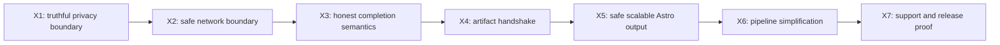

# Moltex Improvements Delivery Plan

## Document Contract

This document is a cross-project remediation plan for issues found in the July 20, 2026
repository audit. It sequences work across the existing `moltex_exporter` and
`moltex_harness` projects; it does not create a third implementation project or replace
either authoritative plan.

Authority remains divided as follows:

| Concern | Authoritative document |
|---|---|
| Product scope, supported site profile, exporter behavior, bundle contract, and end-to-end acceptance | [`moltex.md`](./moltex.md) |
| Intake, canonical models, conversion, Astro generation, planning, verification, lifecycle, and eval implementation | [`moltex_harness.md`](./moltex_harness.md) |
| Remediation order, cross-project checkpoints, and closure evidence for the audit findings | `moltex_improvements.md` |

When a phase changes product scope or an owning component contract, the implementation
must update the authoritative document in the same change. This plan should cross-link to
those changes instead of becoming a second detailed specification.

## Status and Intent

- Plan status: **active**
- Audit baseline: commit **`b629fd1`**
- Export contract: **`moltex-export/1`**
- Projects in scope: **`moltex_exporter`** and **`moltex_harness`** only
- Primary goal: remove security and correctness blockers before broadening WordPress
  compatibility or making production-complete pipeline claims
- Compatibility rule: preserve accepted fixtures unless a reviewed contract change
  explicitly versions or replaces them

The current automated baseline is healthy: 141 Python tests, Ruff, mypy, 127 PHPUnit tests
with 1,742 assertions, PHP lint, Composer validation, standalone exporter regressions, and
the sample bundle validators passed during the audit. Those results show that the existing
behavior is stable; they do not cover the boundary failures addressed here.

## Executive Decision

The fixes are delivered in dependency order:



Security and truthfulness come first. Performance refactors and additional site-family
support must not be used to defer privacy, SSRF, eligibility, or diagnostic fixes.

## Remediation Principles

### Claims require evidence

The exporter may report a privacy or secret-scan result only when the exported bytes were
actually checked. The pipeline may report success only for the lifecycle stage it has
actually completed.

### One observed artifact, one declared consumer

Every packaged artifact must have a named producer, privacy class, contract status, and
consumer or an explicit diagnostic-only disposition. Evidence with no consumer is removed
rather than retained speculatively.

### Network access is a security boundary

Source URLs, redirects, DNS results, CSS references, media links, and browser subrequests
are untrusted. PHP and Python use separate implementations of the same reviewed behavioral
policy because neither project imports the other at runtime.

### Invalid input remains diagnosable

Partial output must not be published as a site, but bounded failure reports and logs must
survive long enough for an operator to understand and repair the problem.

### Simplify after deleting dead work

Remove unused scanners, artifacts, duplicate passes, and generated-file duplication before
splitting large classes. File-size-only refactors are not acceptance criteria.

## Audit Finding Traceability

| Audit finding | Severity | Owning phase |
|---|---|---|
| Hard-coded `secret_scan=pass` and packaged raw theme PHP | Critical | X1 |
| Catch-all artifact registry weakens the closed bundle boundary | High | X1, X4 |
| Private-network/redirect SSRF and disabled TLS verification | Critical | X2 |
| Exporter fallback executes theme templates during capture | High | X2 |
| `create-site` can publish an explicitly ineligible site | Critical | X3 |
| Pipeline logs and reports disappear with the temporary workspace | High | X3 |
| Workspace status overstates what the pipeline completed | High | X3 |
| Producer paths, intake names, and capability consumers disagree | High | X4 |
| Site name is interpolated into generated Astro source | High | X5 |
| Media retries semantic HTTP failures and does not validate payload type | High | X5 |
| Per-route Astro files duplicate complete content records | High | X5 |
| Intake/contract compilation and browser startup are repeated | Medium | X6 |
| Large multi-responsibility classes retain dead or duplicated work | Medium | X6 |
| Elementor and Divi have no supported conversion path | High | X7 |
| Release scripts, versions, and status documentation have drifted | High | X7 |
| No current live end-to-end proof exists for the 1.2.10 candidate | High | X7 |

## Phase Summary

| Phase | Outcome | Primary project | Depends on |
|---|---|---|---|
| X1 | Implemented: export privacy declarations are earned and raw-source exposure is bounded | `moltex_exporter` | Audit baseline |
| X2 | Implemented: every automatic HTTP/browser request obeys a public-network and TLS policy | Both | X1 |
| X3 | Implemented: eligibility and failure semantics are truthful and durable | `moltex_harness` | X2 |
| X4 | Implemented: the producer-to-consumer artifact handshake is closed and executable | Both | X3 |
| X5 | Implemented: generated Astro repositories are injection-safe, payload-safe, and scalable | `moltex_harness` | X4 |
| X6 | Implemented: the pipeline performs each expensive stage once and uses bounded resources | `moltex_harness` | X5 |
| X7 | Supported site classes and release readiness are proven by live fixtures | Both | X6 |

## Phase X1 - Make the Export Privacy Boundary Truthful

Outcome: no export claims to be secret-free unless its final packaged bytes passed a real,
recorded check, and raw executable source is absent from the default migration bundle.

Implementation scope:

1. Stop copying active and parent-theme PHP into normal exports. Replace raw templates and
   `functions.php` with bounded structured evidence such as template hierarchy, registered
   supports, enqueue metadata, layout identifiers, and public rendered presentation facts.
2. Review other copied trees and binary sidecars for equivalent raw-source or credential
   exposure. Keep only public assets or explicitly approved diagnostic artifacts.
3. Introduce a final archive-input privacy scanner that checks every file that will be
   packaged, including non-JSON evidence, for credential signatures, private keys,
   sensitive absolute paths, and seeded privacy canaries.
4. Replace the hard-coded privacy result with an evidence-backed state. A scan that did not
   run is `unknown`, not `pass`; a hit blocks packaging and names the artifact without
   printing the secret.
5. Remove the unrestricted registry `*` fallback. If extension evidence remains supported,
   constrain it to a namespace such as `extensions/<slug>/...`, an extension allowlist,
   file and byte bounds, and a review-required privacy class.
6. Update exporter-owned bundle/privacy requirements in `moltex.md` and, if fields change,
   update both pinned schema copies and the harness adapter in the same contract change.

Required tests:

- A synthetic secret in JSON, PHP, CSS, HTML, SVG, and a binary-like text file blocks the
  package without exposing the value in logs.
- Clean public assets pass and receive a scan receipt bound to their final checksums.
- Default exports contain no `.php` theme or plugin source files.
- Extension artifacts outside the approved namespace or type allowlist are rejected.
- Existing private-content, metadata-filter, traversal, size, and checksum tests remain
  green.

Acceptance evidence:

- reviewed export inventory before and after raw-source removal
- archive-wide privacy scan receipt schema and clean fixture receipt
- negative canary fixtures for every supported text artifact class
- standalone validator output for the updated synthetic and Golden bundles

Exit gate:

- No code path assigns `secret_scan=pass` without a successful scan receipt.
- No normal export contains executable PHP source.
- Every packaged path resolves to a specific registry definition; no global wildcard
  accepts undeclared evidence.

## Phase X2 - Enforce Safe Outbound Network Access

Outcome: automatic source capture and media acquisition cannot reach private services,
silently weaken TLS, or execute a theme template as a fallback.

Implementation scope:

1. Define one behavioral network policy covering schemes, credentials in URLs, public DNS
   resolution, IPv4 and IPv6 ranges, ports, redirect hops, timeouts, response limits, and
   retryable status codes. Record it in the appropriate owning documents.
2. Implement the policy independently in WordPress/PHP and harness/Python. Do not create a
   cross-runtime dependency between the two projects.
3. Replace unsafe WordPress HTTP calls with safe requests, TLS verification enabled by
   default, explicit response-size limits, and redirect validation. A local-development
   certificate override must be explicit, visibly unsafe, and excluded from production
   release defaults.
4. Restrict rendered-CSS downloads to validated public HTTP(S) targets. Validate every URL
   extracted from frontend HTML before requesting it.
5. Remove server-side `include $template` capture. A failed public HTTP snapshot becomes
   structured unavailable evidence; the exporter does not re-execute the active theme
   under a synthetic query.
6. Apply the public-network policy to visual route probes and every redirect before a
   request is sent.
7. Intercept Playwright navigation and subresource requests. Block private/non-public
   destinations and disallowed schemes before network access, not after page navigation.
8. Add a documented DNS-rebinding defense. Where the runtime cannot bind the validated IP
   directly, use request-time interception and fail closed on resolution changes.

Required tests:

- Reject localhost, loopback, RFC1918, link-local, multicast, unspecified, IPv4-mapped IPv6,
  and cloud metadata destinations.
- Reject a public URL that redirects to a private address and an off-origin browser request
  that occurs before final navigation.
- Reject credentials in URLs and non-HTTP schemes.
- Prove valid public HTTPS, bounded public redirects, and approved CDN CSS/media still work.
- Prove certificate verification is enabled in release behavior.
- Prove snapshot failure records a diagnostic without executing theme PHP.

Acceptance evidence:

- shared behavioral policy table with PHP and Python conformance tests
- SSRF mutation suite and redirect-chain fixtures
- WordPress smoke receipt showing TLS-safe snapshot/CSS capture
- Playwright receipt showing blocked private subrequests and successful public capture

Exit gate:

- No default exporter request sets `sslverify` to false.
- No harness request reaches an address before public-network validation.
- No exporter fallback includes a theme template to obtain rendered evidence.

## Phase X3 - Restore Honest Completion and Durable Failure Semantics

Outcome: `create-site` stops at explicit readiness blockers, reports only the stage it
completed, preserves bounded diagnostics, and still never publishes a partial site.

Implementation scope:

1. Add an eligibility gate after verified H2 contracts and before source capture, asset
   acquisition, Astro generation, Node installation, or planning.
2. Keep diagnostic H1/H2 commands available for ineligible exports. The normal
   complete-migration command exits with a distinct blocked/readiness classification and a
   machine-readable report.
3. Define pipeline states that distinguish `contracts_compiled`, `workspace_generated`,
   `workspace_ready_for_migration`, and `migration_verified`. Do not call a planned baseline
   a completed migrated site.
4. Preserve failure artifacts outside the disposable workspace under a bounded path such as
   `output/.moltex-failures/<workspace-slug>/<run-id>/`.
5. Persist the pipeline report, relevant process metadata, redacted stdout/stderr tails,
   contract/readiness summary, and pointers to operator actions. Apply retention and size
   limits.
6. Preserve the atomic publish invariant: the final site directory appears only after all
   gates promised by `create-site` pass.
7. Make CLI text and JSON report the same state, error code, and durable diagnostic path.

Required tests:

- A blocked WooCommerce-style fixture compiles diagnostics but cannot publish a site.
- `needs_decision` and `ineligible` follow explicitly different tested policies.
- Real baseline, Node-build, planning, timeout, and output-race failures leave no partial
  site but do leave readable bounded diagnostics.
- Failure reports redact seeded credentials and never copy the untrusted archive wholesale.
- Successful publication remains atomic and does not leave a failure directory.

Acceptance evidence:

- pipeline state model and exit-code table in `moltex_harness.md`
- integration receipts for one success and each failure class
- retained diagnostic examples with privacy review

Exit gate:

- An ineligible contract cannot produce `site_workspace_created` or another success status.
- Every failure message that references logs points to a path that exists after the command
  returns.
- A success state names exactly what has been built, planned, and verified.

## Phase X4 - Close the Artifact Producer-to-Consumer Handshake

Outcome: every exported artifact has one canonical path and a tested downstream purpose;
unused or misleading evidence is removed.

Implementation scope:

1. Create a machine-readable producer-to-consumer matrix derived from the exporter artifact
   registry and harness adapter/compiler declarations.
2. For every artifact, record canonical path, producer, required status, schema, privacy
   class, harness consumer, and unsupported/diagnostic disposition.
3. Resolve known path mismatches, including `blocks_usage.json` versus `block_usage.json`,
   `theme/theme_mods.json`, and plugin-scoped taxonomy/custom-post-type artifacts.
4. Collapse root and plugin-scoped fingerprint duplicates into one canonical artifact.
5. Remove declared artifacts with no producer and exporter scans with no consumer, unless an
   explicit diagnostic-only need and bounded retention policy is approved.
6. Add a capability consumer only where the canonical model and target behavior are already
   defined. Do not keep Elementor, Kadence, database, hook, or theme evidence merely because
   a filename exists.
7. Fail tests when a producer adds an artifact without a declared consumer/disposition or
   when a harness consumer names a path no accepted exporter can produce.
8. Preserve the schema-pin and immutable-fixture policy for any additive contract update.

Required tests:

- Data-driven tests exercise every matrix entry uniformly.
- The current Golden and synthetic bundles contain no unknown or duplicate semantic
  artifacts.
- Each canonical capability artifact produces the expected contract or explicit finding.
- Historical accepted bundles remain readable through version adapters.

Acceptance evidence:

- reviewed producer-to-consumer matrix
- before/after archive inventory and size comparison
- compatibility report for legacy, synthetic, and Golden fixtures

Exit gate:

- There are no path-name mismatches between producer, registry, adapter, and compiler.
- Every packaged artifact has a consumer or an explicit diagnostic-only disposition.
- No duplicate fingerprint or equivalent semantic artifact remains.

## Phase X5 - Generate Safe, Payload-Validated, Scalable Astro Repositories

Outcome: untrusted WordPress values cannot become Astro source code, downloaded media must
match its contract, and repository size grows primarily with content rather than duplicated
page source.

Implementation scope:

1. Stop interpolating site names or other archive strings into `.astro` source. Serialize
   untrusted values as data and let Astro escape text and attributes.
2. Audit every generated TypeScript, JavaScript, Astro, JSON, CSS, XML, and redirect file for
   source-code or delimiter injection.
3. Classify `HTTPError` before `URLError`. Retry only declared transient infrastructure
   failures; do not retry ordinary 4xx responses or semantic validation failures.
4. Validate fetched and bundled asset payloads against the contract using bounded file
   signatures and MIME policy. Reject HTML error bodies saved as images and sanitize or
   explicitly disallow active SVG content.
5. Generate XML through an escaping serializer and apply equivalent structural emitters to
   other generated formats where practical.
6. Make the content collection the single source of page data. Replace one physical Astro
   source file per route with bounded route-family templates and `getStaticPaths` or an
   equivalent Astro-native mapping.
7. Keep route, SEO, asset, parity, and verifier behavior deterministic after the template
   change. Do not weaken the generated verifier to accommodate the refactor.
8. Add repository-size and build-time characterization for small, Golden, and high-count
   fixtures.

Required tests:

- Hostile site titles, SEO values, navigation labels, URLs, and content delimiters build
  successfully and cannot introduce executable markup or Astro directives.
- A 404 is attempted once and classified permanent; bounded 429/5xx behavior follows policy.
- A 200 HTML body with an image URL, MIME mismatch, malformed image, and active SVG payload
  are rejected and localized to the asset contract.
- A high-count fixture uses bounded page-template files and preserves every route.
- Clean and mutation verifier suites still localize route, content, asset, SEO, redirect,
  and capability failures.

Acceptance evidence:

- generated-source injection test corpus
- media payload-validation matrix
- repository file-count, byte-size, install, and build comparison before and after the
  route-template refactor

Exit gate:

- No untrusted source value is concatenated into executable generated source.
- Every published media asset passes checksum/size rules where declared and a type-safety
  policy in all cases.
- Route count no longer implies an equal number of duplicated full-record Astro source
  files.

## Phase X6 - Simplify Pipeline Execution and Resource Use

Outcome: one migration run performs each expensive deterministic stage once, browser work
uses bounded shared resources, and large services have clear responsibilities.

Implementation scope:

1. Introduce an immutable pipeline context carrying accepted intake evidence, site identity,
   canonical contracts, receipts, and workspace paths between stages.
2. Run safe extraction/intake once and contract compilation once in `create-site`. Keep
   phase-specific CLI commands as wrappers around the same services rather than recomputing
   prior phases.
3. Run visual capture in one Playwright runtime/browser session with isolated contexts or
   pages per target. Apply deterministic ordering and bounded concurrency.
4. Probe routes with bounded concurrency, global deadlines, and stable result ordering so a
   large site cannot consume route-count multiplied timeout windows.
5. Split `BaselineService` into workspace template emission, content emission, route
   generation, metadata generation, and expectations only where the X5 refactor establishes
   real boundaries.
6. Split planning and lifecycle orchestration around task-family builders and explicit state
   transitions when this removes duplication. Preserve stable models under `models/`.
7. In the exporter, remove dead scanners first; then separate scanner orchestration,
   progress/batching, and artifact persistence where behavior-focused tests justify it.
8. Record per-stage duration, bounded resource counts, and artifact sizes without logging
   private content.

Required tests:

- Instrumented services prove exactly one intake and one contract compilation per site run.
- Visual capture proves one browser launch, both pinned viewports, stable receipts, and
  bounded simultaneous pages.
- Route probe output is deterministic under concurrency and respects a global deadline.
- Phase-specific CLI commands and the composed pipeline produce byte-equivalent contracts
  for the same input.
- Existing lifecycle, mutation, cleanup, and process-supervision tests remain green.

Acceptance evidence:

- stage-call and timing report for Golden and high-count fixtures
- browser/process resource receipt
- module responsibility map before and after refactoring

Exit gate:

- No composed pipeline phase repeats H1 or H2 work.
- Browser startup is bounded independently of capture-target count.
- Refactoring reduces duplicated work or state ownership; line count alone is not used as
  evidence.

## Phase X7 - Define Support Tiers and Prove the Release

Outcome: Moltex names the WordPress sites it can migrate, blocks unsupported builders and
applications honestly, and publishes a release only after current live end-to-end proof.

Implementation scope:

1. Update the product support matrix in `moltex.md` with three states: supported,
   conditionally supported with explicit decisions, and unsupported for complete migration.
2. Keep the supported baseline focused on content-led WordPress: standard posts/pages,
   classic or Gutenberg content, navigation, media, SEO, redirects, static ACF fields, and
   the specifically tested GeoDirectory subset.
3. Detect Elementor, Divi, and other page builders explicitly through plugin, post-meta,
   shortcode, and rendered-markup evidence. Until a dedicated adapter and fixtures exist,
   mark them unsupported or decision-blocked rather than implying conversion support.
4. Require a separate future support phase for each builder. Such a phase must define
   exporter evidence, canonical models, deterministic conversion boundaries, representative
   fixtures, visual acceptance, negative mutations, and fallback behavior before claiming
   support.
5. Derive exporter version references in release scripts from one authoritative source.
   Remove hard-coded 1.2.9 paths from the 1.2.10 candidate workflow.
6. Update root status, exporter README/readme, `moltex.md`, and `moltex_harness.md` together so
   phase and release statements match executable behavior.
7. Build the development-free release ZIP and run minimum/reference WordPress install,
   activation, export, validation, download, and privacy gates against that exact ZIP.
8. Run the complete local pipeline on the immutable Golden fixture and at least one fresh
   real content-led staging export.
9. Re-run the Meganoche staging export after its HTTP 500 source routes are repaired or
   explicitly classified. Record route availability instead of treating an unexplained
   server failure as a successful migration.
10. Publish a support/readiness report that explains why Elementor, Divi, transactional,
    membership, LMS, booking, multisite, or other unsupported sites are blocked.

Required tests:

- Builder fixtures for Elementor and Divi are detected and cannot silently pass as ordinary
  content-led sites.
- Supported Gutenberg/classic, ACF, and GeoDirectory fixtures retain expected contracts and
  parity coverage.
- The release smoke locates and installs the version declared by the plugin entry point.
- The release ZIP is reproducible and contains no development dependencies or raw PHP
  evidence from a source site.
- Golden and fresh staging runs complete from export through generated workspace build,
  planning, verification, and durable report production.

Acceptance evidence:

- authoritative support matrix and readiness examples
- exact release ZIP, SHA-256 receipt, file inventory, and reproducibility result
- minimum/reference WordPress release-smoke receipts
- Golden and fresh staging pipeline reports
- Meganoche route-failure resolution or explicit blocked report

Exit gate:

- Documentation, plugin constants, release filenames, validators, and smoke scripts agree on
  one current version.
- No Elementor or Divi migration is described as supported without its dedicated accepted
  adapter phase.
- The exact release artifact and at least two content-led site classes have current
  end-to-end evidence.
- No critical or high audit finding remains open.

## Cumulative Verification

Every phase runs the gates relevant to its changes. X7 runs the cumulative set from a clean
checkout.

Harness gate:

```powershell
uv sync --project moltex_harness
uv run --project moltex_harness pytest
uv run --project moltex_harness ruff check moltex_harness/src moltex_harness/tests
uv run --project moltex_harness mypy --config-file moltex_harness/pyproject.toml moltex_harness/src/moltex_harness
```

Exporter gate:

```powershell
composer install --working-dir moltex_exporter
composer validate --strict --working-dir moltex_exporter
composer test --working-dir moltex_exporter
php moltex_exporter/tests/content_export_regression.php
php moltex_exporter/tests/sample_scope_regression.php
php moltex_exporter/tests/export_directory_regression.php
php moltex_exporter/tests/packager_download_regression.php
php moltex_exporter/tests/audit_inventory_regression.php
php moltex_exporter/tests/callback_path_regression.php
php moltex_exporter/tests/identity_regression.php
php moltex_exporter/tests/privacy_fixture_regression.php samples/golden-export.zip
php moltex_exporter/tools/validate-bundle.php samples/moltex-export-1.zip
php moltex_exporter/tools/validate-bundle.php samples/golden-export.zip
```

Generated workspace gate, using Node 24.14.0 and npm 10.9.2 exactly:

```powershell
npm ci
npm run build
npm run verify
```

Live release gates remain the commands documented under
[`moltex_exporter/tests/README.md`](./moltex_exporter/tests/README.md). A missing Docker,
WordPress, browser, PHP, Node, or Composer prerequisite is reported as blocked evidence; it
is never converted into a passing claim.

## Risk Controls and Cut Lines

### Privacy scanner creates false confidence

Mitigation: scan the final artifact inputs, seed multiple canary classes, bind the receipt to
checksums, and retain manual review for real release fixtures. Pattern scanning supplements
rather than replaces minimization.

### SSRF protection breaks legitimate CDN assets

Mitigation: validate public DNS/IP and redirect behavior rather than using a vendor
allowlist. A blocked URL produces a localized decision or acquisition failure, never a
silent omission.

### Artifact cleanup breaks older accepted bundles

Mitigation: change current producer paths deliberately while keeping explicit adapters for
immutable historical fixtures. Breaking contract changes require a new major version.

### Dynamic routing weakens verifier coverage

Mitigation: preserve route and record contracts as the source of expected outputs. Add
high-count and deletion mutations before removing per-route page source.

### Builder detection is mistaken for builder support

Mitigation: detection changes readiness only. Support requires a separately accepted
adapter phase with fixtures and end-to-end evidence.

### Refactoring expands beyond audit remediation

Mitigation: each refactor must remove a traced audit finding, duplicated operation, unsafe
boundary, or measured scaling problem. Unrelated framework or dependency changes are out of
scope.

## Definition of Done

This remediation plan is complete only when:

- final export bytes receive a real privacy result and normal bundles contain no source PHP;
- all automatic network access rejects private destinations and verifies TLS by default;
- ineligible sites cannot complete the normal migration pipeline;
- failed runs preserve redacted, bounded, actionable diagnostics without publishing a
  partial site;
- producer, registry, adapter, and consumer artifact declarations agree mechanically;
- generated repositories are safe against source injection and invalid media payloads;
- high-count sites use bounded templates and avoid duplicating full records in page source;
- intake, contract compilation, and browser startup are not repeated per composed run;
- supported, conditional, and unsupported WordPress profiles are explicit;
- Elementor and Divi remain blocked until dedicated support phases are accepted;
- version references and current-status documentation match the exact release artifact;
- the cumulative unit, integration, mutation, generated-workspace, WordPress release, Golden,
  and fresh staging gates pass;
- all critical/high findings in the traceability table are closed with reviewed evidence.

## Current Next Actions

1. Accept this remediation order and open X1 with a characterization test proving the current
   hard-coded secret-scan claim and raw-PHP package contents.
2. Decide the additive `moltex-export/1` representation for a real privacy scan receipt while
   preserving historical adapter compatibility.
3. Write the shared X2 network-policy behavior table before changing either PHP or Python
   request code.
4. Add failing X3 tests for an ineligible `create-site` run and for diagnostics disappearing
   after a Node build failure.
5. Generate the initial X4 producer-to-consumer matrix directly from current declarations and
   review every unmatched entry before deleting or renaming artifacts.
